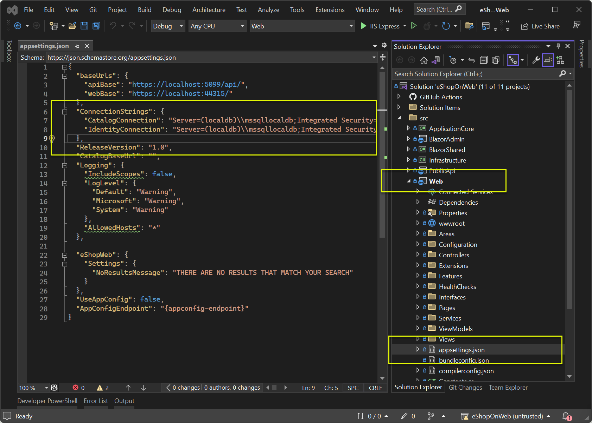
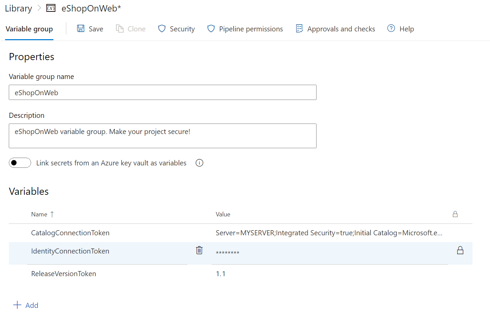
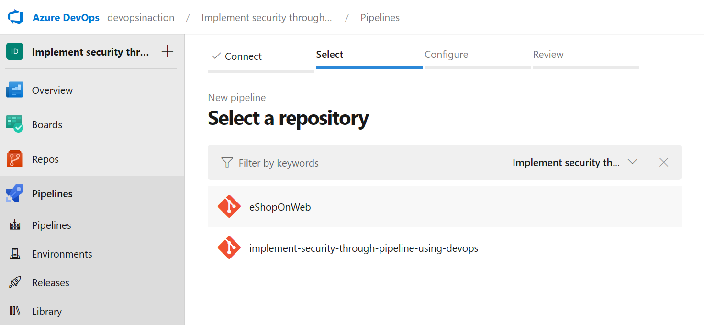
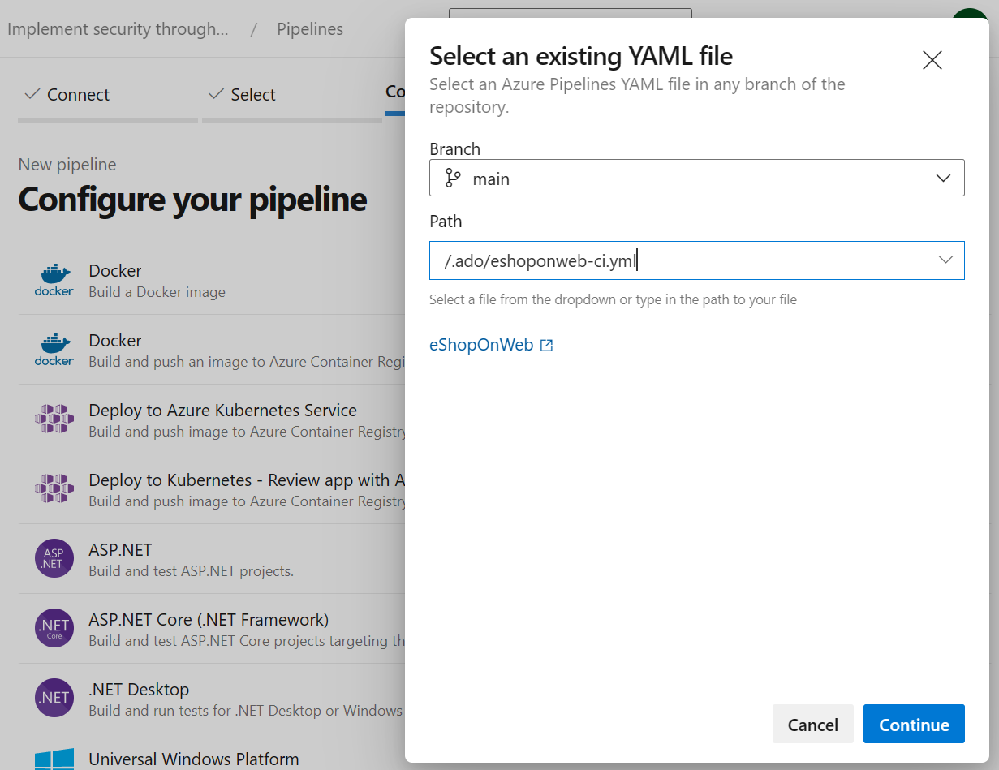
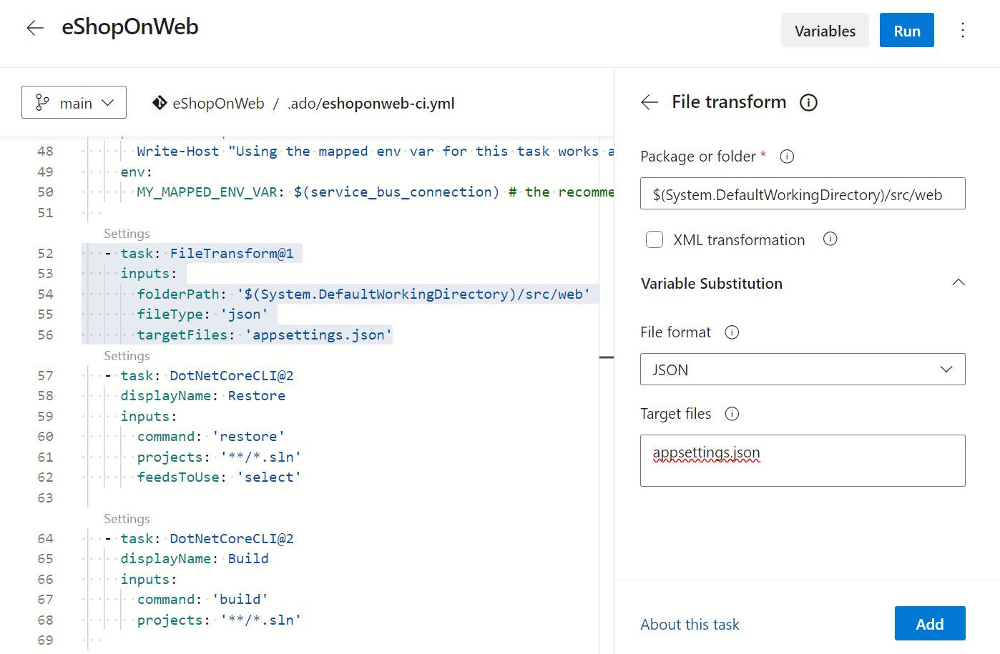
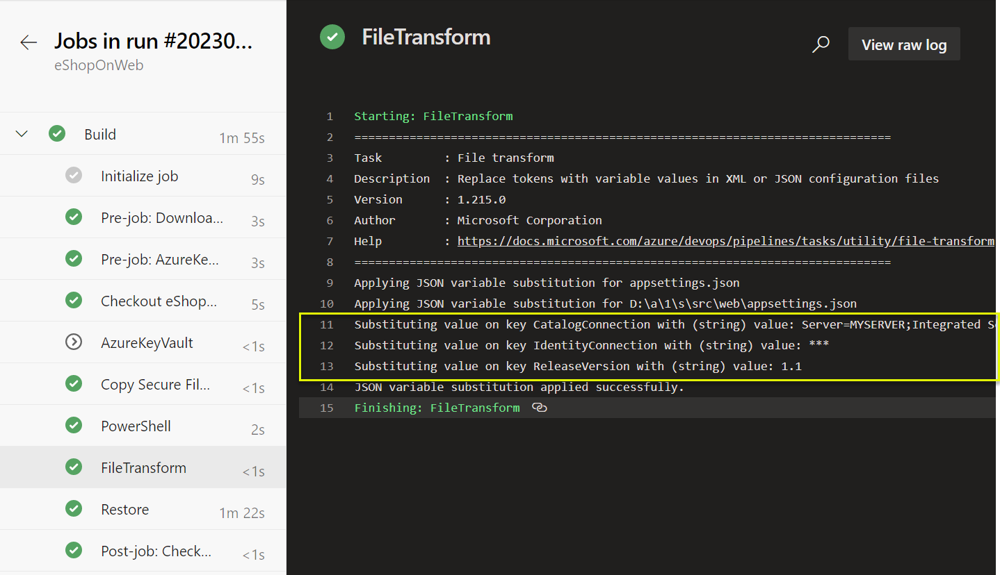
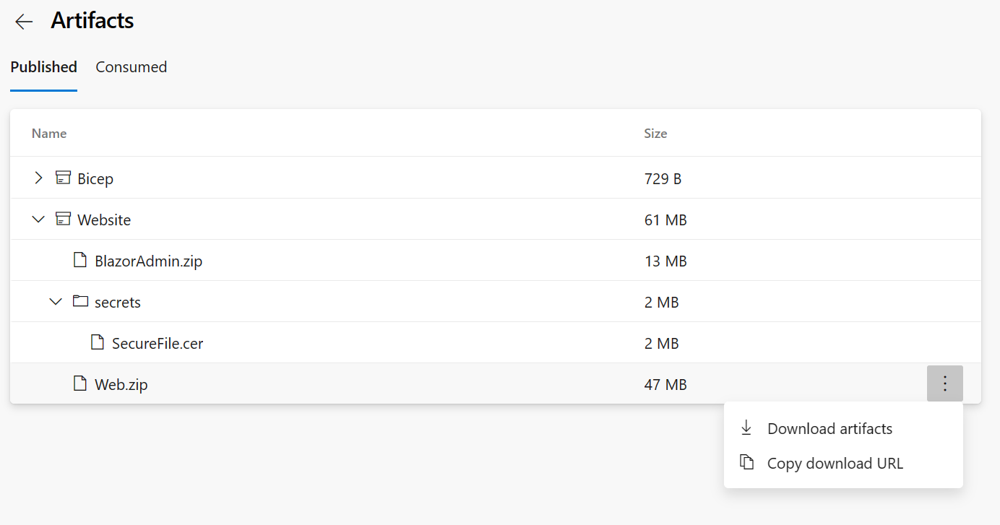

Disclosing sensitive information like passwords, API keys, or database connection strings can lead to serious security risks, such as data breaches, unauthorized access to systems, or even financial losses. It's essential to ensure plain text secrets aren't stored or transmitted insecurely.

Removing plain text secrets and replacing them with variables or tokens is a best practice that allows teams to securely store and manage their sensitive information while still being able to use it in their pipelines or applications.

By using secure methods like FileTransform, Azure Key Vault, or other tools, teams can ensure pipelines and applications are built and deployed securely and reliably while keeping their sensitive information safe from prying eyes.

There are many ways to create a secure application using Azure Pipelines for each technology and type of application you're building.

In this unit, learn to use Azure Pipelines to create a secure .NET application. You'll create tokens for database connections or variables, create a YAML pipeline, and remove plain text secrets.

## Prerequisites

- An Azure DevOps organization.
- A .NET application or eShopOnWeb from Step 1.
- [Visual Studio Community](https://visualstudio.microsoft.com/vs/community/), VS Code or another IDE that supports .NET Core.
- An Azure subscription.

## Step 1: Import eShopOnWeb to your Azure DevOps Repository

The repository is organized the following way:

- .ado folder contains Azure DevOps YAML pipelines.
- .devcontainer folder container set up to develop using containers (either locally in VS Code or GitHub Codespaces).
- .Azure folder contains Bicep & ARM template infrastructure as code templates.
- src folder contains the .NET 6 website used on the lab scenarios.

To import the repository to your Azure DevOps organization, follow these steps:

1. From Azure DevOps organization, choose the project you want to import the eShopOnWeb application.
2. Open the Repos tab and click on Import repository.
3. On the Import a repository page, click on Import a repository link (below the page title).
4. Add the following information:
    Repository type: Git
    Clone URL: https://github.com/MicrosoftLearning/eShopOnWeb.git
    Name: eShopOnWeb

    

5. Click on Import and wait for your repository to be ready.

> [!NOTE]
> For more information about how to import a git repository, see: [Import a Git repo](https://learn.microsoft.com/azure/devops/repos/git/import-git-repository/)

## Step 2: Create tokens for database connections or variables

The first step in creating a secure application is listing all the secrets you want to replace, such as database connections or variables with sensitive information stored securely and referenced in your code or pipeline.

1. Open your .NET application in VS Code or Visual Studio.
2. Find the secrets you want to replace. For example, you can find the database connection string in the `appsettings.json` file, inside the Web project from the src folder.

    

3. Add your database connection string or any other sensitive information to the JSON file using the following format:

    ```JSON
    {
        "ConnectionStrings": {
            "CatalogConnection": "Server=(localdb)\\mssqllocaldb;Integrated Security=true;Initial Catalog=Microsoft.eShopOnWeb.CatalogDb;",
            "IdentityConnection": "Server=(localdb)\\mssqllocaldb;Integrated Security=true;Initial Catalog=Microsoft.eShopOnWeb.Identity;"
          },
        "ReleaseVersion":  "1.0"
    }
    ```

4. Replace the sensitive information with placeholders.

    ```JSON
    {
        "ConnectionStrings": {
            "CatalogConnection": "CatalogConnectionToken",
            "IdentityConnection": "IdentityConnectionToken"
          },
        "ReleaseVersion":  "ReleaseVersionToken"
    }
    ```

    > [!IMPORTANT]
    > You can use the actual information, or a token like `ConnectionToken` or `ReleaseVersion` as value. It will be replaced in the pipeline.

5. Save the changes to the JSON file, and commit/push your changes to the repository.

## Step 2: Create a new variable group

The next step is to create a new variable group in Azure DevOps to store the tokens you created in Step 1.

1. Open Azure DevOps and navigate to your project.
2. Click on "Library" and then "Variable groups."
3. Click on "Create variable group" and add the variables you want to store securely and replace in your `appsettings.json`:
    - Name: eShopOnWeb
    - Variables:
        - **CatalogConnectionToken**: Server=MYSERVER;Integrated Security=true;Initial Catalog=Microsoft.eShopOnWeb.CatalogDb;
        - **IdentityConnectionToken**: Server=MYSERVER;Integrated Security=true;Initial Catalog=Microsoft.eShopOnWeb.Identity;
        - **ReleaseVersionToken**: 1.1
    
4. Make sure click on the "Lock" icon to secure the variable.
5. Click on "Save" to create the variable group.

## Step 3: Create a YAML Pipeline and import the variable group

The next step is to create a YAML pipeline in Azure Pipelines, or use existing definitions. This pipeline builds your application and references the tokens you created in Step 1.

1. Open Azure DevOps and navigate to your project.
2. Click on "Pipelines" and then "New pipeline."
3. Select Azure Repos Git as the source of the code and select the repository that contains the application. You can choose the eShopOnWeb repository you imported in Step 1."
    
4. Select "Existing Azure Pipelines YAML file" and choose the existing `eshoponweb-ci.yml` from the `.ado` folder and Click on Continue.
    
5. In the YAML editor, import the variable group created in Step 2 by adding the following code to the top of the file:

    ```YAML
    variables:
    - group: eShopOnWeb
    - name: ConnectionStrings.CatalogConnection
      value: '$(CatalogConnectionToken)'
    - name: ConnectionStrings.IdentityConnection
      value: '$(IdentityConnectionToken)'
    - name: ReleaseVersion
      value: '$(ReleaseVersionToken)'
    ```

    > [!IMPORTANT]
    > You need to provide the correct variable names, starting with the root node name, in this example `ConnectionStrings.CatalogConnection` and `ConnectionStrings.IdentityConnection`. You can find the correct names in the `appsettings.json` file.

6. Add the File Transform task code to the steps:

    ```YAML
    variables:
    - group: eShopOnWeb
    
    - task: FileTransform@1
      inputs:
        folderPath: '$(System.DefaultWorkingDirectory)/src/web'
        fileType: 'json'
        targetFiles: 'appsettings.json'
    ```

    

7. Click on "Save" to save the pipeline file with the new task, and commit.

## Step 4: Run your release pipeline

The last step is to run your release pipeline to build your application and replace the tokens with the values you stored in the variable group.

1. Click on "Pipelines" under the "Pipelines" tab and then click on the pipeline you created in Step 3.
2. Click on "Run pipeline" and then click on "Run".
3. Once the pipeline is completed, you can see the tokens replaced with the values you stored in the variable group in the `appsettings.json` file. Check your pipeline log results to see the tokens replaced:

    

    > [!IMPORTANT]
    > In this example we did not encrypted the variable `CatalogConnectionToken` to show the value in the log. In a real scenario, you need encrypt the variable to avoid exposing the value in the log.

4. Open the Artifacts from your pipeline execution results and download the **`Web.zip`** file.

    

5. Unzip the file and open the `appsettings.json` file. You can see the tokens replaced with the values you stored in the variable group.

    

For more information about file transformation and variables substitution in YAML pipelines, see:

- [File transforms and variable substitution reference](https://learn.microsoft.com/azure/devops/pipelines/tasks/transforms-variable-substitution)
- [FileTransform@1 - File transform v1 task](https://learn.microsoft.com/azure/devops/pipelines/tasks/reference/file-transform-v1)
- [YAML schema reference for Azure Pipelines](https://learn.microsoft.com/azure/devops/pipelines/yaml-schema/)
- [Customize your pipeline](https://learn.microsoft.com/azure/devops/pipelines/customize-pipeline)
