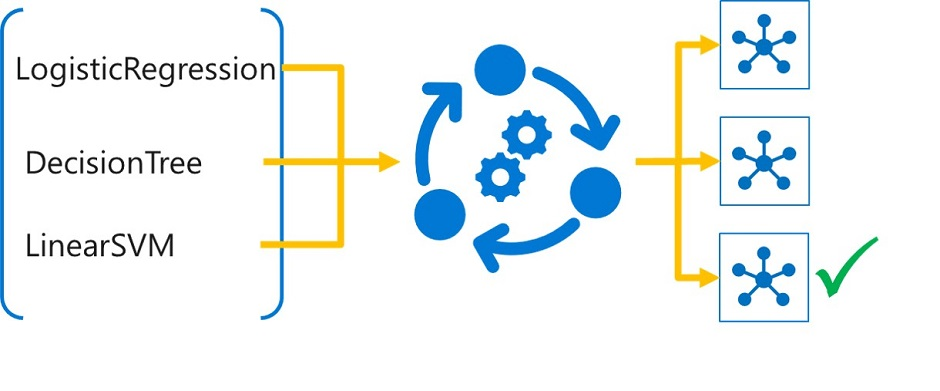

Going through trial and error to find the best performing model can be time-consuming. Instead of manually having to test and evaluate various configurations to train a machine learning model, you can automate it with **automated machine learning** or **AutoML**.

AutoML allows you to try multiple preprocessing transformations and algorithms with your data to find the best machine learning model.

Imagine you want to find the best performing **classification** model. You can create an AutoML experiment using the visual interface of Azure Machine Learning studio, the Azure command-line interface (CLI), or the Python software development kit (SDK). 

> [!Note]
> You can use AutoML for other tasks such as regression, forecasting, image classification, and natural language processing. Learn more about [when you can use AutoML](/azure/machine-learning/concept-automated-ml?azure-portal=true).

As a data scientist, you may prefer to configure your AutoML experiment with the Python SDK. 

## Learning objectives 

In this module, you'll learn how to:

- Prepare your data to use AutoML for classification.
- Configure and run an AutoML experiment.
- Evaluate and compare models. 
