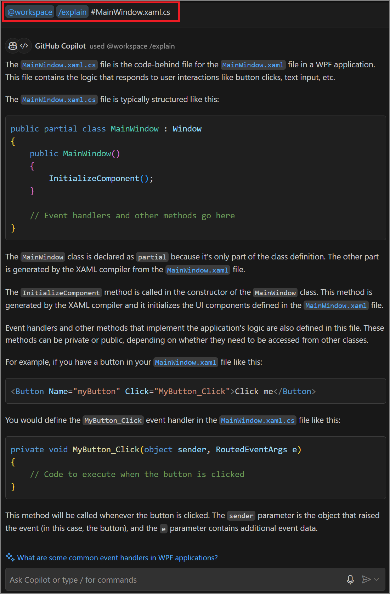
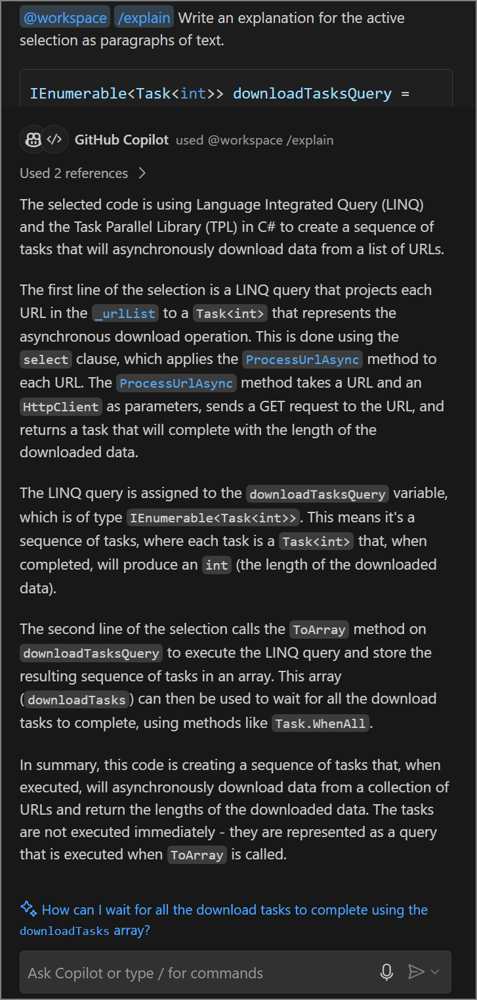
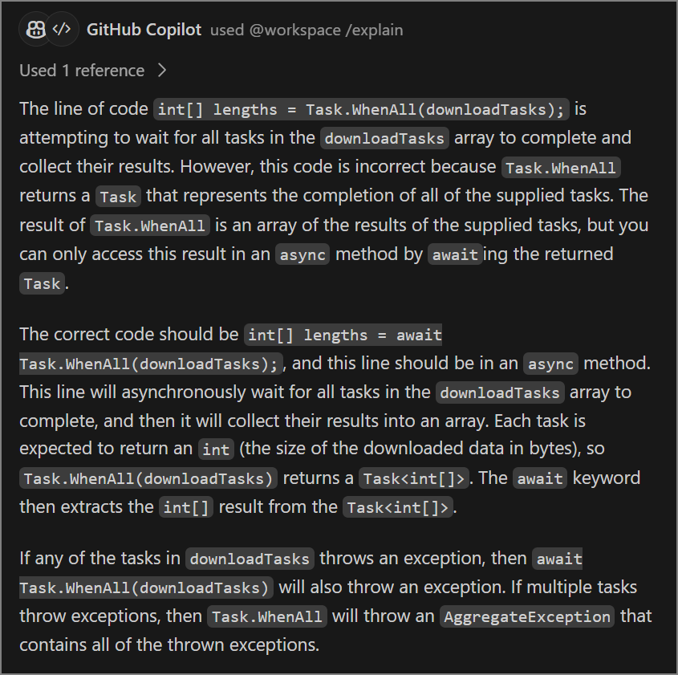

GitHub Copilot Chat is a powerful tool that leverages AI to help you with a variety of coding-related tasks. One great example is its ability to answer your code-related questions.

You can use Copilot Chat to generate explanations in a variety of situations. For example:

- When you inherit a new code project, Copilot Chat can provide an explanation of the entire project or specific project files.
- Copilot Chat can explain specific code lines or sections to help you understand the purpose of the code and how it works.
- Copilot Chat can explain errors in your code and suggest ways to fix them.
- Copilot Chat can explain how to add new functionality to your project and provide code snippets to help you implement it.

Copilot Chat also provides interface options when asking for explanations:

- Chat view and Quick Chat: You can use a combination `@workspace`, `/explain`, and `#file` in the Chat view or Quick Chat window to generate an explanation your project or specific project files.
- Smart actions: You can use the `Explain This` smart action explain the purpose of selected code lines.
- Inline chat: You can use the inline chat to explain selected code sections, coding errors, or how to add functionality to your project.

### Prepare sample apps in your Visual Studio Code environment

This module includes practice activities that use GitHub Copilot Chat and prepared code samples. The activities are designed for an environment that includes the following resources:

- Visual Studio Code.
- The C# Dev Kit extension for Visual Studio Code
- The GitHub Copilot and GitHub Copilot Chat extensions for Visual Studio Code. A GitHub account with an active subscription for GitHub Copilot is required.
- Sample code projects created using C#.

> [!NOTE]
> If you have not already installed Visual Studio Code and the required extensions, complete those installations before continuing.

1. To download a zip file containing the sample apps, select the following link: [SampleApps](https://raw.githubusercontent.com/MicrosoftLearning/APL-2007-Accelerate-app-development-by-using-GitHub-Copilot/master/LearnModuleExercises/Downloads/SampleApps.zip).

1. Unzip the download files.

    Unzip the files in your development environment. Consider using your PC as your development environment so that you have access to your code after completing this module. If you aren't using your PC as your development environment, you can unzip the files in a sandbox or hosted environment.

    1. On your local machine, navigate to your downloads folder.
    1. Right-click **SampleApps.zip**, and then select **Extract all**.
    1. Select **Show extracted files when complete**, and then select **Extract**.
    1. Make note of the extracted folder location.

1. Copy the extracted **SampleApps** folder to your Windows Desktop folder.

    The **SampleApps** folder contains a collection of sample apps, including the **APL2007M2Sample1** code project that you use in this exercise.

1. Open the **APL2007M2Sample1** folder in Visual Studio Code.

    1. Open Visual Studio Code on your PC.
    1. In Visual Studio Code, on the **File** menu, select **Open Folder**.
    1. Navigate to the Windows Desktop folder, open the **SampleApps** folder, and locate the **APL2007M2Sample1** folder.
    1. Select **APL2007M2Sample1** and then select **Select Folder**.

    The Visual Studio Code EXPLORER view should show a APL2007M2Sample1 code project containing the following files:

    - App.xaml
    - App.xaml.cs
    - MainWindow.xaml
    - MainWindow.xaml.cs
    - Sample1.csproj
    - Sample1.sln

You are now ready to use GitHub Copilot Chat to complete this exercise.

### Workspace and project file explanations

GitHub Copilot Chat can help you understand new projects or specific project files. You can use a combination `@workspace`, `/explain`, and `#file` in the Chat view or a Quick Chat window to generate an explanation of your project or specific project files.

1. Open the Chat view in Visual Studio Code.

1. Use the following command to ask Copilot Chat to explain the `APL2007M2Sample1` project:

    ```plaintext
    @workspace Explain this project
    ```

1. Take a minute to review the response in the Chat view.

    > [!NOTE]
    > Since Copilot Chat uses an AI model to generate responses, the actual response you receive may vary slightly from the example shown here.

    Copilot Chat generates explanation of the APL2007M2Sample1 project that's similar to the following response:

    

1. At the bottom of the Chat view, notice that GitHub Copilot Chat has suggested a follow-up question.

    

    As mentioned earlier, the response from the AI model isn't an exact match for the examples shown. Your response may include a different follow-up question. If you don't see a follow-up question, you can skip over the next step.

1. Select the suggested follow-up question and review the response in the Chat view.

1. Use the following command to ask Copilot to explain the `MainWindow.xaml.cs` file:

    ```plaintext
    @workspace /explain #file:MainWindow.xaml.cs
    ```

    

1. Take a minute to review the response in the Chat view.

    Notice that GitHub Copilot Chat generates a detailed explanation of the `MainWindow.xaml.cs` file. The explanation includes information about the file's purpose, structure, and key components.

    Once again, GitHub Copilot Chat suggests a follow-up question. Although GitHub Copilot Chat suggests great follow-up questions, we suggest that you continue on to the next section of this exercise.

    > [!IMPORTANT]
    > GitHub Copilot Chat maintains a history of your chat conversation. As you continue to ask questions, it refines its responses accordingly. The context of your questions, especially in regard to your code project, influences GitHub Copilot Chat's subsequent responses. This helps it to provide more accurate and relevant responses. However, it also means the response you receive for a particular question is likely to vary based on your conversation history.

### Selected code explanations

Even experienced developers encounter code that's difficult to understand. Rather than spending time trying to decipher complex code, you can ask GitHub Copilot Chat to provide an explanation. Chat view, inline chat, and smart actions can each be used to generate explanations for selected code lines or sections.

In this section of the exercise, you use the **Explain This** smart action to generate an explanation of selected code lines.

1. In Visual Studio Code, open the `MainWindow.xaml.cs` file in the editor.

1. Scroll down to locate the `SumPageSizesAsync()` method.

    ```csharp
    private async Task SumPageSizesAsync()
    {
        var stopwatch = Stopwatch.StartNew();
    
        IEnumerable<Task<int>> downloadTasksQuery =
            from url in _urlList
            select ProcessUrlAsync(url, _client);
    
        Task<int>[] downloadTasks = downloadTasksQuery.ToArray();
    
        int[] lengths = Task.WhenAll(downloadTasks);
        int total = lengths.Sum();
    
        await Dispatcher.BeginInvoke(() =>
        {
            stopwatch.Stop();
    
            _resultsTextBox.Text += $"\nTotal bytes returned:  {total:#,#}";
            _resultsTextBox.Text += $"\nElapsed time:          {stopwatch.Elapsed}\n";
        });
    }
    ```

1. Select the following code lines, and then use the **Explain This** smart action to generate an explanation.

    ```csharp

    IEnumerable<Task<int>> downloadTasksQuery =
        from url in _urlList
        select ProcessUrlAsync(url, _client);

    Task<int>[] downloadTasks = downloadTasksQuery.ToArray();

    ```

    Right-click the selected code lines, select **Copilot**, and then select **Explain This** from the context menu.

1. Take a minute to review the response in the Chat view.

    

1. Notice that the response includes a detailed explanation of the selected code lines.

### Error explanations

Managing errors is an essential aspect of software development. Some errors are easy to spot and fix, while others can be more challenging. When you encounter an error in your code that's difficult to understand, you can ask GitHub Copilot Chat to provide an explanation. For example, you can ask GitHub Copilot Chat to explain why a specific line of code is causing an error.

1. Ensure that you have `MainWindow.xaml.cs` open in the editor.

1. In the `SumPageSizesAsync()` method, locate the following code line:

    ```csharp
    int[] lengths = Task.WhenAll(downloadTasks);
    ```

1. Hover the mouse cursor over `downloadTasks` to display the error message.

    

    Error messages don't always help you to understand why your code is generating an error. You can ask Copilot Chat to provide an explanation of the error and suggest ways to fix it.

1. Select the code line, and then press `Ctrl` + `I` to open an inline chat.

1. To have Copilot Chat explain what's causing the error, enter the following prompt:

    ```plaintext
    /explain why is the selection causing an error
    ```

1. Take a minute to review the response in the Chat view.

    

    Notice that the response includes information about the error and suggestions for fixing it. In this case, GitHub Copilot Chat explains that the `Task.WhenAll(downloadTasks)` line is causing an error because it's missing the `await` keyword. The response also provides a code snippet that shows how to fix the error by adding the `await` keyword before the `Task.WhenAll(downloadTasks)` line.

    > [!NOTE]
    > Copilot Chat uses an AI model to generate responses, the actual response you receive may vary slightly from the example shown here.

1. You can use the explanations provided by GitHub Copilot Chat to fix the errors in your code.

    Add the `await` keyword before the `Task.WhenAll(downloadTasks)` line, as shown in the following code snippet:

    ```csharp
    int[] lengths = await Task.WhenAll(downloadTasks);
    ```

    After you make this change, the error should be resolved.

1. Save your changes to the `MainWindow.xaml.cs` file.

### New feature or functionality explanations

Adding new features to your applications requires planning and coordination with your team.

When you're considering new features or improved functionality for a project, GitHub Copilot Chat can help. You can use the `/explain` command to have GitHub Copilot Chat explain how to extend your app. GitHub Copilot Chat provides code snippets and explanations to help you implement new functionality.

The APL2007M2Sample1 project is used to download web pages and calculate the total size of the downloaded pages. GitHub Copilot Chat can explain how to add a new feature or capability to the project. For example, you can ask GitHub Copilot Chat to explain how to handle exceptions thrown during the download process.

1. In the Chat view, to have GitHub Copilot Chat explain how to handle exceptions thrown during the download process, enter the following question:

    ```plaintext
    @workspace /explain #MainWindow.xaml.cs How can I handle exceptions thrown during the download process?
    ```

1. Take a minute to review the response in the Chat view.

    Copilot Chat generates a response that's similar to the following explanation:

    

    The response provides a detailed explanation of how to handle exceptions thrown during the download process. It includes code snippets and suggestions for improving error handling in the project.

    Notice that the response includes an additional "How can I" suggestion. You can select this suggestion to ask Copilot Chat to provide more information about the topic.

    > [!NOTE]
    > GitHub Copilot Chat uses an AI model to generate responses, the actual response you receive may vary slightly from the example shown here.

1. To ask the question using inline chat, select the `ProcessUrlAsync` method, press `Ctrl` + `I`, and then enter the following prompt:

    ```plaintext
    How can I handle exceptions thrown during the download process?
    ```

1. Take a minute to review the inline response.

    

1. To accept the proposed error handling code, select **Accept**.

    Notice that the proposed `try-catch` block is implemented.

1. Save your changes to the `MainWindow.xaml.cs` file.

### Summary

In this exercise, you used GitHub Copilot Chat to generate explanations for code lines, errors, and new features. GitHub Copilot Chat provides a powerful set of features that can help you ramp up on new project quickly. By using the inline chat and Chat view, you can get help from GitHub Copilot Chat without leaving the Visual Studio Code environment. GitHub Copilot Chat's AI model generates accurate and useful responses that can help you become a more efficient and effective developer.
