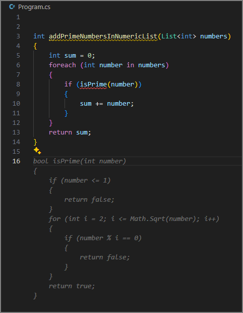
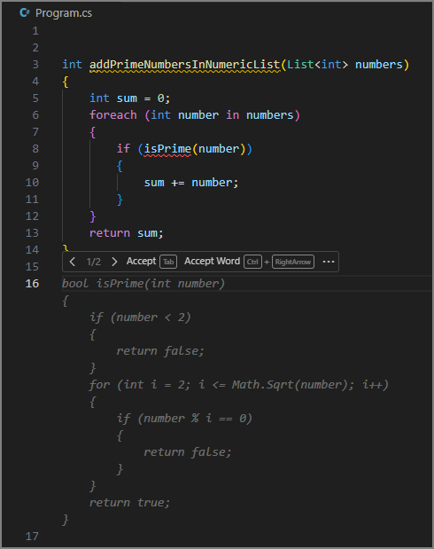
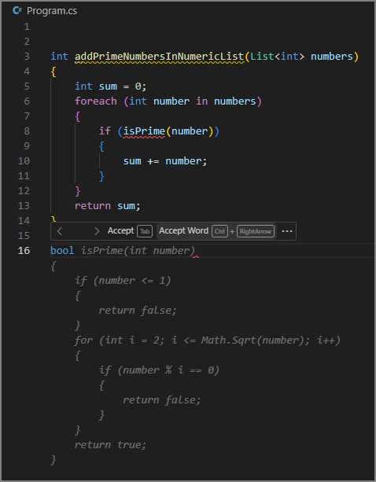
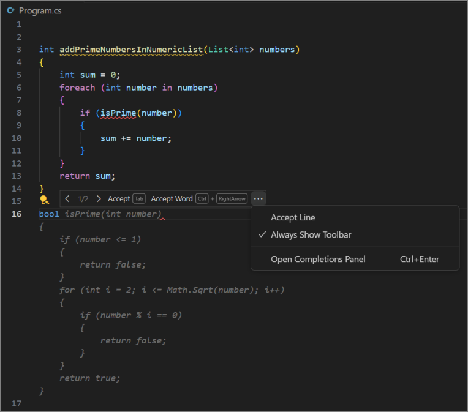
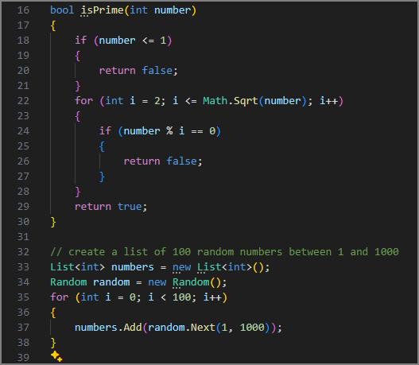

GitHub Copilot provides autocomplete-style suggestions as you enter code. You receive autocomplete-style suggestions when you perform the following actions:

- Start writing (or enter) a code line in the editor.
- Start writing (or enter) a code comment.
- Enter a blank code line.

## Generate an autocomplete suggestion

GitHub Copilot can help to accelerate app development by suggesting code completions based on the code you're writing.

For example, suppose you want to create a function named `addInt` that returns the sum of two integers. If you start typing the function signature, GitHub Copilot suggests the code that it believes you want to create.

The suggested autocompletion is displayed without colored syntax highlighting. This helps differentiate the autocomplete suggestion from your existing code. You can accept the suggested code by pressing the Tab key. Pressing the Esc key dismisses the suggestion.

GitHub Copilot interprets the code you're writing and works with the underlying AI to generate an autocomplete suggestion.

The `addInt` example is a bit simplistic, so you may be wondering how GitHub Copilot does with something more complex. Suppose you want to create a function named `addPrimeNumbersInNumericList` that accepts a list of numbers and returns the sum of the prime numbers contained in the list. When you start typing the function signature, GitHub Copilot generates a suggestion for you.

Once again, you can accept the suggestion by pressing the Tab key.

Notice that when you accept the suggested autocompletion, the `isPrime` function is undefined (underlined in red). GitHub Copilot is trained to follow best practices, which include breaking down complex problems into smaller, more manageable pieces. In this case, GitHub Copilot is suggesting that you create a separate function to check if a number is prime.

As you would expect, GitHub Copilot is ready suggest a code snippet for the `isPrime` function as well. When you enter a blank line below the `addPrimeNumbersInNumericList` function, GitHub Copilot suggests an `isPrime` function that you can use.

## Manage autocomplete suggestions

When GitHub Copilot suggests an autocompletion, it also provides an interface for managing the suggestions. You can accept a suggestion, dismiss it, or cycle through alternative suggestions.

When you hover the mouse pointer over a suggested autocompletion, you're presented with several options for managing the suggestions.

The default interface for managing suggestions includes the following options:

- Accept the suggestion (in full) by selecting **Accept**. You can also accept the suggestion by pressing the Tab key.
- Partially accept the suggestion by selecting **Accept Word**. You can also partially accept a suggestion by pressing the `Ctrl` + `>` keys.
- View alternate suggestions by selecting **`>`** or **`<`**. You can also view the alternative suggestions by pressing the `Alt` + `]` or `Alt` + `[` keys.

Selecting the **Accept Word** option  accepts the next word in suggestion. This is useful when you want to accept part of the suggestion and then continue typing your own code.

You can continue selecting **Accept Word** until you accepted as much of the suggestion as you want.

Selecting the ellipsis (...) icon to the right of the Accept Word button provides options for **Accept Line** and **Always Showing Toolbar**.

Selecting the **Always Show Toolbar** option ensures that the toolbar remains visible when using hot keys to managing autocomplete suggestions. Selecting the **Accept Line** option accepts an entire line of the suggestion.

## Generate code suggestions from comments

In addition to suggesting an autocompletion based on code, GitHub Copilot can use comments containing natural language phrases to suggestion code snippets. This enables Copilot to propose autocomplete suggestions that meet specific requirements. For example, you could specify the type of algorithm that you want to use in a calculation, or which methods and properties you want to add to a class.

Let's return to the prime number example. At this point, you have the following code:

The `addPrimeNumbersInNumericList` and `isPrime` methods appear to be complete. However, you still need a list of numbers that can be used as an argument when you call the `addPrimeNumbersInNumericList` method. You can write a comment to describe the list of numbers that you want. For example, a list of 100 random numbers that range from 1 and 1000.

When you start writing the comment, GitHub Copilot suggests an autocompletion for your natural language text as it did for your code. It does this using the code it finds in your solution and the portion of the comment that you entered. If you start typing the comment `// create `, GitHub Copilot sees the `addPrimeNumbersInNumericList` methods and predicts that you want to create `a list of numbers`.

As you continue to write your comment, GitHub Copilot updates its autocomplete suggestion. When you're ready to accept the suggestion, select **Accept** or press the Tab key.

When you create a new code line after the comment, GitHub Copilot begins generating a code snippet based on the comment and your existing code.

Accept each of the suggestions as they appear. If GitHub Copilot isn't done, it generates another suggestion for you to accept.

Once the code snippet is complete, GitHub Copilot stops displaying suggestions.

If you enter a new code line after the snippet is complete, GitHub Copilot generates another autocomplete suggestions based on the requirements of your code project. In this case, GitHub Copilot suggests a code line that calls the `addPrimeNumbersInNumericList` function, passing in the list named `numbers`.

## View multiple suggestions

What if you don't want any of the initial suggestions GitHub Copilot offers?

If you don't like any of the initial autocomplete suggestions, GitHub Copilot provides an interface for reviewing a larger selection of autocomplete suggestions in a new Code Editor tab. You can review the larger list of suggestions to find the one that best fits your needs and then select it.

To demonstrate how you might use this feature, let's go back to an earlier stage in the prime numbers example. Suppose you still need to create the `isPrime` function. When you enter a blank line below the `addPrimeNumbersInNumericList` function, GitHub Copilot suggests an `isPrime` function for you as it did before. However, let's suppose that you're not satisfied with the suggestions that GitHub Copilot offers and would like to see more options.

To open a new tab with multiple other options, press the `Ctrl` + `Enter` keys.

10 other suggestions are displayed in a new Code Editor tab. You can review the suggestions to find the one that best fits your needs.

To accept a suggestion, select the `Accept selection` label below the suggestion. For example, select the `Accept suggestion 1` label below the first suggestion.

To reject all suggestions, close the tab.
