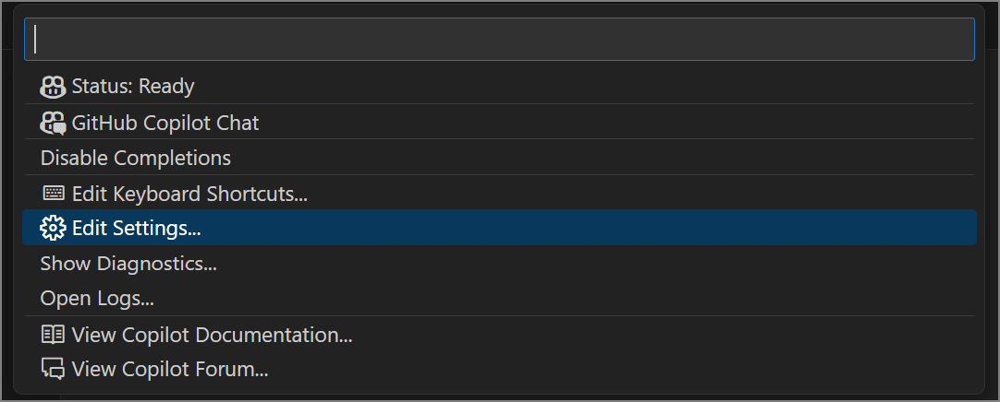
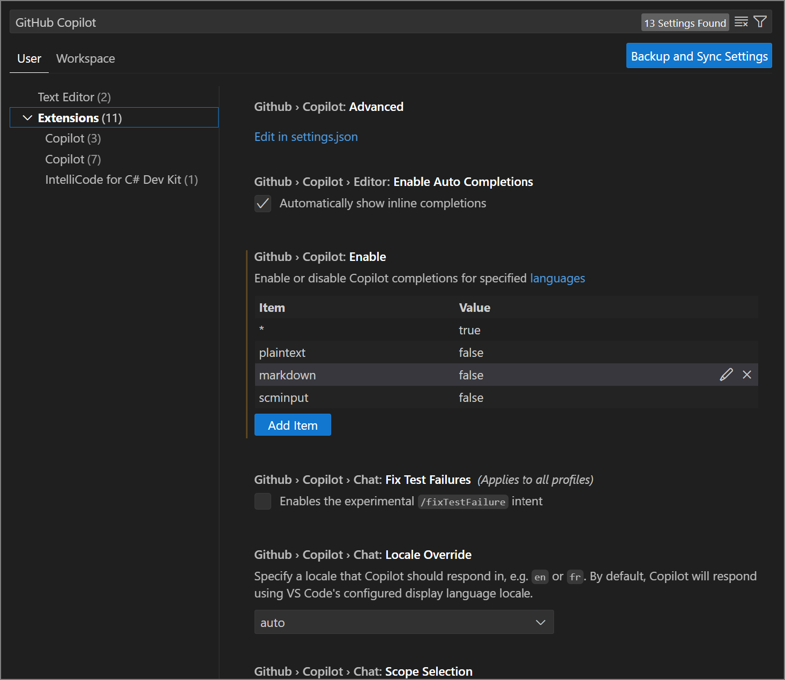
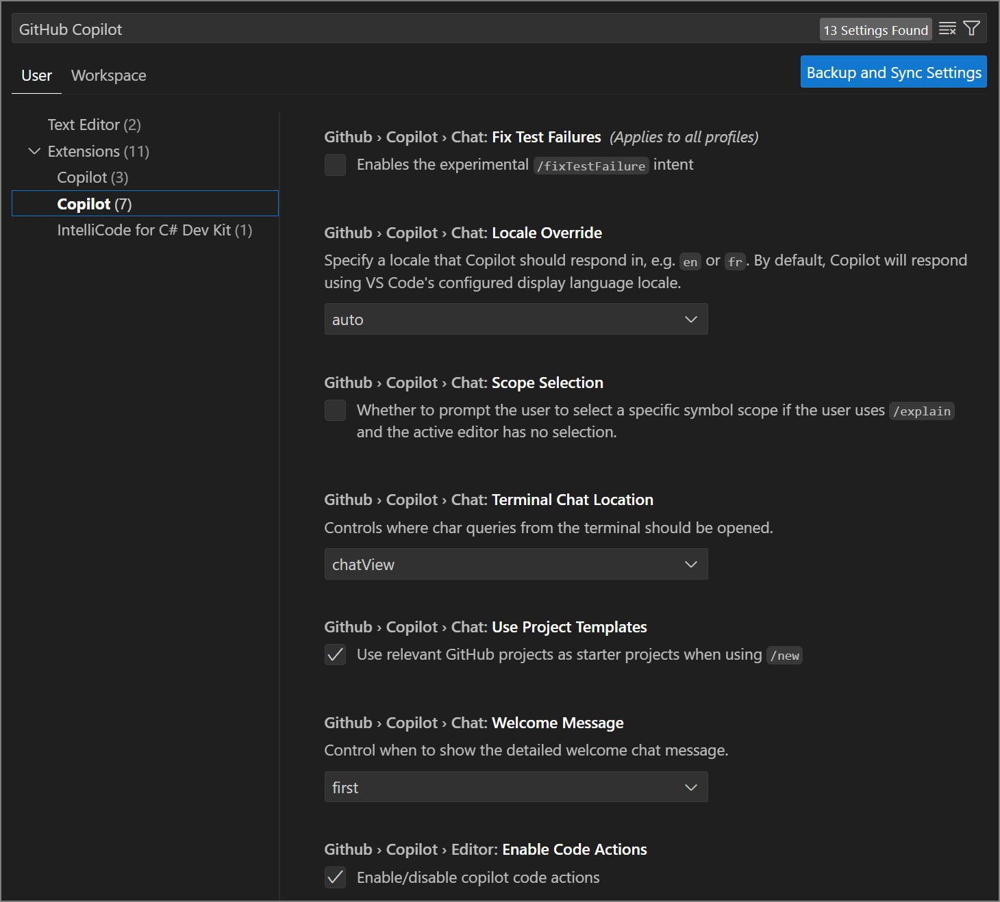
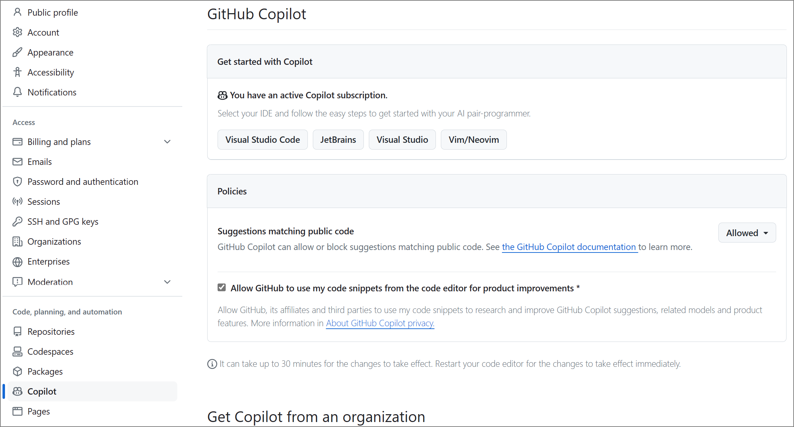

Your GitHub Copilot experience can be customized using configuration settings available through your GitHub.com account and in coding environment. In Visual Studio Code, you can access the settings for GitHub Copilot and Copilot Chat using the GitHub Copilot status menu. The settings allow you to enable or disable GitHub Copilot for specific languages, configure the behavior of GitHub Copilot Chat, and customize the GitHub Copilot experience to suit your preferences. You can also configure GitHub Copilot settings on GitHub.com to manage your GitHub Copilot subscription, configure the retention of prompts and suggestions, and allow or block suggestions matching public code.

## Enable or disable GitHub Copilot

GitHub Copilot is enabled by default when you install the extension in Visual Studio Code. You can disable GitHub Copilot if you prefer not to use it.

To view the enable and disable options for the GitHub Copilot extension, follow these steps:

1. In Visual Studio Code, open the **Extensions** view.

1. In the list of installed extensions, scroll down until you find **GitHub Copilot**.

1. To display a dropdown menu for the GitHub Copilot extension that list Enable and Disable options, select on the gear icon next to GitHub Copilot.

    

    If you want to test the enable/disable options, you can select the disable option. However, be sure to re-enable GitHub Copilot before you continue with this exercise.

## Configure GitHub Copilot and Copilot Chat in Visual Studio Code

The GitHub Copilot extensions are configured with default settings when you install the extensions in Visual Studio Code. You can customize these settings to suit your preferences. For example, you can

Visual Studio Code provides two ways to access the settings for the GitHub Copilot extensions:

- You can use the `Manage` icon to open the Visual Studio Code Settings tab. On the Settings tab, you can select **Extensions** and then select **Copilot**.
- You can use the GitHub Copilot status icon to access the GitHub Copilot status menu and then select **Edit Settings**.

Using the GitHub Copilot status menu to access settings opens the Visual Studio Code Settings tab with settings filtered for GitHub Copilot. Using the status menu is the quickest way to access the settings for the GitHub Copilot extensions.

### Configure GitHub Copilot settings

To view the configuration settings for GitHub Copilot, follow these steps:

1. On the bottom panel of the Visual Studio Code window, to open the GitHub Copilot status menu, select the GitHub Copilot status icon.

    

    The GitHub Copilot status icon indicates whether GitHub Copilot is enabled or disabled. When enabled, the background color of the icon matches the color of the status bar. When disabled, the background color of the icon contrasts with the color of the status bar.

1. In the GitHub Copilot status menu, select **Edit Settings**.

    

1. Take a minute to review the list of available settings.

    

    Notice that the settings for both GitHub Copilot and GitHub Copilot Chat are listed. Also, under the Extensions label on the left, both extensions are labeled as Copilot. The first Copilot extension is for GitHub Copilot and the second is for GitHub Copilot Chat.

1. Under the Extensions label, select the first Copilot extension.
  
    

    Notice that the settings list is now filtered for GitHub Copilot only.

    The settings for GitHub Copilot include the following options:

    - Enable Auto Completions
    - Enable or disable Copilot completions for specified languages

1. Take a minute to review the settings for **Enable or disable Copilot completions for specified languages**.

    Notice that the settings for this option are configured using a list of languages and a value of **true** or **false** to enable or disable GitHub Copilot for each language. By default, GitHub Copilot is enabled for all languages. This setting is specified with the wildcard character `*` on the first row and the value **true**. The subsequent rows specify languages for which GitHub Copilot is enabled or disabled. For example, GitHub Copilot is enabled for **C#**, **JavaScript**, and **Python** and disabled for **Plaintext** and **Markdown**.

1. Under **Enable or disable Copilot completions for specified languages**, select **markdown**.

    Notice that the value for Markdown is set to **false**. This means that GitHub Copilot is disabled for Markdown files.

1. To enable Copilot for Markdown files, select **Edit Item** (pencil icon), select **false**, change the value to **true**, and then select **OK**.

    

    You can now use GitHub Copilot document projects using Markdown files.

1. Under the Extensions label, select the second Copilot extension.

    

    Notice that the settings list is now filtered for GitHub Copilot Chat only.

    The settings for GitHub Copilot Chat include the following options:

    - Enable or disable the **Fix Test Failures** intent. This option is disabled by default.
    - Specify a **Locale Override** for Copilot responses. By default, GitHub Copilot responds using Visual Studio Code's configured display language locale.
    - Enable or disable **Scope Selection**. This option is disabled by default. When enabled, the user is prompted for a scope symbol when the user uses `/explain` in Chat without anything selected in the Editor.
    - Specify the **Terminal Chat Location** for queries that originate in Visual Studio Code's Integrated Terminal. The default setting is the Chat View. The other option is the Quick Chat area.
    - Enable or disable **Use Project Templates**. This option is enabled by default so that GitHub Copilot uses relevant GitHub project templates when the user uses `/new` in Chat.
    - Specify when to show a detailed **Welcome Message** for GitHub Copilot Chat. The default setting is **first** use. The other options are **never** and **always**.
    - Enable or disable **Enable Code Actions**. This option is enabled by default so that GitHub Copilot can provide code actions in the Editor.

    We recommend keeping the default settings for now. This helps to ensure that you have the expected experience when working on the modules in this learning path. When you have completed the training, you can experiment with these settings to customize your experience with GitHub Copilot Chat.

## Configure GitHub Copilot settings on GitHub.com

Your GitHub account settings on GitHub.com include options for configuring GitHub Copilot. These settings are used to manage your GitHub Copilot subscription, configure the retention of prompts and suggestions, and allow or block suggestions matching public code.

GitHub Copilot can be managed through personal accounts with GitHub Copilot Individual or through organization accounts with GitHub Copilot Business.

## Keyboard shortcuts for GitHub Copilot

You can use the default keyboard shortcuts in Visual Studio Code when using GitHub Copilot. Alternatively, you can rebind the shortcuts in the Keyboard Shortcuts editor using your preferred keyboard shortcuts for each specific command.

For more information, see [Rebinding keyboard shortcuts.](https://docs.github.com/copilot/configuring-github-copilot/configuring-github-copilot-in-your-environment)
