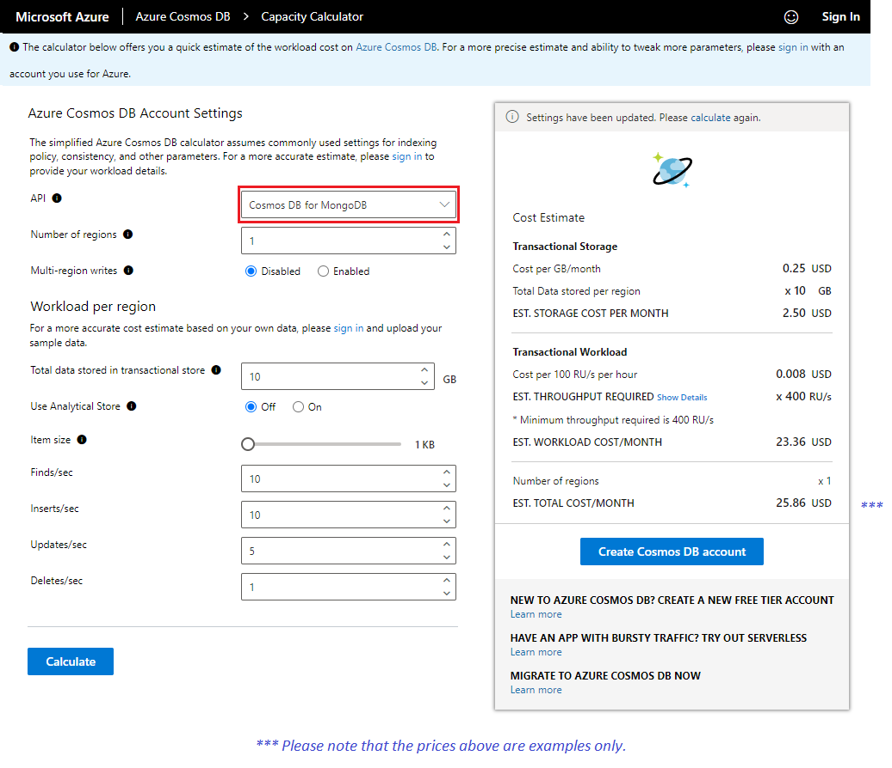
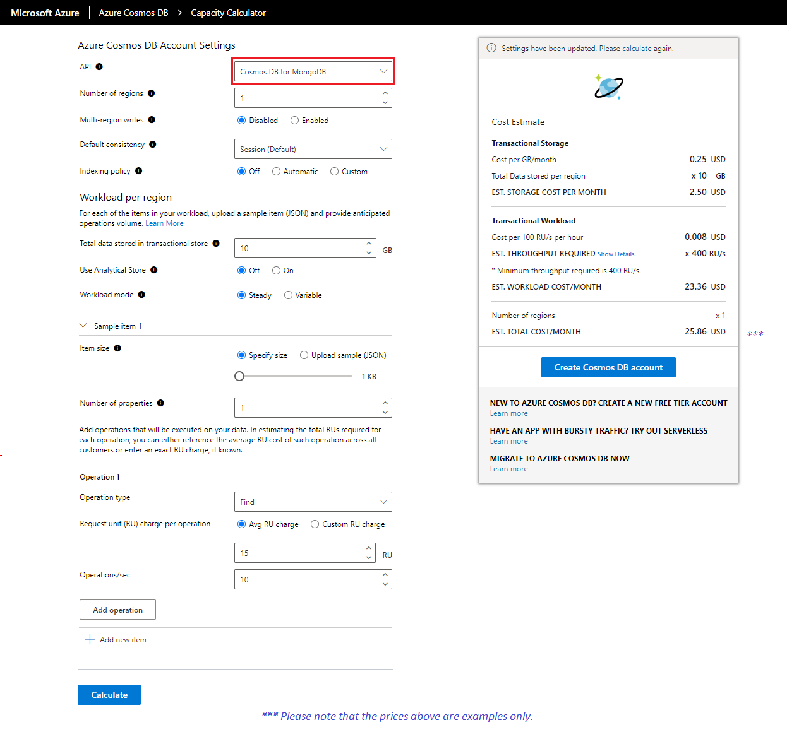

There are a couple of ways you can do capacity planning for your Azure Cosmos DB workloads:

- If you're migrating your existing database workload but you only know your number of vcores and servers in your existing cluster, you'll need to estimate requests units using [vCores or vCPUs](/azure/cosmos-db/convert-vcore-to-request-unit). We'll discuss this topic in more detail under the *migration* module.
- If you know your current database workloads typical request rates, you can estimate request units by using the [Azure Cosmos DB capacity planner][/capacitycalculator/].

To optimize cost and performance in Azure Cosmos DB, we must provide the  databases and collections workloads with the right amount of throughput (Request Units per second or RU/s for short). The [Azure Cosmos DB capacity planner][/capacitycalculator/] will help us estimate the required RU/s for our Azure Cosmos DB API for MongoDB workloads. Let's take a look at this tool in more details.

## Azure Cosmos DB capacity planner

The [*Azure Cosmos DB capacity planner*][/capacitycalculator/] is an online tool that will estimate the amount of RU/s your workload will need based on multiple parameters that define the workload itself. The capacity planner offers two modes, Basic and Advanced.  Let's take a look at the different workload parameters we'll define for each of these modes. 

### Basic mode

The *Basic mode* provides a quick cost and throughput estimation for your workloads.  This mode will require less information about your workload and will assume you're using the default Azure Cosmos DB settings for indexing policy, consistency and other Azure Cosmos DB parameters. 

Let's review the diffent workload parameters and the values to input.

- **API** -	Select *Cosmos DB API for MongoDB*.
- **Number of regions**	- Azure Cosmos DB API for MongoDB is available in all Azure regions. Select the number of regions required for your workload.
- **Multi-region writes** - If *Enabled*, your application can read and write to any Azure region. If *Disabled*, your application can write data to only a single region, but can read from any selected region. 
    - Enable it when you expect to have an active-active workload that requires low latency writes in different regions.
    - Multi-region writes guarantees 99.999% read and write availability. 
    - Multi-region writes require more throughput when compared to the single write regions.
- **Total data stored in transactional store** - Total estimated data stored (GB) in the transactional store *in a single region*.
- **Use analytical store** - Choose *On* if you want to use Synapse analytical store. 
    - If set to *On*, enter the **Total data stored in analytical store**, which represents the estimated data stored (GB) in the analytical store *in a single region*.
- **Item size** - The estimated average size of the documents (1 KB - 2 MB).
- **Finds/sec** - Number of find operations expected per second per region.
- **Inserts/sec** - Number of insert operations expected per second per region.
- **Updates/sec** - Number of update operations expected per second per region. 
    - When you choose automatic indexing, the estimated RU/s for the update operation is calculated as one property being changed per an update.
- **Deletes/sec** - Number of delete operations expected per second per region.

Once you select **Calculate**, the **Cost Estimate** tab will show the total cost for storage and provisioned throughput.  Notice that by default it will show you the **EST. THROUGHPUT REQUIRED**, but you can select **Show Details** to see the estimated cost of the different types of CRUD and query requests.

> [!TIP] 
> Don't forget to select **Calculate** again if you change any of the parameters to get a new estimation.

### Advanced mode

The *Advanced mode* requires a more detailed view of your workload. You'll need to provide more settings that will yield a more precise estimate on the cost and throughput of your workload. To choose the Advanced mode of the capacity planner, you'll need to sign in to the tool with an account you use to connect to Azure. You can find the **Sign In** option on the upper right hand corner of the tool. 

Once you signed in, you'll notice a more detailed set of parameters than the Basic mode. Let's review the diffent workload parameters and the values to input.

- **API** -	Select *Cosmos DB API for MongoDB*.
- **Number of regions**	- Azure Cosmos DB API for MongoDB is available in all Azure regions. Select the number of regions required for your workload.
- **Multi-region writes** - If *Enabled*, your application can read and write to any Azure region. If *Disabled*, your application can write data to only a single region, but can read from any selected region. 
    - Enable it when you expect to have an active-active workload that requires low latency writes in different regions.
    - Multi-region writes guarantees 99.999% read and write availability. 
    - Multi-region writes require more throughput when compared to the single write regions.
- **Default consistency** - Azure Cosmos DB API for MongoDB supports 4 [consistency levels](/azure/cosmos-db/mongodb/consistency-mapping), to allow developers to balance the tradeoff between consistency, availability, and latency tradeoffs. We'll discuss consistency levels in more details in the *Replication, Monitor and Optimize* module.
 - **Indexing policy** - This setting defines how your workload plans to use its indexes. We'll discuss indexes in more detail in the *Design MongoDB Databases for Azure Cosmos DB* module. To learn more, see [index management](azure/cosmos-db/mongodb/mongodb-indexing) in API for MongoDB.
    - If you choose *Off* option, none of the properties are indexed that results in the lowest RU charge for writes. You'll need to query using the _id field and the shard key for every query, any other query will scan all partitions.
    - If you choose the *Automatic* option, will index all fields/properties in your documents that in turn allows flexible and efficient queries.
    - If you choose the *Custom* option, you can define the properties that are indexed with multi-key indexes or compound indexes. 
        - You can enter the number of properties indexed later in the form. 
- **Total data stored in transactional store** - Total estimated data stored (GB) in the transactional store *in a single region*.
- **Use analytical store** - Choose *On* if you want to use Synapse analytical store. 
    - If set to *On*, enter the **Total data stored in analytical store**, which represents the estimated data stored (GB) in the analytical store *in a single region*.
- **Workload mode** - Select if you expect your workload to be *Steady* (constant), or *Variable*.
    - Select *Steady* if you expect the workload volume to be constant.
    - Select *Variable* if your workload changes over time. For example, a retail company whose sales drastically increase on weekend and/or holiday seasons.
        - When *Variable* is selected, Enter the **Percentage of time at peak**.
        - With peak and off-peak intervals, you can optimize your cost by programmatically scaling your provisioned throughput up and down accordingly.
- **Item size** - The estimated average size of the documents (1 KB - 2 MB).
    - You can also Upload sample (JSON) document for a more accurate estimate.
    - If your workload has multiple types of items (with different JSON content) in the same container, you can upload multiple JSON documents and get the estimate. Use the Add new item button to add multiple sample JSON documents.
- **Operation type** - The type of operation such as Find, Aggregate, Modify etc.
- **Request unit (RU) charge per call** - The estimated RU/s charge to execute the selected operation type.
- **Calls/sec per region** - Number selected operation types executed per second per region.

Once you select **Calculate**, the **Cost Estimate** tab will show the total cost for storage and provisioned throughput.  Notice that by default it will show you the **EST. THROUGHPUT REQUIRED**, but you can select **Show Details** to see the estimated cost of the different types of CRUD and query requests.

> [!TIP]
> Don't forget to select **Calculate** again if you change any of the parameters to get a new estimation.

> [!NOTE]
> All prices are shown in US dollars. Refer to the [Azure Cosmos DB pricing page][/pricing/details/cosmos-db/] to see all rates by region.

[/capacitycalculator/]: https://cosmos.azure.com/capacitycalculator/
[/pricing/details/cosmos-db/]: https://azure.microsoft.com/pricing/details/cosmos-db/
