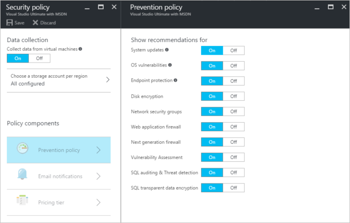
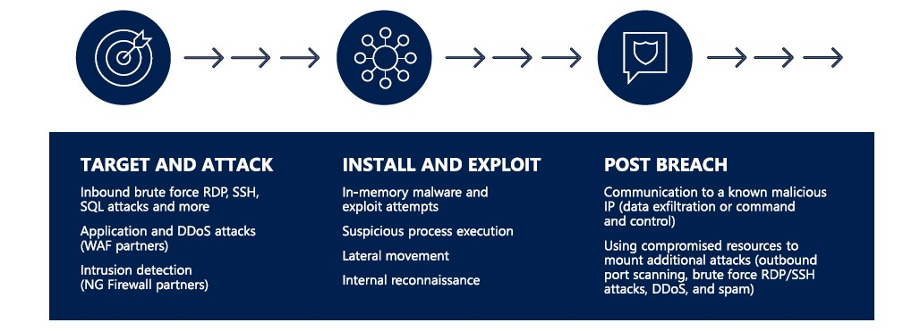

Azure Security Center helps you prevent, detect, and respond to threats with increased visibility into and control over the security of your Azure resources. Security Center helps you safeguard VM data in Azure by providing visibility into the security settings of your VMs. When Security Center helps safeguard your VMs, the following capabilities are available:

* OS security settings with the recommended configuration rules

* System security updates and critical updates that are missing

* Endpoint protection recommendations

* Disk encryption validation

* Vulnerability assessment and remediation

* Threat detection

**Set security policies to manage vulnerabilities for VMs**

You need to enable data collection so that Azure Security Center can gather the information it needs to provide recommendations and alerts based on the security policy you configure. In the following figure, data collection has been turned on.

> [!div class="mx-imgBorder"]
> 

A security policy defines the set of controls recommended for resources within the specified subscription or resource group. Before enabling a security policy, you need to enable data collection. Security Center collects data from your VMs to assess their security state, provide security recommendations, and alert you to threats. In Security Center, you define policies for your Azure subscriptions or resource groups according to your company’s security needs and the types of applications or sensitivity of data in each subscription.

Security Center analyzes the security state of your Azure resources. When Security Center identifies potential security vulnerabilities, it creates recommendations. The recommendations guide you through the process of configuring the needed controls.

After setting a security policy, Security Center analyzes the security state of your resources to identify potential vulnerabilities. It depicts recommendations in a table format, where each line represents one recommendation. The table [here](/azure/governance/policy/how-to/get-compliance-data) has examples of recommendations for Azure VMs and what each will do if you apply it. When you select a recommendation, Security Center provides information about how you can implement that recommendation.

 

Security Center also monitors and analyzes the enabled security policies to identify potential vulnerabilities. On the **Resource security health** blade, you can check the security state of your resources along with any issues. When you select **Virtual machines** in **Resource security health**, the **Virtual machines** blade opens with recommendations for your VMs, as the following figure depicts.

> [!div class="mx-imgBorder"]
> 

Security Center threat detection works by automatically collecting security information from your Azure resources, the network, and connected partner solutions. It analyzes this information, often correlating information from multiple sources, to identify threats. Security Center prioritizes alerts along with recommendations on how to remediate the threats.

> [!div class="mx-imgBorder"]
> 

 

Security Center employs advanced security analytics that go far beyond signature-based approaches. Security Center takes advantage of breakthroughs in big data and machine learning technologies to evaluate events across the entire cloud fabric—detecting threats that would be impossible to identify via manual approaches and predicting the evolution of attacks. These security analytics include:

* Integrated threat intelligence. Seeks known malicious hackers by taking advantage of global threat intelligence from Microsoft products and services, the Microsoft Digital Crimes Unit, the Microsoft Security Response Center, and external feeds.

* Behavioral analytics. Applies known patterns to discover malicious behavior.

* Anomaly detection. Uses statistical profiling to build a historical baseline. It sends alerts on deviations from established baselines that conform to potential attack vectors.

 

Using these analytics, Security Center can help disrupt the kill chain by adding detection in different phases of the kill chain, as the following figure depicts.

> [!div class="mx-imgBorder"]
> 

The preceding figure depicts some common alerts for each phase, and several more [types of alerts](/azure/governance/policy/overview) exist. Security Center also correlates alerts and creates a [security incident](/azure/virtual-network/security-overview). Security incidents give you a better view of which alerts belong to the same attack campaign.
