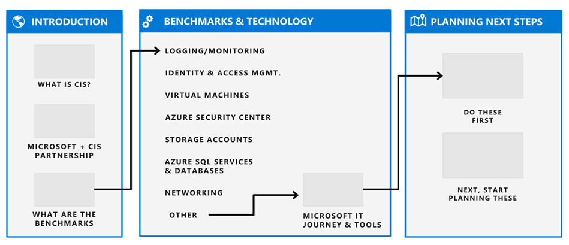

The Azure Security Benchmark includes a collection of high-impact security recommendations you can use to help secure the services you use in Azure:
**Security controls**: These recommendations are generally applicable across your Azure tenant and Azure services. Each recommendation identifies a list of stakeholders that are typically involved in planning, approval, or implementation of the benchmark.
**Service baselines**: These apply the controls to individual Azure services to provide recommendations on that service’s security configuration.

Microsoft's cybersecurity group in conjunction with the Center for Internet Security (CIS) has developed best practices to help establish security baselines for the Azure platform. A security baseline is:

+ A set of basic security objectives which must be met by any given service or system. 
+ Establishes what you need to do and not how to do it. 

The [CIS Microsoft Azure Foundations Security Benchmark](/azure/governance/blueprints/samples/cis-azure-1-3-0) guide provides prescriptive guidance for establishing a secure baseline configuration for Azure. This guide was tested against the listed Azure services as of March 2018. The scope of this benchmark is to establish the foundational level of security for anyone adopting Azure.

## Create a platform security baseline

A variety of security standards can help cloud service customers to achieve workload security when using cloud services. The following are recommended technology groupings to help create secure cloud-enabled workloads. These recommendations should not be considered an exhaustive list of all possible security configurations and architectures but just as a starting point.

> [!div class="mx-imgBorder"]
> 

CIS has two implementation levels, and several categories of recommendations.

**Level 1** - Recommended minimum security settings

+ These should be configured on all systems.
+ These should cause little or no interruption of services nor reduced functionality.
    
**Level 2** - Recommendations for highly secure environments

+ These might result in reduced functionality.

The following table provides the categories and number of recommendations made for each.

| Technology group | Description | # of recommendations |
|------------------|-------------|----------------------|
| **Identity & Access Management (IAM)** | Recommendations related to IAM policies | 23 |
| **Azure Security Center** | Recommendations related to the configuration and use of Azure Security Center | 19 |
| **Storage accounts** | Recommendations for setting storage account policies | 7 |
| **Azure SQL Database** | Recommendations for helping secure Azure SQL databases | 8 |
| **Logging and monitoring** | Recommendations for setting logging and monitoring policies for your Azure subscriptions | 13 |
| **Networking** | Recommendations for helping to securely configure Azure networking settings and policies | 5 |
| **VMs** | Recommendations for setting security policies for Azure compute services - specifically VMs | 6 |
| **Other** | Recommendations regarding general security and operational controls, including those related to Azure Key Vault and resource locks | 3 |
| **Total recommended** | | 84 |

