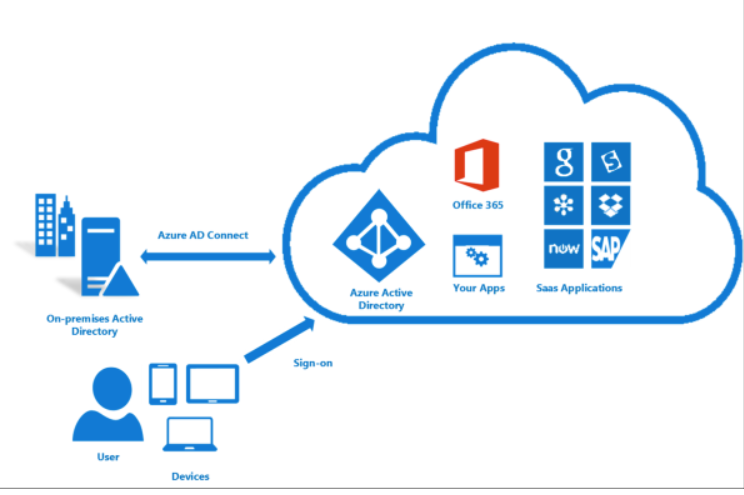

Azure AD Connect will integrate your on-premises directories with Azure Active Directory. This allows you to provide a common identity for your users for Microsoft 365, Azure, and SaaS applications integrated with Azure AD.

> [!div class="mx-imgBorder"]
> 

Azure AD Connect provides the following features:

+ **Password hash synchronization**. A sign-in method that synchronizes a hash of a users on-premises AD password with Azure AD.

+ **Pass-through authentication**. A sign-in method that allows users to use the same password on-premises and in the cloud, but doesn't require the additional infrastructure of a federated environment.

+ **Federation integration**. Federation is an optional part of Azure AD Connect and can be used to configure a hybrid environment using an on-premises AD FS infrastructure. It also provides AD FS management capabilities such as certificate renewal and additional AD FS server deployments.

+ **Synchronization**. Responsible for creating users, groups, and other objects. As well as, making sure identity information for your on-premises users and groups is matching the cloud. This synchronization also includes password hashes.

+ **Health Monitoring**. Azure AD Connect Health can provide robust monitoring and provide a central location in the Azure portal to view this activity. 

When you integrate your on-premises directories with Azure AD, your users are more productive because there's a common identity to access both cloud and on-premises resources. However, this integration creates the challenge of ensuring that this environment is healthy so that users can reliably access resources both on premises and in the cloud from any device. 

> [!div class="mx-imgBorder"]
> 

**Azure Active Directory (Azure AD) Connect Health** provides robust monitoring of your on-premises identity infrastructure. It enables you to maintain a reliable connection to Microsoft 365 and Microsoft Online Services. This reliability is achieved by providing monitoring capabilities for your key identity components. Also, it makes the key data points about these components easily accessible.
Azure AD Connect Health helps you:

*	Monitor and gain insights into AD FS servers, Azure AD Connect, and AD domain controllers.   

*	Monitor and gain insights into the synchronizations that occur between your on-premises AD DS and Azure AD.   

*	Monitor and gain insights into your on-premises identity infrastructure that is used to access Microsoft 365 or other Azure AD applications  

With Azure AD Connect the key data you need is easily accessible. You can view and act on alerts, setup email notifications for critical alerts, and view performance data. 
 
>[!IMPORTANT]
>Using AD Connect Health works by installing an agent on each of your on-premises sync servers.
