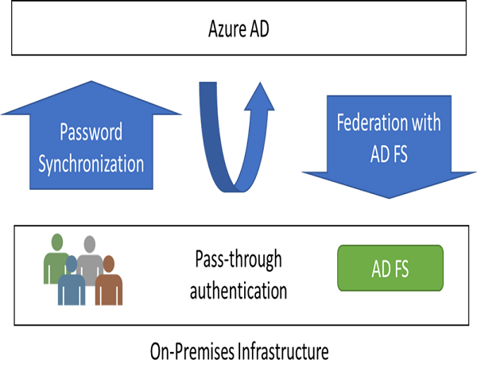

Choosing an Azure AD Authentication method is important as it is one of the first important decisions when moving to the cloud as it will be the foundation of your cloud environment and is difficult to change at a later date. 

You can choose **cloud authentication** which includes: Azure AD password hash synchronization and Azure AD Pass-through Authentication. You can also choose **federated authentication** where Azure AD hands off the authentication process to a separate trusted authentication system, such as on-premises Active Directory Federation Services (AD FS), to validate the user’s password.

> [!div class="mx-imgBorder"]
> 

## Summary

* Do you need on-premises Active Directory integration? If the answer is No, then you would use Cloud-Only authentication.  

* If you do need on-premises Active Directory integration, then do you need to use cloud authentication, password protection, and your authentication requirements are natively supported by Azure AD? If the answer is Yes, then you would use **Password Hash Sync + Seamless SSO**.

* If you do need on-premises Active Directory integration, but you do not need to use cloud authentication, password protection, and your authentication requirements are natively supported by Azure AD, then you would use **Pass-through Authentication Seamless SSO**.

* If you need on-premises Active Directory integration, have an existing federation provider and your authentication requirements are NOT natively supported by Azure AD, then you would use **Federation** authentication.

