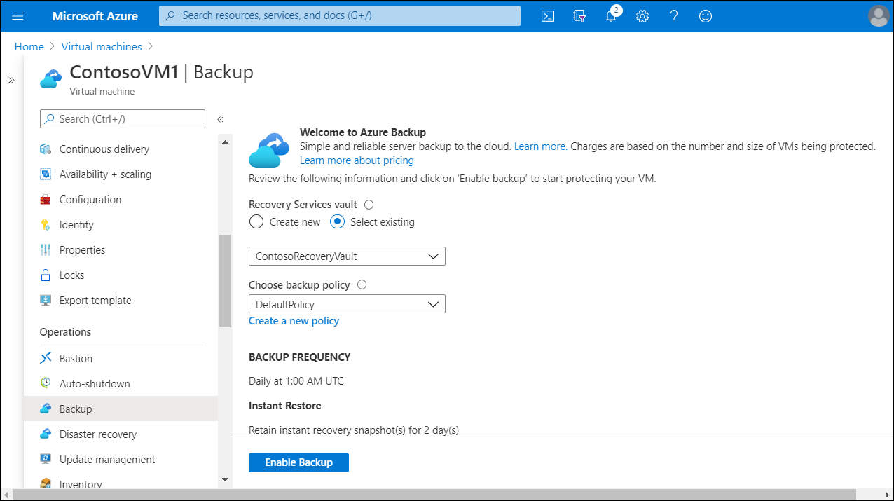
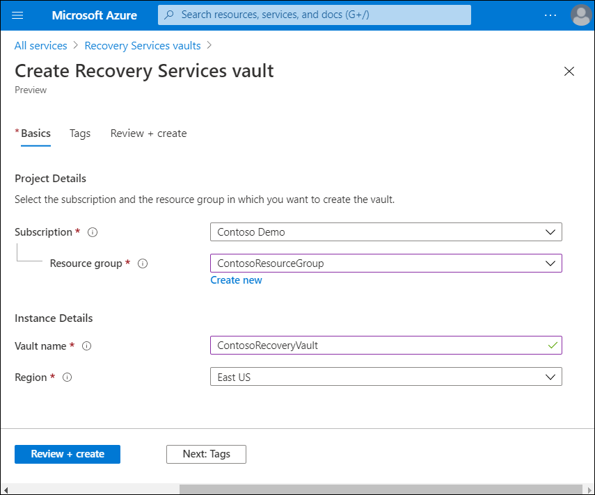

<!-- 7 minutes minutes to read -->

Contoso could use Recovery Services vaults to keep backup data for their various Azure services, such as IaaS VMs (Linux or Windows) and Azure SQL databases. Recovery Services vault is a storage entity in Azure that houses data, which typically is copies of data, or configuration information for VMs, workloads, servers, or workstations.

## What is Recovery Services vault?

Recovery Services vaults make it easier to organize your backup data, while minimizing management overhead. A *Recovery Services vault* is a storage entity that stores the recovery points created over time. It also contains the backup policies that are associated with protected items. Recovery Services vaults support DPM, Windows Server, Azure Backup Server, and more.

> [!TIP]
> Within an Azure subscription, you can create up to 25 Recovery Services vaults per region.

Creating and managing Recovery Services vaults in the Azure portal is straightforward because the Backup service is integrated into the Azure **Settings** menu. This integration means you can create or manage a Recovery Services vault in the context of the target service.

For example, to review the recovery points for a VM, select the VM, and then within the **Operations** heading, select **Backup**. The backup information specific to that VM displays. You don't need to remember the name of the Recovery Services vault that stores the recovery points, you can access this information from the VM.

If multiple servers are protected using the same Recovery Services vault, it might be more logical to use the Recovery Services vault itself. You can search for all Recovery Services vaults in the subscription, and then select one from the list.

## Create a Recovery Services vault

To create a Recovery Services vault, complete the following steps.

1. Sign in to your subscription in the Azure portal.
2. In the navigation pane, select **All services**.
3. In the **All services** dialog box, enter **Recovery Services**. The list of resources filters according to your input.
4. From the list of resources, select **Recovery Services vaults**. The list of Recovery Services vaults in the subscription displays.
5. On the **Recovery Services vaults** dashboard, select **Add**.
6. When the **Recovery Services vault** dialog box opens, provide values for the following settings:

   - **Subscription**. Select the subscription to use.
   - **Resource group**. Use an existing resource group or create a new one. To find the list of available resource groups in your subscription, select **Use existing**, and then select a resource from the drop-down list.
   - **Create new**. To create a new resource group, select **Create new**, and then enter a name for the new resource group.
   - **Vault name**. Enter a name to identify the vault. The name must be unique to the Azure subscription.
   - **Region**. Select the geographic region for the vault. To create a vault to protect any data source, the vault must be in the same region as the data source.

> [!TIP]  
> If you're not sure of the location of your data source, close the dialog box, then go to the list of your resources in the Azure portal. If you have data sources in multiple regions, create a Recovery Services vault for each region. Create the vault in the first location before you create the vault for another location. you don't need to specify storage accounts to store the backup data. The Recovery Services vault and Azure Backup does this automatically.

7. When you're ready to create the Recovery Services vault, select **Create**.

> [!TIP]
> It can take a while to create the Recovery Services vault. Monitor the status notifications in the **Notifications** area. After your vault is created, it's added to the list of Recovery Services vaults. If your vault has not been added, select **Refresh**.

## Additional reading

You can learn more by reviewing the following document:

- [Managing your Recovery Services vaults in the portal](https://aka.ms/recovery-services-vault-overview?azure-portal=true)
