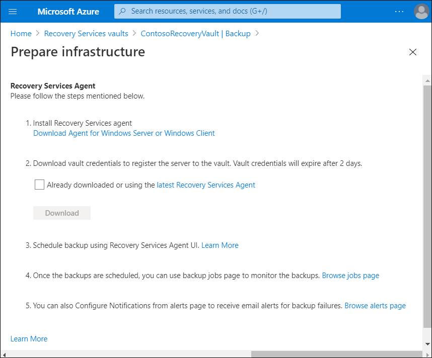
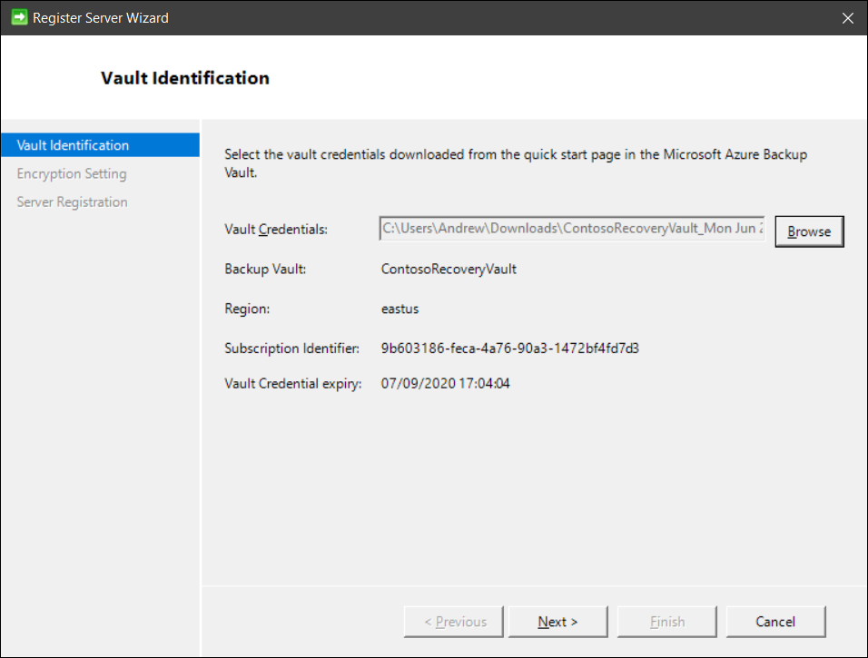
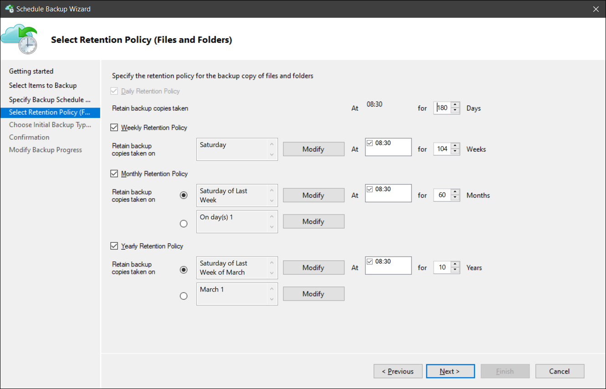
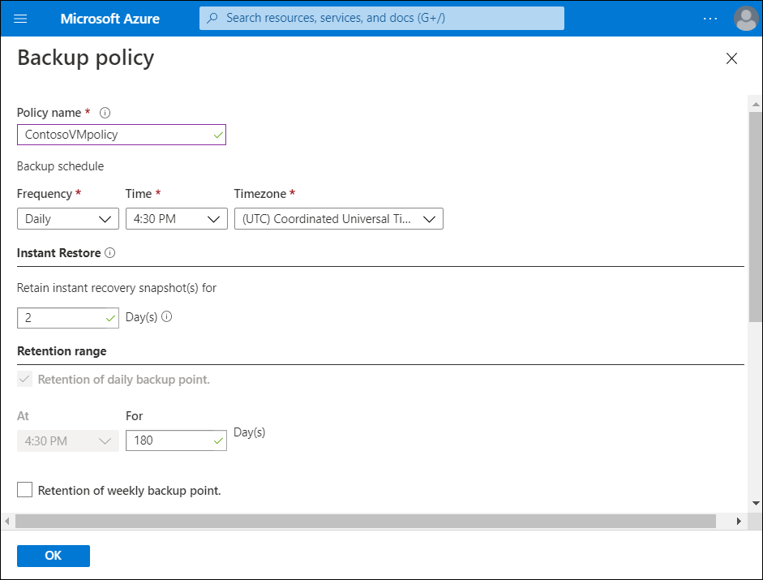

<!-- 10 minutes minutes to read -->

The Contoso IT Team wants control over its backup policy. They can use the Microsoft Azure Recovery Services (MARS) agent to configure this policy. The team can specify when to take snapshots of their data to create recovery points. They can also specify how long to keep recovery points.

## What is the MARS agent?

Azure Backup uses the MARS agent to back up files, folders, and system state from on-premises machines and Azure VMs. Those backups are stored in a Recovery Services vault in Azure. You can run the agent directly on on-premises Windows machines. These machines can back up directly to a Recovery Services vault in Azure. You can also back up Azure VMs that run Windows side by side with the Azure VM backup extension. The agent backs up specific files and folders on the VM.

> [!CAUTION]
> Azure Backup doesn't automatically take daylight saving time (DST) into account. This default could cause some discrepancy between the actual time and the scheduled backup time.

## Installing the MARS agent

You can download the MARS agent direct from the Azure portal using the following procedure:

1. In your Recovery Services vault, in **Getting Started**, select **Backup**.
2. Under **Where is your workload running?**, select **On-premises**. Select this option even if you want to install the MARS agent on an Azure VM.
3. Under **What do you want to back up?**, select **Files and folders**. You can also select **System State**. Many other options are available, but these options are supported only if you're running a secondary backup server.
4. Select **Prepare Infrastructure**.
5. For **Prepare infrastructure**, in the **Install Recovery Services agent** section, download the MARS agent.

6. In the download menu, select **Save**. The **MARSagentinstaller.exe** file is saved automatically to your **Downloads** folder.
7. Select **Already download or using the latest Recovery Services Agent**, and then selecting **Download** to download the vault credentials.
8. Select **Save**. The file is downloaded to your Downloads folder. You can't open the vault credentials file, because it is not a executable or text file.

You can install the MARS agent on your computer using the following procedure. Run the **MARSagentinstaller.exe** file on the machines that you want to back up and complete the registration process.

1. In the **MARS Agent Setup Wizard**, select **Installation Settings**. 
2. Choose where to install the agent and select a location for the cache, taking into account:
   - Azure Backup uses the cache to store data snapshots before sending them to Azure.
   - The cache location should have free space equal to at least 5 percent of the size of the data you'll back up.
3. After selecting the locations, select **Next**.
4. For **Proxy Configuration**, specify how the agent that runs on the Windows machine will connect to the internet, keeping in mind:
   - If you use a custom proxy, specify any necessary proxy settings and credentials.
   - Remember that the agent needs access to specific URLs.
5. After selecting the connection method, select **Next**.
6. For **Installation**, review the prerequisites, and then select **Install**.
7. After the agent is installed, select **Proceed to Registration**.
8. In the **Register Server Wizard**, on the **Vault Identification** blade, browse to and select the credentials file that you downloaded.

9. Select **Next**.
10. On the **Encryption Setting** page, specify a passphrase that will be used to encrypt and decrypt backups for the machine:
   - Save the passphrase in a secure location. You will need it to restore a backup.
   - If you lose or forget the passphrase, Microsoft can't help you recover the backup data.
11. Select **Finish**.

The agent is now installed, and your machine is registered to the vault. You're now ready to configure and schedule your backup.

## Create a backup policy

To create a backup policy, use the following procedure:

1. After you download and register the MARS agent, open the agent's console. You can find it by searching your machine for **Microsoft Azure Backup**.
2. Under **Actions**, select **Schedule Backup**.
3. In the **Schedule Backup Wizard**, select **Getting started**, and then select **Next**.
4. Under **Select Items to Back up**, select **Add Items**.
5. In the **Select Items** box, select items to back up, and then select **OK**.
6. On the **Select Items to Back Up** page, select **Next**.
7. On the **Specify Backup Schedule** page, specify when to create daily or weekly backups, and then select **Next**:
   - A recovery point is created when a backup is taken.
   - The number of recovery points created in your environment depends on your backup schedule.
   - You can schedule up to three daily backups per day. 
   - You can run weekly backups too. 
8. On the **Select Retention Policy** page, specify how to store historical copies of your data:
   - Retention settings specify which recovery points to store and how long to store them.
   - For a daily retention setting, you indicate that at the time specified for the daily retention the latest recovery point will be retained for the specified number of days. For a monthly retention policy, you could indicate that the recovery point created on the 30th of every month should be stored for 12 months.
   - Retention for daily and weekly recovery points usually coincide with the backup schedule. When the schedule triggers a backup, the recovery point that the backup creates is stored for the duration that the daily or weekly retention policy specifies.
1. After specifying how to store the copies, select **Next**.

9. On the **Choose Initial Backup Type** page, decide whether you want to perform the initial backup over the network, or use an offline backup. To perform the initial backup over the network, select **Automatically over the network**, and then select **Next**.
10. On the **Confirmation page**, review the information, and then select **Finish**.
11. After the wizard finishes creating the backup schedule, select **Close**.

## Create a policy through the Azure portal

You can also create a policy through the Azure portal. In this example, the administrator has selected **Backup** in the **Operations** section on a specific VM, in this case, **ContosoVM1**. The administrator can select the **Create a new policy** link in the **Choose backup policy** section. On the **Backup policy** blade, displayed in the screenshot, the administrator can then define the following properties:

- Policy name
- Backup schedule
- Instant Restore settings
- Retention range

