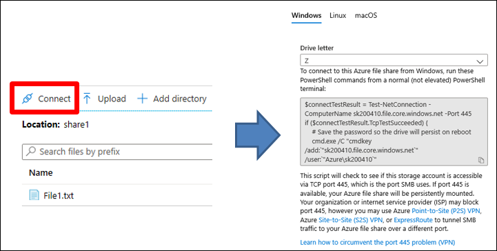
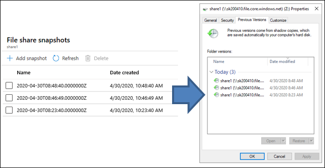

Users at Contoso will likely connect to Azure Files using the SMB protocol, although NFS is also supported. SMB uses TCP port 445 for establishing connections. Many companies and internet service providers block that port, which is a common reason why users can't access Azure Files. If unblocking port 445 isn't an option, you can still access Azure Files by first establishing a point-to-site (P2S) virtual private network (VPN), a site-to-site (S2S) VPN, or by using an Azure ExpressRoute connection to Azure. Alternatively, the company can use Azure File Sync to sync an Azure file share to an on-premises file server, which users can always access.

## Azure Storage firewalls and virtual networks

Azure Storage, which includes Azure Files, provides a layered security model. This model enables you to help secure and control the level of access to your storage accounts based on the type and subset of networks from where the request originates. By default, a storage account firewall allows access from all networks, but you can modify its configuration to allow access only from specified IP addresses, IP ranges, or from a list of subnets in an Azure virtual network. Firewall configuration also enables you to select trusted Azure platform services to access a storage account securely.

In addition to the default public endpoint, storage accounts (which include Azure Files) provide the option to have one or more private endpoints. A *private endpoint* is an endpoint that's only accessible within an Azure virtual network. When you create a private endpoint for a storage account, the storage account gets a private IP address from within the address space of the virtual network, similar to how an on-premises file server or a NAS device receives an IP address from the dedicated address space of an on-premises network. This secures all traffic between the virtual network and the storage account over a private link.

> [!TIP]
> You can also use the storage account firewall to block all access through a public endpoint when using private endpoints.

## Connecting to an Azure file share

To use an Azure file share with the Windows OS, you must either mount it—which means assigning it a drive letter or mount point path—or access it through its Universal Naming Convention (UNC) path. The UNC path includes the Azure storage account name, the `file.core.windows.net` domain suffix, and the share name. For example, if the Azure storage account is named **storage1** and the share name is **share1**, the UNC path would be `\\storage1.file.core.windows.net\share1`.

If user-identity authentication is enabled for the storage account and you're connecting to an Azure file share from a domain-joined Windows device, you don't need to manually provide any credentials. Otherwise, you must provide credentials. You can use `(AZURE\*<storage account name>*)` as the user name, and the storage access key as a password. The same credentials are used if you connect to an Azure file share by using the script that the Azure portal provides.

> [!CAUTION]
> Be aware that a storage access key provides unrestricted access to an Azure file share and that user-identity authentication should be used instead when possible.

## Azure file share snapshots

In Windows Server, you can create a shadow copy of a volume, which captures the volume state at that point in time. You can later access the shadow copy over a network by using the File Explorer **Previous Versions** feature. Similar functionality is available with Azure file share snapshots. A *share snapshot* is a point-in-time, read-only copy of the Azure file share data.

You create a share snapshot at the file share level. You can then restore individual files from the Azure portal or from File Explorer, where you can also restore an entire share. You can have up to 200 snapshots per share, which enables you to restore files to different point-in time versions. If you delete a share, all its snapshots are also deleted.

Share snapshots are incremental. Only the data that has changed after your most recent share snapshot is saved. This minimizes the time required to create the share snapshot and saves on storage and storage costs.

Use snapshots in the following situations:

- As protection against accidental deletions or unintended changes. A share snapshot contains point-in-time copies of the share's files. If share files are unintentionally modified, you can use share snapshots to review and restore previous versions of the files.
- For general backup purposes. After you create a file share, you can periodically create a share snapshot. This enables you to maintain previous versions of data that can be used for future audit requirements or disaster recovery.
