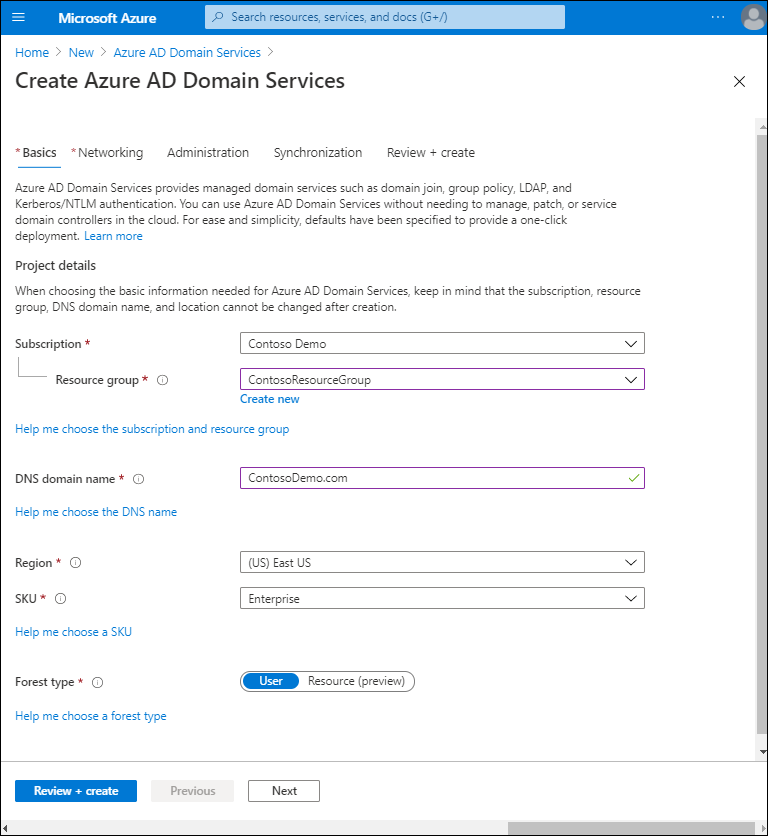
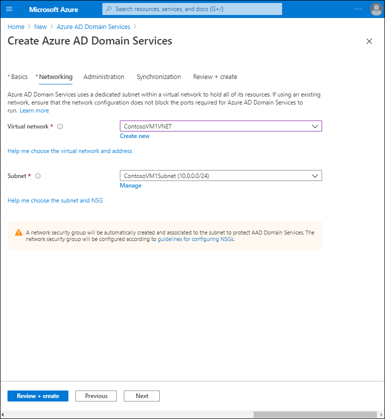

Organizations that use cloud-only Azure AD can enable Azure AD DS for an Azure VNet, and then get a new managed domain. Users and groups in Azure AD are available in the newly created domain, which has directory services similar to on-premises AD DS, including Group Policy, Kerberos protocol, and LDAP support.

You can join Azure VMs running Windows to the newly created domain, and you can manage them by using basic Group Policy settings. By enabling Azure AD DS, credential hashes that are required for NTLM and Kerberos authentication are stored in Azure AD.

Because Contoso is a hybrid organization, they can integrate their identities from their on-premises AD DS with Azure AD DS by using Azure AD Connect. Users in hybrid organizations can have the same experience when accessing domain-based resources in an on-premises infrastructure, or when accessing resources from VMs that run in an Azure virtual network that integrates with Azure AD DS.

## Implement Azure AD DS

To implement, configure, and use Azure AD DS you must have an Azure AD tenant created on an Azure AD subscription. Additionally, to use Azure AD DS, you must have password hash synchronization deployed with Azure AD Connect. This is necessary because Azure AD DS provides NTLM and Kerberos authentication, so users’ credentials are required.

When you enable Azure AD DS for your tenant, you have to select the DNS domain name that you will use for this service. You also need to select the domain that you will synchronize with your on-premises environment.

> [!CAUTION]
> You should not use an existing Azure or on-premises DNS domain name space.

The following table describes the available DNS domain name options.

|Option|Description|
|----|----|
|Built-in domain name|By default, the directory's built-in domain name is used (a .onmicrosoft.com suffix). If you want to enable secure LDAP access to the managed domain over the internet, you cannot create a digital certificate to secure the connection with this default domain. Microsoft owns the .onmicrosoft.com domain, so a Certificate Authority (CA) won't issue a certificate.|
|Custom domain names|The most common approach is to specify a custom domain name, typically one that you already own and is routable. When you use a routable, custom domain, traffic can correctly flow as needed to support your applications.|
|Non-routable domain suffixes |We generally recommend that you avoid a non-routable domain name suffix, such as contoso.local. The .local suffix is not routable and can cause issues with DNS resolution.|

> [!TIP]
> You might need to create additional DNS records for other services in your environment or conditional DNS forwarders between existing DNS namespaces in your environment.

During implementation, you must also select which type of forest to provision. A *forest* is a logical construct used by AD DS to group one or more domains. There are two forest types, as described in the following table.

|Forest type|Description|
|----|----|
|User|This type of forest synchronizes all objects from Azure AD, including any user accounts created in an on-premises AD DS environment.|
|Resource|This type of forest synchronizes only users and groups created directly in Azure AD.|

Next, you will need to choose the Azure location in which the managed domain should be created. If you choose a region that supports availability zones, the Azure AD DS resources are distributed across zones for additional redundancy. 

> [!NOTE]
> You are not required to configure Azure AD DS to be distributed across zones. The Azure platform automatically manages the zone distribution of resources.

You must also select a VNet to which you will connect this service. Because Azure AD DS provides functionalities for on-premises resources, you must have a VNet between your local and Azure environments.

During provisioning, Azure AD DS creates two enterprise applications in your Azure AD tenant. These applications are needed to service your managed domain, and therefore you should not delete these applications. The enterprise applications are:

- Domain Controller Services.
- AzureActiveDirectoryDomainControllerServices.

After you deploy the Azure AD DS instance, you must configure the VNet to enable other connected VMs and applications to use the managed domain. To provide this connectivity, you must update the DNS server settings for your VNet to point to the IP addresses associated with your Azure AD DS instance.

To authenticate users on the managed domain, Azure AD DS needs password hashes in a format that's suitable for NTLM and Kerberos authentication. Azure AD doesn't generate or store password hashes in the format that's required for NTLM or Kerberos authentication until you enable Azure AD DS for your tenant. For security reasons, Azure AD also doesn't store any password credentials in clear-text form. Therefore, Azure AD can't automatically generate these NTLM or Kerberos password hashes based on users' existing credentials. After the usable password hashes are configured, they are stored in the Azure AD DS-managed domain. 

> [!NOTE]
> If you delete the Azure AD DS-managed domain, any password hashes stored at that point are also deleted. 

Synchronized credential information in Azure AD can't be re-used if you later create an Azure AD DS-managed domain - you must reconfigure the password hash synchronization to store the password hashes again. Previously domain-joined VMs or users won't be able to immediately authenticate - Azure AD needs to generate and store the password hashes in the new Azure AD DS managed domain.

The steps to generate and store these password hashes are different for cloud-only user accounts created in Azure AD versus user accounts that are synchronized from your on-premises directory using Azure AD Connect. A cloud-only user account is an account that was created in your Azure AD directory using either the Azure portal or Azure AD PowerShell cmdlets. These user accounts aren't synchronized from an on-premises directory.

For cloud-only user accounts, users must change their passwords before they can use Azure AD DS. This password change process causes the password hashes for Kerberos authentication and NTLM authentication to be generated and stored in Azure AD. The account isn't synchronized from Azure AD to Azure AD DS until the password is changed. Either expire the passwords for all cloud users in the tenant who need to use Azure AD DS, which forces a password change on next sign-in, or instruct cloud users to manually change their passwords.

> [!TIP]
> Before a user can reset their password, you must configure the Azure AD tenant for self-service password reset.

### Additional reading

To learn more, review the following documents.

- [Tutorial: Create and configure an Azure Active Directory Domain Services managed domain with advanced configuration options](https://aka.ms/tutorial-create-instance-advanced?azure-portal=true).
- [Tutorial: Create an outbound forest trust to an on-premises domain in Azure Active Directory Domain Services (preview)](https://aka.ms/tutorial-create-forest-trust?azure-portal=true)
- [Implement password hash synchronization with Azure AD Connect sync](https://aka.ms/connect-password-hash-synchronization?azure-portal=true).
