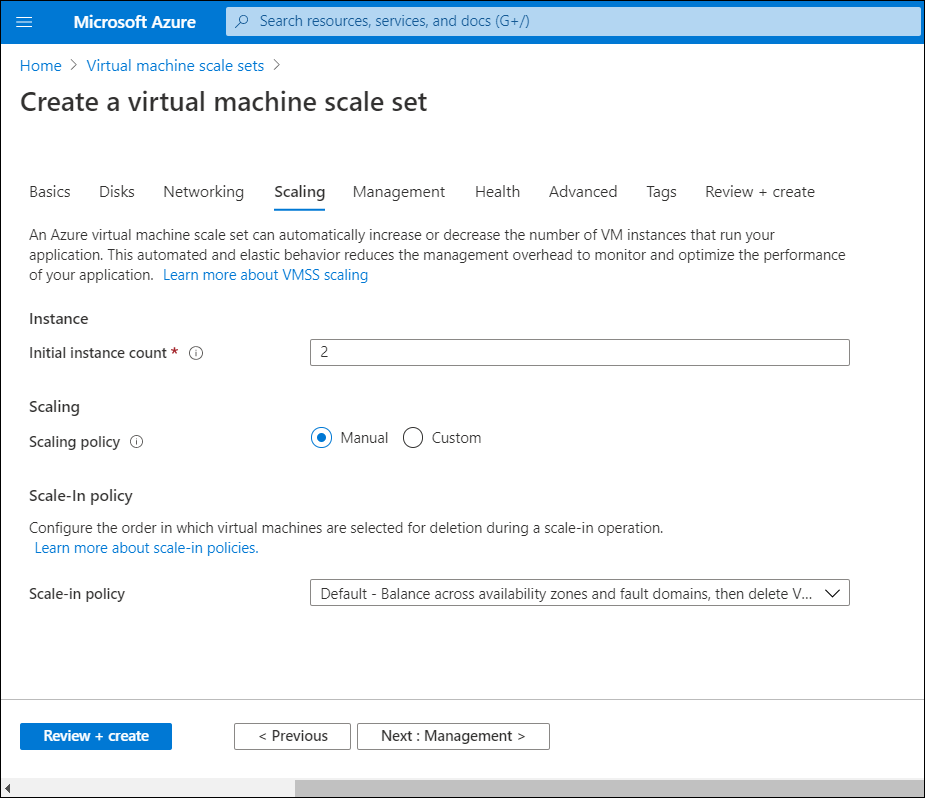
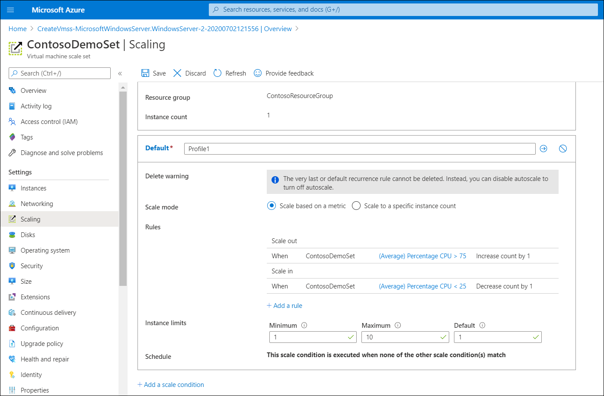
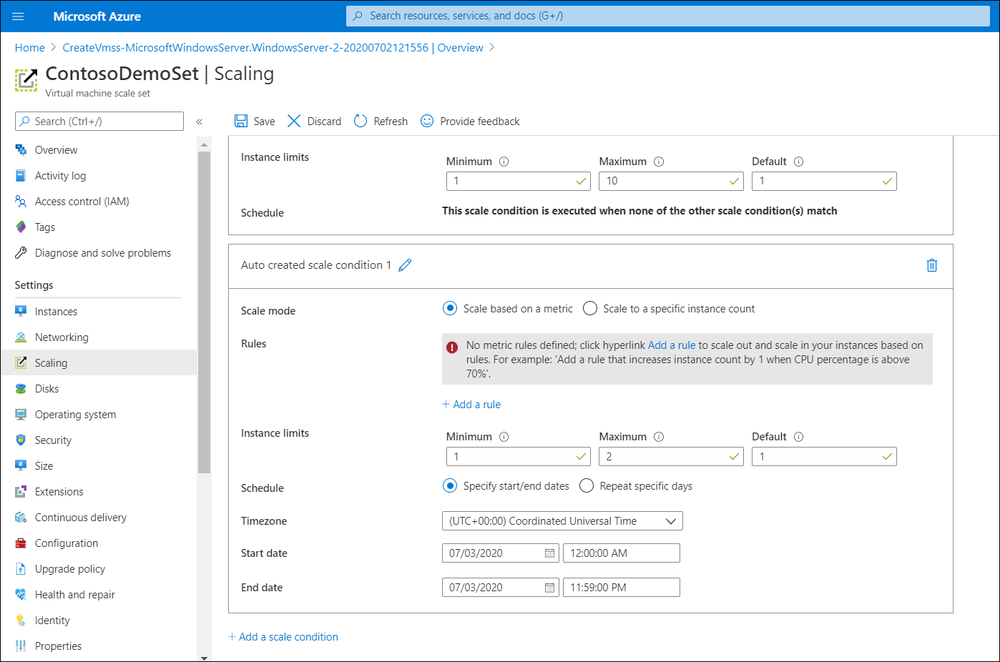

<!-- 10 minutes minutes to read -->

For Contoso, virtual machine scale sets might solve their need to quickly create and manage VMs for fluctuating workloads. They can use either vertical scaling or horizontal scaling to meet their needs.

## What is vertical scaling?

Vertical scaling, also known as *scale up* and *scale down*, means increasing or decreasing VM sizes in response to a utilization. When you implement vertical scaling, sometimes existing VMs are reconfigured. Other times, VMs are replaced with others that have higher capacity.

Removing an existing VM and replacing it with a new one is known as *reprovisioning*. When you increase or decrease the size of VMs in a virtual machine scale set, in some cases you want to resize existing VMs and retain your data, while in other cases you need to deploy new, larger-sized VMs. 

Vertical scaling can be useful when:

- A service built on VMs is under-utilized (perhaps on weekends). Reducing the VM size can reduce monthly costs.
- Increasing VM size to cope with larger demand without creating additional VMs.

You can set up vertical scaling to be triggered based on metric based alerts from your virtual machine scale set. When the alert is activated, it triggers a webhook that activates a runbook, which can scale your scale set up or down. You can perform vertical scaling by using the following high-level procedure:

1. Create an Azure Automation account with run-as capability.
2. Import Azure Automation Vertical Scale runbooks for virtual machine scale sets into your subscription.
3. Add a webhook to your runbook.
4. Add an alert to your virtual machine scale set using a webhook notification.

To create a vertical scale set, review [Vertical autoscale with virtual machine scale sets](https://aka.ms/vertical-scale-reprovision?azure-portal=true).

## What is horizontal scaling?

Horizontal scaling, also referred to as *scale out* and *scale in*,  the number of VMs is altered depending on the workload. If Contoso opted for horizontal scaling, they could configure scaling in two ways, as described in the following table.

|Type|Description|
|--------------------|------------------------------------------------------------|
|Manual scale|With manual scaling, you maintain a fixed instance count and adjust it by using a manual slider when needed to address increases in demand.|
|Custom autoscale|With custom autoscaling, you can scale on either a scheduled basis, by using metrics, or a combination of both.|

Consider the following examples.

### Example 1

At Contoso, access to the company website on Friday night is typically their busiest time. Conversely, 7:00 AM on Wednesday is generally their quietest time. Contoso determine that to meet their peak demand on Friday night, they need 50 web servers. Whereas on Wednesday (the quietest morning), they require only 2 servers to manage demand. Because Azure charges are accrued based on the consumption of resources, it's important that Contoso doesn't use services that it doesn't need. It simply doesn't make sense for Contoso to pay for 50 servers all week to meet the demand of a few peak hours.

In this example, after creating the virtual machine scale set, the administrator at Contoso selects the **Scaling** tab for the scale set on the **Create a virtual machine scale set** blade, and then selects **Custom autoscale**. The administrator adds a new scale condition, and defines an appropriate schedule to meet expected demands.

### Example 2

Contoso is creating a new product, and as the launch approaches, IT support are expecting an increase in website traffic. The problem is IT support can't be certain when the demand might increase or for how long. Nonetheless, they want to be able to meet the increased demand when it occurs. In this case, Contoso should again consider custom autoscaling. This type of autoscaling will scale out their infrastructure as demand rises, and scale back in when demand declines.

In this example, after creating the virtual machine scale set, the administrator at Contoso selects the **Scaling** tab for the scale set on the **Create a virtual machine scale set** blade. They then select **Custom autoscale**. The administrator adds a new scale condition, and defines scaling based on a metric. For example, they can add: **(Average) Percentage CPU > 75, Increase count by 1**. 

## Create a virtual machine scale set using horizontal scaling

In this procedure, we'll create a virtual machine scale set for a Windows Server VM. To do this, use the following steps:

1. In the Azure portal, in the search box, enter **Scale set**.
2. In the results, under **Marketplace**, select **Virtual machine scale sets**.
3. On the **Virtual machine scale sets** blade, select **Create virtual machine scale set**.
4. On the **Create a virtual machine scale set** blade, on the **Basics** tab, configure the following information:
    - **Subscription** and **Resource group**
    - **Virtual machine scale set name**
    - **Region** and **Availability zone**
    - Image: **Windows Server 2019 Datacenter**
    - **Size**
    - Administrator account details
5. Select **Next** to move to the other tabs.
6. On the **Scaling** tab, configure **Initial instance count**, **Scaling policy**, and **Scale-In policy**.
7. Select **Review + create**.
8. After validation, select **Create** to deploy the scale set.

If you want to customize the scaling settings, on the **Scaling** tab, for **Scaling policy**, select **Custom**. When the new page opens, configure the additional details, and then select **Review + create**.

### Configuring scaling

After you have created the virtual machine scale set, open the newly created resource. On the **Create a virtual machine scale set** page, Under **Settings**, select **Scaling**. You can then configure scaling to be either:

- Manual scale (the default)
- Custom autoscale

If you want to configure autoscaling, select the **Custom autoscale** option, and then for **Scale Mode**, you can scale based on a metric, such as virtual machine host percentage CPU, or a specific instance count.

If you want to schedule the scaling automatically, select the **Custom autoscale** option, and then select **Add a scale condition**. You can then specify additional metrics, or a schedule for accommodating known changes in demand.

## Try it

If you wish to perform some of the tasks described in the preceding units, use the following links to access documented exercises in the Learn portal.

- [Exercise - Deploy a scale set in the Azure portal](https://aka.ms/exercise-deploy-scale-set-azure-portal?azure-portal=true)
- [Exercise - Configure a virtual machine scale set](https://aka.ms/exercise-configure-virtual-machine-scale-set?azure-portal=true)
- [Exercise - Update applications in virtual machine scale sets](https://aka.ms/exercise-update-applications-virtual-machine-scale-sets?azure-portal=true)

To complete these exercises, [get a free trial Azure subscription](https://azure.microsoft.com/free/?azure-portal=true). After completing the exercises, remove any resource groups that you created.
