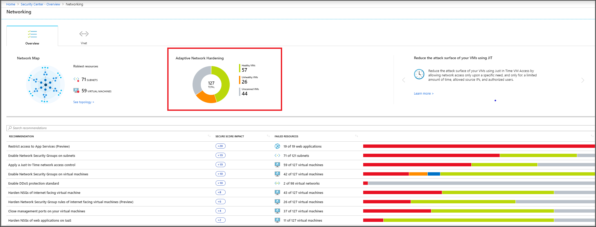
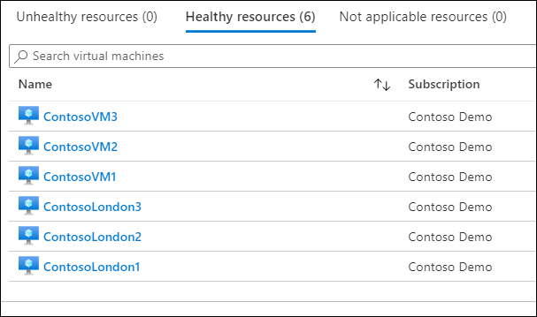
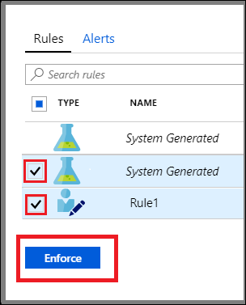

While planning for NSG implementation at Contoso, you need to know precisely which NSG can best secure your Microsoft Azure workloads.

To achieve this goal, you can use Adaptive Network Hardening. Adaptive Network Hardening learns about the network traffic patterns in your infrastructure to and from your Azure workloads. It then makes recommendations for NSGs that can help to secure those workloads.

## How it works

Adaptive Network Hardening uses machine learning to provide recommendations to allow traffic only from specific IP addresses or ports. When formulating the recommendations, it considers:

- Actual network traffic
- Known, trusted configuration information
- Threat intelligence
- Other indicators

For example, suppose that Contoso IT had an application that required TCP port 22 for network access. This application traffic for Port 22 is allowed through the use of an NSG from addresses in the range 140.20.30.10/24. After analysis, Adaptive Network Hardening learns that traffic only originates from a smaller subset of IPs in Contoso's Sales department. It recommends that the rule be updated to narrow the IP range to 140.23.30.10/29, the range for the computers in the London Sales office, and deny all other traffic.

> [!NOTE] 
> Adaptive Network Hardening recommendations are only supported on the following specific ports (for both TCP and UDP): 13, 17, 19, 22, 23, 53, 69, 81, 111, 119, 123, 135, 137, 138, 139, 161, 162, 389, 445, 512, 514, 593, 636, 873, 1433, 1434, 1900, 2049, 2301, 2323, 2381, 3268, 3306, 3389, 4333, 5353, 5432, 5555, 5800, 5900, 5900, 5985, 5986, 6379, 6379, 7000, 7001, 7199, 8081, 8089, 8545, 9042, 9160, 9300, 11211, 16379, 26379, 27017, 37215

## Reviewing Adaptive Network Hardening alerts and rules

You review the Adaptive Network Hardening recommendations in the **Adaptive Network Hardening** blade within the Azure portal. To review recommendations,  in **Adaptive Network Hardening**, select **Defender for Cloud**, and then beneath **RESOURCE SECURITY HYGIENE**, select **Networking**. In the **Networking** blade, on the **Overview** tab, you can review the recommendations.

When you select **Adaptive Network Hardening** in the Azure portal, VMs are displayed on one of three tabs, as depicted in the graphic.

- **Unhealthy resources**. This tab displays VMs that have alerts and recommendations triggered by running Adaptive Network Hardening.
- **Healthy resources**. These are VMs with no alerts or recommendations.
- **Not applicable resources**. VMs that you cannot run Adaptive Network Hardening against display on this tab. Reasons VMs might not be able to run Adaptive Network Hardening are:
  - VMs are Classic VMs, and only Azure Resource Manager VMs are supported.
  - Not enough data is available. To generate accurate traffic hardening recommendations, Defender for Cloud requires at least 30 days of traffic data.
  - The VM is not protected by Microsoft Defender for Cloud standard: Only VMs that are set to Defender for Cloud's Standard pricing tier are eligible for this feature.

> [!NOTE] 
> You can review Defender for Cloud pricing at [Defender for Cloud pricing](https://aka.ms/pricing-details-security-center?azure-portal=true).

From the list of unhealthy VMs, you can select a specific VM and review the recommended hardening rules.

You can also review the security alerts.

## Applying Adaptive Network Hardening recommendations

Having reviewed the recommended rules and alerts, you can choose whether to modify those rules. Otherwise, simply select the rule(s) you want to apply, and then select **Enforce**.

> [!NOTE] 
> To modify a rule, use the instructions at [Adaptive Network Hardening in Microsoft Defender for Cloud, Modify a rule](https://aka.ms/modify-a-rule?azure-portal=true).
