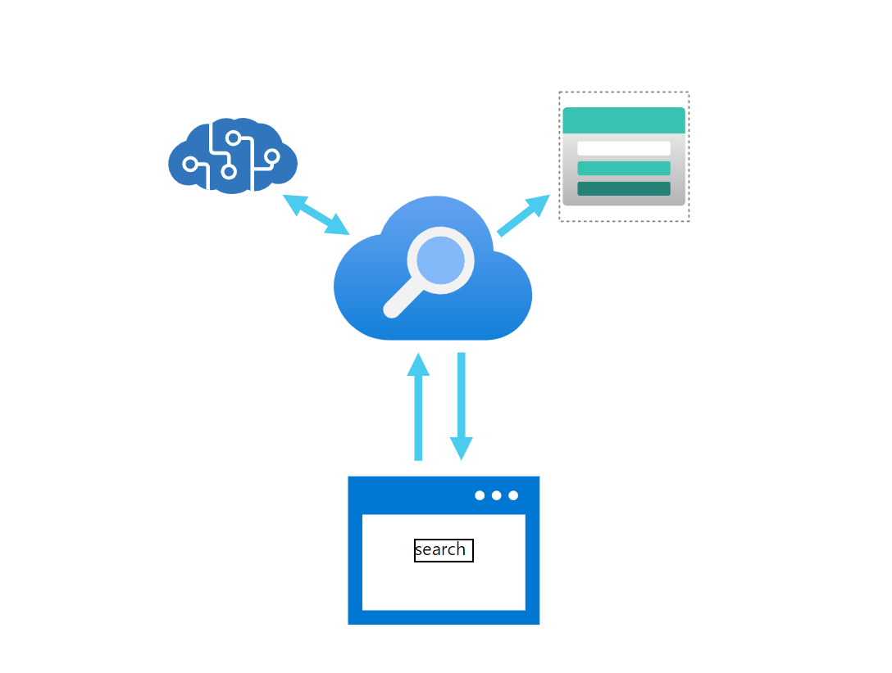

Azure Cognitive Search provides the infrastructure and tools to create search solutions that extract data from various structured, semi-structured, and non-structured documents. 

Azure Cognitive Search results contain only your data, which can include text inferred or extracted from images, or new entities and key phrases detection through text analytics. It's a Platform as a Service (PaaS) solution. Microsoft manages the infrastructure and availability, allowing your organization to benefit without the need to purchase or manage dedicated hardware resources.

## Azure Cognitive Search features 

Azure Cognitive Search exists to complement existing technologies and provides a programmable search engine built on Apache Lucene, an open-source software library. It's a highly available platform offering a 99.9% uptime SLA available for cloud and on-premises assets.

Azure Cognitive Search comes with the following features:

- **Data from any source**: Azure Cognitive Search accepts data from any source provided in JSON format, with auto crawling support for selected data sources in Azure.
- **Full text search and analysis**: Azure Cognitive Search offers full text search capabilities supporting both simple query and full Lucene query syntax.
- **AI powered search**: Azure Cognitive Search has Cognitive AI capabilities built in for image and text analysis from raw content.
- **Multi-lingual**: Azure Cognitive Search offers linguistic analysis for 56 languages to intelligently handle phonetic matching or language-specific linguistics. Natural language processors available in Azure Cognitive Search are also used by Bing and Office.
- **Geo-enabled**: Azure Cognitive Search supports geo-search filtering based on proximity to a physical location.
- **Configurable user experience**: Azure Cognitive Search has several features to improve the user experience including autocomplete, autosuggest, pagination, and hit highlighting.