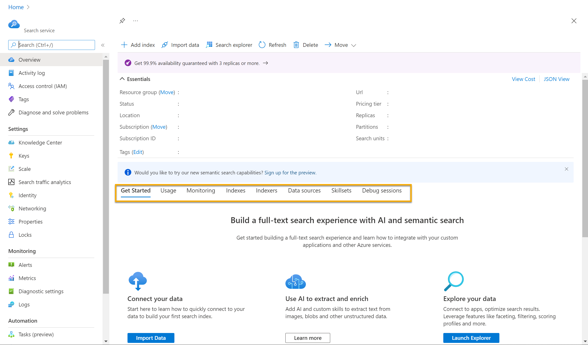

Integrating Azure Cognitive Search into apps and websites allows companies to provide customers with a rich search experience. 

The Azure Cognitive Search service enables search over different types of content by letting you create and manage search indexes. You can import data from a variety of sources, with AI-powered indexing that can infer and extract searchable content from non-text sources. You decide what data is imported into the index, and set up indexers to pull that data into it, or push JSON formatted documents manually.

Azure Cognitive Search also lets you query search indexes. The results contain only your data, which can include text inferred or extracted from images, or new entities and key phrases detection through text analytics. It's a Platform as a Service (PaaS) so Microsoft manages the infrastructure and availability, allowing your organization to benefit without the need to purchase or manage additional hardware resources.

### What can Azure Cognitive Search do?

Azure Cognitive Search exists to compliment existing technologies and provides a programmable search engine built on Apache Lucene, an open-source software library. Azure Cognitive Search is a highly available platform offering a 99.9% uptime SLA available for cloud and on-premises assets.

Azure Cognitive Search comes with the following features:

- **Data from any source**: Azure Cognitive Search accepts data from any source provided in JSON format, with auto crawling support for selected data sources in Azure.
- **Full text search and analysis**: Azure Cognitive Search offers full text search capabilities supporting both simple query and full Lucene query syntax.
- **AI powered search**: Azure Cognitive Search has Cognitive AI capabilities built in for image and text analysis from raw content.
- **Multi-lingual**: Azure Cognitive Search offers linguistic analysis for 56 languages to intelligently handle phonetic matching or language-specific linguistics. Natural language processors available to you in Azure Cognitive Search are the same as those used by Bing and Office.
- **Geo-enabled**: Azure Cognitive Search supports geo-search filtering based on proximity to a physical location.
- **Configurable user experience**: Azure Cognitive Search has several features to improve the user experience including autocomplete, autosuggest, pagination, and hit highlighting.

### Importing content to storage 

In order to build with the Azure Search service, you will first need to upload your content to an Azure data source. Supported data storage sources include:

- Azure SQL Database
- SQL Server on an Azure VM
- Cosmos DB
- Azure Blob storage
- Azure Table storage

The content in storage will need to be exported from its original file type to JSON in order to populate an index. You will work with the index using Azure Cognitive Search service. 

### Creating an Azure Cognitive Search resource

To use the Azure Cognitive Search service, you will need an Azure Cognitive Search resource. You can create a resource in the Azure portal. Once the resource is created, you can manage components of your service from the resource Overview page in the portal including: 

- Usage
- Monitoring
- Indexes
- Indexers
- Data sources
- Skillsets 
- Debug resources 

 

You can create and customize Azure search index using the Azure portal or programmatically with the REST API or software development kits (SDKs). In this module, we will focus on understanding and describing how to use the Azure portal to build an index schema, populate the index with data, and query the index for content. 

## Use the Azure portal to create an index 
Contained within the Azure Cognitive Search service dashboard is the Import data wizard, automates processes in the Azure portal to create various objects needed for the search engine. You see it in action when  creating any of the following objects using the Azure portal:

- **Data Source**: Persists connection information to source data, including credentials. A data source object is used exclusively with indexers.
- **Index**: Physical data structure used for full text search and other queries.
- **Indexer**: A configuration object specifying a data source, target index, an optional skillset, optional schedule, and optional configuration settings for error handing and base-64 encoding.
- **Skillset (Optional)**: A complete set of instructions for manipulating, transforming, and shaping content, including analyzing and extracting information from image files. Except for very simple and limited structures, it includes a reference to a Cognitive Services resource that provides enrichment.
- **Knowledge store (Optional)**: Stores output from an AI enrichment pipeline in tables and blobs in Azure Storage for independent analysis or downstream processing.