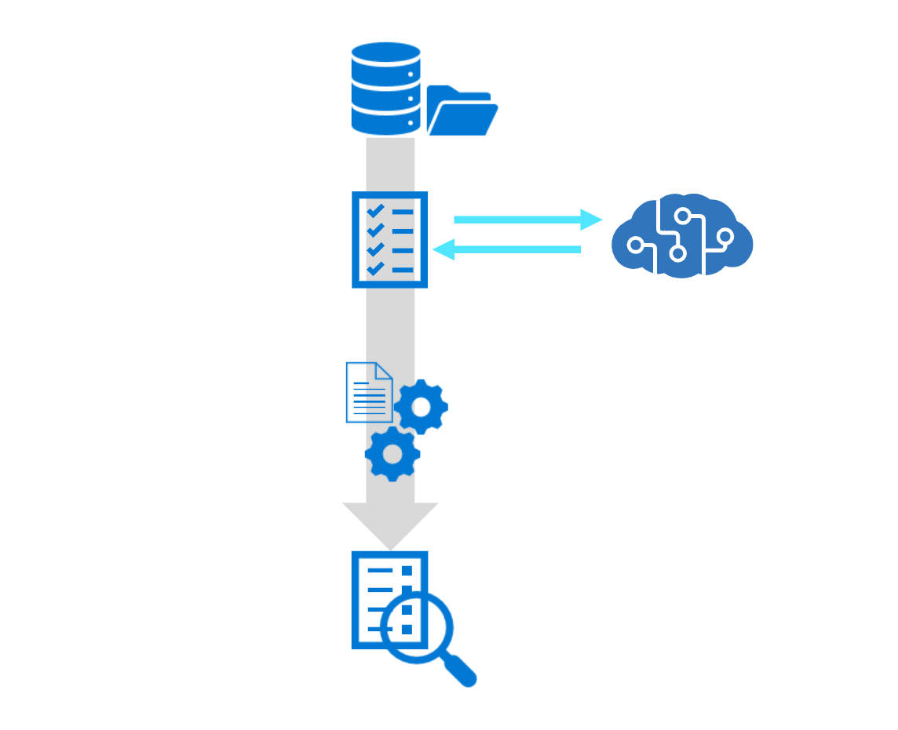

A typical Azure Cognitive Search solution starts with a data source that contains the data artifacts you want to search. This could be a hierarchy of folders and files in Azure Storage, or text in a database such as Azure SQL Database or Azure Cosmos DB. The data format that Cognitive Search supports is JSON. Regardless of where your data originates, if you can provide it as a JSON document, the search engine can index it.

If your data resides in supported data source, you can use an indexer to automate data ingestion, including JSON serialization of source data in native formats. An indexer connects to a data source, serializes the data, and passes to the search engine for indexing. Most indexers support change detection, which makes data refresh a simpler exercise.

Besides automating data ingestion, indexers also support AI enrichment. You can attach a skillset that applies a sequence of AI skills to enrich the data, making it more searchable. A comprehensive set of built-in skills, based on Azure AI services APIs, can help you derive new fields – for example by recognizing entities in text, translating text, evaluating sentiment, or predicting appropriate captions for images. Optionally, enriched content can be sent to a knowledge store, which stores output from an AI enrichment pipeline in tables and blobs in Azure Storage for independent analysis or downstream processing.

Whether you write application code that pushes data to an index - or use an indexer that automates data ingestion and adds AI enrichment - the fields containing your content are persisted in an index, which can be searched by client applications. The fields are used for searching, filtering, and sorting to generate a set of results that can be displayed or otherwise used by the client application.