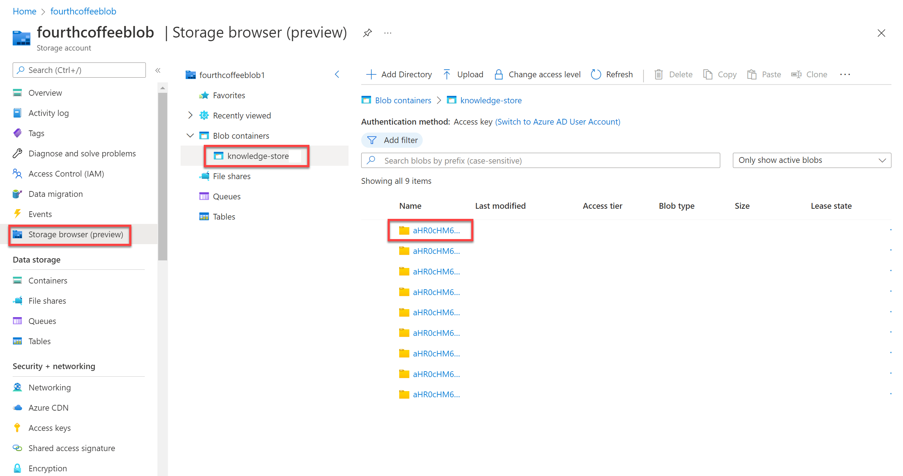
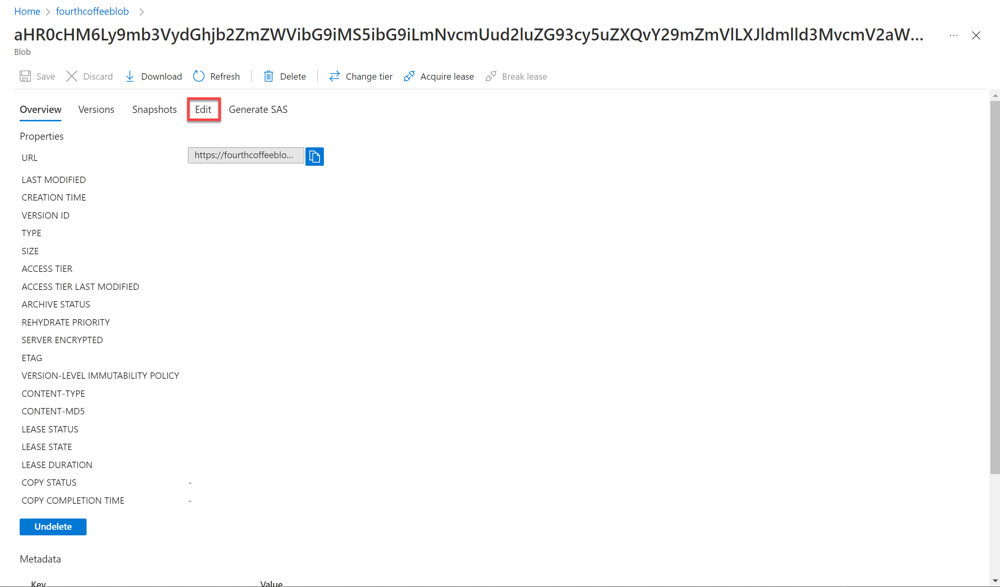
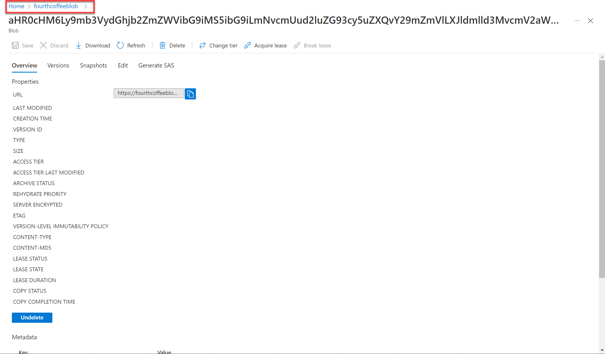
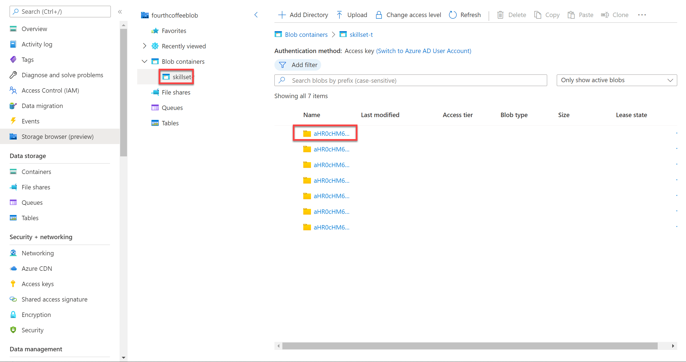

Let's imagine you work for Fourth Coffee, a national coffee chain. You are asked to help build a knowledge mining solution that will will make it easy to search for insights about customer experiences. You decide to build an Azure Cognitive Search index using data extracted from customer reviews.  

In this lab you will:  
- Create Azure resources  
- Extract data from a data source 
- Enrich data with AI skills 
- Use indexer to populate an index in the Azure portal 
- Query your search index 
- Save results to a Knowledge Store

## Azure resources needed 
The solution you will create for Fourth Coffee requires the following resources in your Azure subscription:

- An **Azure Cognitive Search** resource, which will manage indexing and querying.
- A **Cognitive Services** resource, which provides AI services for skills that your search solution can use to enrich the data in the data source with AI-generated insights.
[!NOTE]
>Your Azure Cognitive Search and Cognitive Services resources must be in the same location!
- A **Storage account** with a blob container which will store the raw documents.

### Create an *Azure Cognitive Search* resource 

1. Sign into the [Azure portal](https://portal.azure.com/learn.docs.microsoft.com?azure-portal=true). 

2. Click the **&#65291;Create a resource** button, search for *Azure Cognitive Search*, and create a **Azure Cognitive Search** resource with the following settings:
    - **Subscription**: *Your Azure subscription*.
    - **Resource group**: *Select or create a resource group with a unique name*.
    **Instance Details**
    - **Service name**: coffee-project
    - **Location**: *Choose any available region*:
    - **Pricing tier**: Basic

5. Select **Review + create**, and after you see the response **Validation Success**, select **Create**.

6. After deployment completes, select **Go to resource**. On its overview page you have the ability to add indexes, import data, and search created indexes.

### Create a Cognitive Services resource

If you don't already have one in your subscription, you'll need to provision a **Cognitive Services** resource. Your search solution will use this to enrich the data in the datastore with AI-generated insights.

1. Return to the home page of the Azure portal, and then select the **&#65291;Create a resource** button, search for *cognitive services*, and create a **Cognitive Services** resource with the following settings:
    - **Subscription**: *Your Azure subscription*
    - **Resource group**: *The same resource group as your Azure Cognitive Search resource*
    - **Region**: *The same location as your Azure Cognitive Search resource*
    - **Name**: fourthcoffee
    - **Pricing tier**: Standard S0
2. Select the required checkboxes and create the resource.
3. Wait for deployment to complete, and then view the deployment details.

### Create a storage account

1. Return to the home page of the Azure portal, and then select the **&#65291;Create a resource** button, search for *storage account*, and create a **Storage account** resource with the following settings:
    - **Subscription**: *Your Azure subscription*
    - **Resource group**: *The same resource group as your Azure Cognitive Search and Cognitive Services resources*
    - **Storage account name**: *A unique name*
    - **Location**: *Choose any available location*
    - **Performance**: Standard
    - **Replication**: Locally-redundant storage (LRS)
2. Click **Review + Create** and then click **Create**. Wait for deployment to complete, and then go to the deployed resource.

## Upload Documents to Azure Storage

1. Select **Go to resouce** to access the Storage account you just created. Then navigate to the left-hand pane and click on **Containers**. 

    

2. Select **+ Container**. A pane on your right hand side will open up. 
    
    Enter the following settings: 
    - **Name**: coffee-reviews  
    - **Public access level**: Container (anonymous read access for containers and blobs)
    - **Advanced**: *no changes*
    Click **Create**. 

3. Download and extract the zipped documents from https://aka.ms/km-documents. 
4. Click on the name of your container, then in the container, click **upload**. 
    

5. In the right-hand pane, select all the files in the folder, then click **upload**. Now your documents are in your storage container. 

## Index the documents

Once you have the documents in storage, you can use Azure Cognitive Search to extract insights from the documents.

1. In the Azure portal, browse to your Azure Cognitive Search resource. Then, on its **Overview** page, select **Import data**. The Azure portal provides the Import data wizard that enables you to automatically create an index and indexer for supported data sources. You'll use the wizard to create an index, and import your search documents from storage into the Azure Cognitive Search index. Selecting the **Import data** button starts the Import data wizard. 
    

2. On the **Connect to your data** page, in the **Data Source** list, select **Azure Blob Storage**. Then complete the data store details with the following values:
    - **Data Source**: *Choose Azure Blob Storage*
    - **Data source name**: coffee-customer-data
    - **Data to extract**: Content and metadata
    - **Parsing mode**: Default
    - **Connection string**: *Select **Choose an existing connection**. Then select your storage account, and finally select the **coffee-reviews** container you created. 
    - **Managed identity authentication**: None
    - **Container name**: *this setting is auto-populated after you choose an existing connection*
    - **Blob folder**: *Leave this blank*
    - **Description**: Reviews for Fourth Coffee shops.
3. Proceed to the next step (*Add cognitive skills (Optional)*).
4. in the **Attach Cognitive Services** section, select your Cognitive Services resource. Remember, the Cognitive Services resource needs to have the same location as your Azure Cognitive Search resource. If they are not in the same location, you will need to create a new Cognitive Services resource that matches the location of your Search resource. 
5. In the **Add enrichments** section:
    - Change the **Skillset name** to **coffee-skillset**.
    - Select the option **Enable OCR and merge all text into merged_content field**.
        > [!NOTE]
        > It is important to select **Enable OCR** in order to see all of the enriched field options. 
    - Ensure that the **Source data field** is set to **merged_content**.
    - Change the **Enrichment granularity level** to **Pages (5000 character chunks)**. 
    - Select the following enriched fields:

        | Cognitive Skill | Parameter | Field name |
        | --------------- | ---------- | ---------- |
        | Extract location names | | locations |
        | Extract key phrases | | keyphrases |
        | Detect Sentiment | | sentiment |
        | Generate tags from images | | imageTags |
        | Generate captions from images | | imageCaption |
        

6. Double-check your selections (it can be difficult to change them later). Then for **Save Enrichments to a Knowledge Store**, select the boxes: Image projections, Documents, Key phrases, Image details, Image references). You will be prompted for a Storage Account Connection String.  
7. In the prompt for the Storage Account Connection String, click on **Choose and existing connection**. Choose your *fourthcoffeeblob* storage account, then create a new container called *ai-knowledge-store*. Then click *Select* at the bottom of the screen. 
8. Select **Azure blob projects: Document**. A setting for *Container name* with the knowledge store container auto-populated will appear. Keep the container name as-is. 
9. Click **Next, Customize Target Index**. Change the **Index name** to **fourthcoffee-index**.
10. Ensure that the **Key** is set to **metadata_storage_path** and leave the **Suggester name** blank and the **Search mode** autopopulated.
11. Leave the index fields with their default settings. Proceed to the next step (*Create an indexer*).
12. Change the **Indexer name** to **fourthcoffee-indexer**.
13. Leave the **Schedule** set to **Once**.
14. Expand the **Advanced** options, and ensure that the **Base-64 encode keys** option is selected (generally encoding keys make the index more efficient).
15. Select **Submit** to create the data source, skillset, index, and indexer. The indexer is run automatically and runs the indexing pipeline, which:
    1. Extracts the document metadata fields and content from the data source
    2. Runs the skillset of cognitive skills to generate additional enriched fields
    3. Maps the extracted fields to the index.
16. In the bottom half of the **Overview** page for your Azure Cognitive Search resource, view the **Indexers** tab, which should show the newly created **fourthcoffee-indexer**. Wait a minute, and click **&orarr; Refresh** until the **Status** indicates success.

## Query the index

You'll use the Search explorer to write and test queries. Search explorer is a tool built into the Azure portal that gives you an easy way to validate the quality of your search index. You can use Search explorer to write queries and review results in JSON.

1. In your Search service's *Overview* page, select **Search explorer** at the top of the screen. 

   

2. Notice how the index selected is the index you just created. 


In the **Query string** field, enter `search=*&$count=true`, and then select **Search**. The search query returns all the documents in the search index, including a count of all the documents:
```
@odata.count": 9  
```
The search index should return a JSON document containing your search results. 

3. Now let's search by location with this search `Locations Chicago &$count=true`. The search query returns all the documents in the search index, including a count of 3 documents.

4. Enter `sentiment negative&$count=true` in the **Query string** field, and then select **Search**. The search query returns all the documents in the search index, including a count of 1 document.

   > [!NOTE] 
   > See how the results are sorted by `@search.score`. This is the score assigned by the search engine to show how closely the results match the given query. 

5. One of the problems we may want to solve for is why there might be certain reviews. Let's take a look at the key phrases associated with the negative review. What do you think may be the cause of the review?

## Review the knowledge store 

Finally let's see the power of the knowledge store in action. When you ran the Import data wizard, you also created a knowledge store. Inside the knowledge store you will find the enriched data extracted by AI skills persisted in the form of projections and tables.

1. Navigate back to your Azure blob. 
2. On the left hand pane, click on **Storage browser (preview)**. In the storage browser tree click on **Blob containers**. Select the container you labeled as the knowledge store. 
3. Click on any of the items, and then click on the **objectprojection.json** file. 

4. Click **Edit** to see the JSON produced for one of the documents from your Azure data store. 

5. Return back to the Storage browser's tree by clicking on the storage blob breadcrumb at the top left of the screen. 

6. Now click on **Blob containers** on the left hand panel again. Select the container starting with *skillset*. Click on any of the items. 

7. Click on any of the files. Click **Edit** to see the image stored from the document. Notice how all the images from the documents are stored in this manner. 

8. Return back to the Storage browser's tree by clicking on the storage blob breadcrumb at the top left of the screen. 
9. Now click on **Tables** on the left hand panel. Select the table ending with *KeyPhrases*. Take a look at the key phrases that the knowledge store was able to capture from the content in the reviews.

## Learn more 

This simple search index only some of the capabilities of the Azure Cognitive Search service. To learn more about what you can do with this service, see the [Azure Cognitive Search service page](/azure/search/search-what-is-azure-search). 