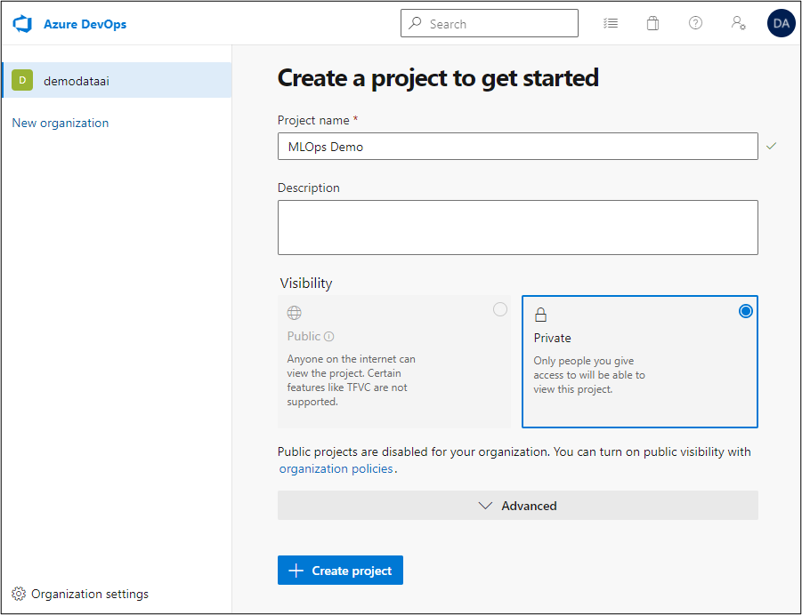
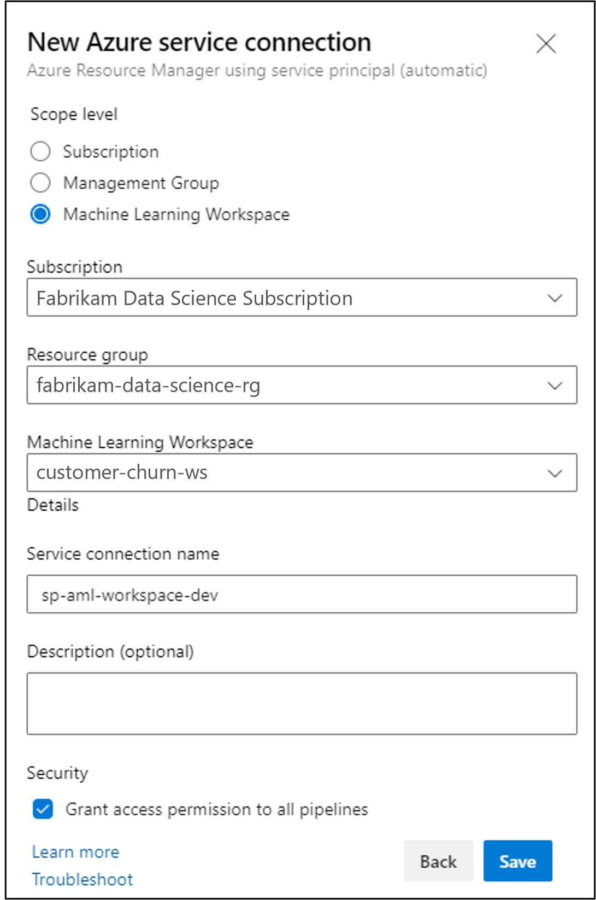

Imagine you work with a data science team on a machine learning project. Your team can choose to use Azure DevOps or GitHub to plan work, store the code repository, and automate workflows.

With either sets of tools, there are generally two roles:

- *Administrator*: sets up the DevOps environment and manages the tools.
- *End user*: contributes to the project by collaborating on the development. Connects to the tools but has restricted access to the configuration of the DevOps environment.

The administrator is responsible for connecting Azure Machine Learning with either Azure DevOps or GitHub. To understand how the integration with Azure Machine Learning is set up, let's explore how an administrator would securely connect Azure DevOps and GitHub with Azure Machine Learning.

## Set up Azure DevOps

To connect Azure DevOps with Azure Machine Learning, you'll first need to create an organization and a project. You'll use the organization to group and manage projects. 

Start by signing in to [Azure DevOps](https://azure.microsoft.com/services/devops/?portal=true) with a Microsoft of GitHub account.

Once signed in, you can create an **organization**. 



Within an organization, you can create multiple **projects**. 


For each project, you'll have access to tools like **Boards**, **Repos**, and **Pipelines** to apply DevOps principles in your project. 

### Connect Azure DevOps to Azure Machine Learning

To securely access your Azure Machine Learning workspace from Azure DevOps, you'll have to create a **service connection**. 

When you create a service connection, you define how Azure DevOps will be authenticated to connect to another service. When working with Azure Machine Learning, the recommended option is to let Azure DevOps create a service principal.

A **service principal** is created as an identity in the **Azure Active Directory**. Instead of using a team member's credentials to connect with Azure Machine Learning, Azure DevOps uses the service principal's credentials.

When an Azure DevOps project is created, you can connect to an existing Azure Machine Learning workspace:

1. Within a project, go to **Project Settings**.
2. Select **service connections** and create a new one.
3. Choose **Azure Resource Manager**.
4. Choose to authenticate with an **automatic Service Principal**.
5. Set the scope level to **Machine Learning Workspace** and connect to an existing Azure Machine Learning workspace you have access to.
6. Grant access permission to all pipelines.
7. Give your service connection a name. You'll use the name whenever you need to authenticate Azure DevOps to manage the Azure Machine Learning workspace. 



Once the service connection is created, you'll notice that a newly created service principal has *Contributor* access to your Azure Machine Learning workspace. 

### Set up GitHub

To connect GitHub with Azure Machine Learning, you'll first need to create a GitHub repository.

Start by signing in to [GitHub](https://github.com/?portal=true).

After signing in to GitHub, you can choose whether you as an individual want to own the repository, or whether it should be owned by a GitHub organization. 

> [!TIP]
> Learn more about [using GitHub organizations to manage repositories](https://docs.github.com/en/organizations/collaborating-with-groups-in-organizations/creating-a-new-organization-from-scratch).

### Connect GitHub with Azure Machine Learning

To use GitHub to automate machine learning workflows, you can authenticate GitHub to connect with Azure Machine Learning. To set up a secure connection you'll have to:

- Create a service principal in Azure.
- Add the service principal's credentials to your repository's secrets.

To create a service principal, you can use the [Azure CLI](/cli/azure/create-an-azure-service-principal-azure-cli). To work with the CLI, one option is to submit commands in the [Azure Cloud Shell](https://shell.azure.com/?portal=true).

You can create a service principal named `github-aml-sp` that will be given *Contributor* access to the resource group with the following command:

```azurecli
az ad sp create-for-rbac --name "github-aml-sp" --role contributor \
                            --scopes /subscriptions/<subscription-id>/resourceGroups/<group-name>/providers/Microsoft.MachineLearningServices/workspaces/<workspace-name> \
                            --sdk-auth
```

Once the service principal is created, you'll see a JSON text as output which includes the credentials GitHub will need to connect to your Azure resource group. Copy the JSON text and save it for the next step.

To store these credentials in GitHub:

1. Go to your repository's **Settings**. 
2. Navigate to the **Secrets** page.
3. Select **Actions**. 
4. Add a **new repository secret**.
5. Enter `AZURE_CREDENTIALS` as the name.
6. Paste in the output JSON with the credentials and add the secret.


Once the secret is added to GitHub, you can use the `AZURE_CREDENTIALS` secret whenever you need GitHub to be authenticated to work with any resources in your resource group, for example your Azure Machine Learning workspace.

> [!TIP]
> Continue your learning on integrating GitHub with Azure Machine Learning and explore how to [use GitHub Actions with Azure Machine Learning](/azure/machine-learning/how-to-github-actions-machine-learning). The tutorial uses the `AZURE_CREDENTIALS` secret to connect with Azure.