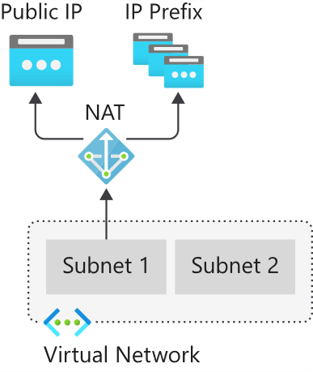
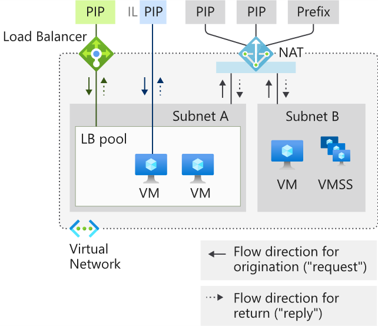

# Configure internet access with Azure Virtual NAT

 

Globally, IPv4 address ranges are in very short supply, and can be an expensive way to grant access to Internet resources. Network Address Translation (NAT) arose out of this need for internal resources on a private network to share routable IPv4 addresses to gain access to external resources on a public network. Rather than purchasing an IPv4 address for each resource that requires internet access, you can use a NAT service to map outgoing requests from internal resources to an external IP address, so that communication can take place. 

NAT services provide mappings for a single IP address, a range of IP addresses defined by an IP Prefix, and a range of ports associated with an IP address. NAT is compatible with standard SKU public IP address resources or public IP prefix resources or a combination of both. You can use a public IP prefix directly or distribute the public IP addresses of the prefix across multiple NAT gateway resources. NAT will map all traffic to the range of IP addresses of the prefix. NAT allows flows to be created from the virtual network to the Internet. Return traffic from the Internet is only allowed in response to an active flow.

The following diagram shows outbound traffic flow from Subnet 1 through the NAT gateway to be mapped to a Public IP address or a Public IP prefix.

You define the NAT configuration for each subnet within a VNet to enable outbound connectivity by specifying which NAT gateway resource to use. After NAT is configured, all UDP and TCP outbound flows from any virtual machine instance will use NAT for internet connectivity. No further configuration is necessary, and you don’t need to create any user-defined routes. NAT takes precedence over other outbound scenarios and replaces the default Internet destination of a subnet.

## Support dynamic workloads by scaling NAT

With NAT, you don't need to do extensive pre-planning or pre-allocate addresses because NAT scales to support dynamic workloads. By using port network address translation (PNAT or PAT), NAT provides up to 64,000 concurrent flows for UDP and TCP respectively, for each attached public IP address. NAT can support up to 16 public IP addresses.

## How to deploy NAT

Configuring and using NAT gateway is a straightforward process:

**NAT gateway resource:**

1. Create regional or zonal (zone-isolated) NAT gateway resource,

2. Assign IP addresses,

3. If necessary, modify TCP idle timeout (optional). 

**Virtual network:**

- Configure virtual network subnet to use a NAT gateway.

- User-defined routes are not necessary.

## Coexistence of inbound and outbound

NAT is compatible with the following standard SKU resources:

- Load balancer

- Public IP address

- Public IP prefix

NAT and compatible Standard SKU features are aware of the direction the flow was started. Inbound and outbound scenarios can coexist. These scenarios will receive the correct network address translations because these features are aware of the flow direction. When used together with NAT, these resources provide inbound Internet connectivity to your subnet(s). NAT provides all outbound Internet connectivity from your subnet(s).

 

 

## Limitations of NAT

- NAT is compatible with standard SKU public IP, public IP prefix, and load balancer resources. Basic resources (for example basic load balancer) and any products derived from them aren't compatible with NAT. Basic resources must be placed on a subnet not configured with NAT.

- IPv4 address family is supported. NAT doesn't interact with IPv6 address family. NAT can't be deployed on a subnet with an IPv6 prefix.

- NAT can't span multiple virtual networks.

- IP fragmentation is not supported.

## Check your knowledge 

Choose the best response for each of the questions below. When you're done, select **Check your answers**.

## Multiple Choice 

What is the purpose of NAT?

( ) NAT enables you to share a single public IPv4 address among multiple internal resources.{{NAT enables internal resources to share an IP address for communication with Internet resources.}} 

( ) NAT allows you to assign multiple private IPv4 addresses to a single virtual machine.{{You can assign multiple IPv4 addresses to a single virtual machine, but the NAT service is not used for this.}} 

( )  NAT enables you to configure an external IPv4 address on each individual virtual machine.{{The NAT service is configured as a gateway, providing shared IPv4 address(es) for internal resoucres. It is not configured on individual virtual machines.}}

( )  NAT enables you to share a single public IPv6 address among multiple internal resources.{{NAT doesn't interact with IPv6 address family. NAT can't be deployed on a subnet with an IPv6 prefix.}}

## Multiple Choice 

How does NAT scale to support dynamic workloads?

( ) NAT supports up to 16 public IP addresses, and for each of those, uses port network address translation (PNAT or PAT) to provide up to 64,000 concurrent traffic flows.{{NAT supports up to 16 public IP addresses. Using port network address translation (PNAT or PAT), NAT provides up to 64,000 concurrent flows for UDP and TCP respectively, for each attached public IP address.}} 

( ) NAT supports up to 4 public IP addresses.{{NAT supports up to 16 public IP addresses. Additionally, by using port network address translation (PNAT or PAT), NAT provides up to 64,000 concurrent flows for UDP and TCP respectively, for each attached public IP address.}} 

( )  NAT does not scale dynamically. You must configure NAT to scale manually, by adding additional NAT Gateways.{{NAT scales automatically to support dynamic workloads. You do not need to add extra NAT gateways.}}

( )  NAT automatically duplicates the external IPv4 address that is shared by the internal resources.{{NAT does not duplicate IP addresses.}}

