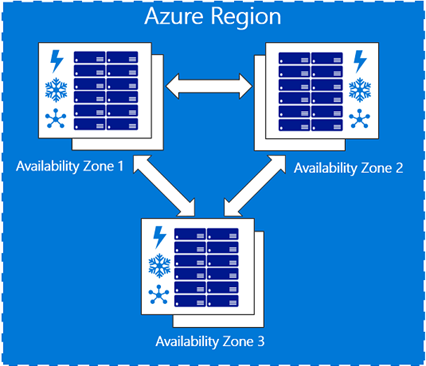
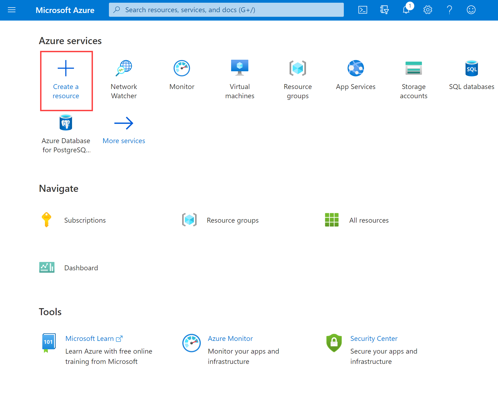
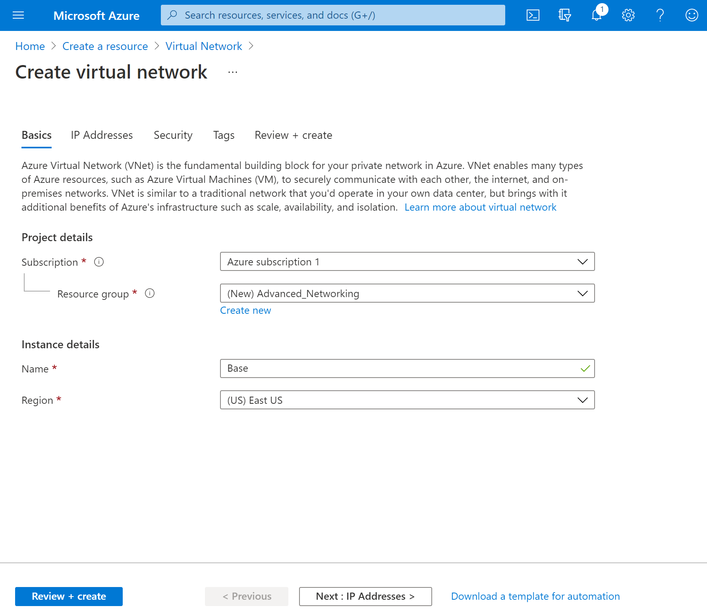
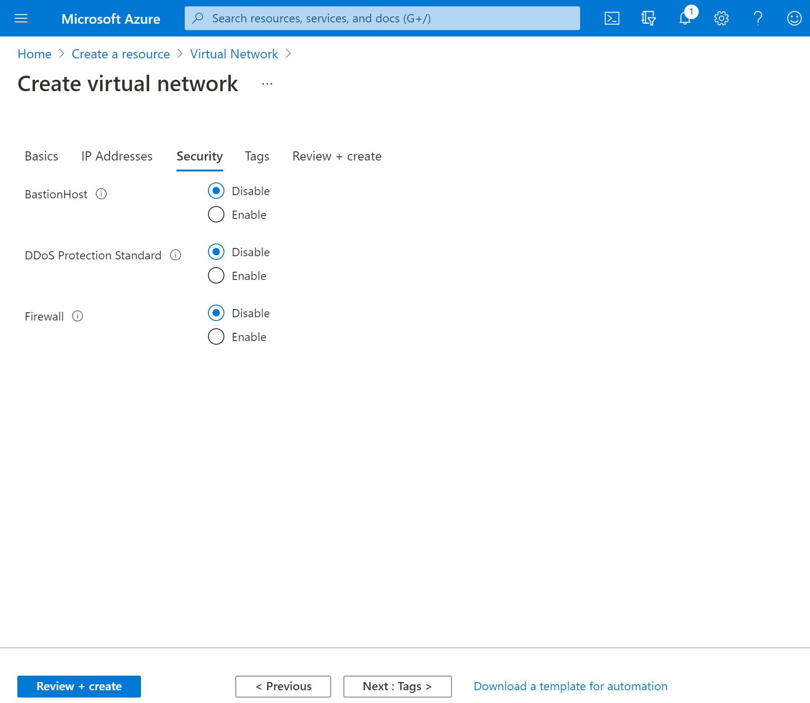

Azure Virtual Networks (VNets) are the fundamental building block of your private network in Azure. VNets enable you to build complex virtual networks that are similar to an on-premises network, with additional benefits of Azure infrastructure such as scale, availability, and isolation. A VNet is a representation of your own network in the cloud. It is a logical isolation of the Azure cloud dedicated to your subscription. You can use VNets to provision and manage virtual private networks (VPNs) in Azure and, optionally, link the VNets with other VNets in Azure, or with your on-premises IT infrastructure to create hybrid or cross-premises solutions. Each VNet you create has its own CIDR block and can be linked to other VNets and on-premises networks as long as the CIDR blocks do not overlap. You also have control of DNS server settings for VNets, and segmentation of the VNet into subnets.

## Capabilities of Azure Virtual Networks

Azure VNets enable resources in Azure to securely communicate with each other, the internet, and on-premises networks. 

- **Communication with the internet.** All resources in a VNet can communicate outbound to the internet, by default. You can communicate inbound to a resource by assigning a public IP address or a public Load Balancer. You can also use public IP or public Load Balancer to manage your outbound connections.

- **Communication between Azure resources.** There are three key mechanisms through which Azure resource can communicate: VNets, VNet service endpoints and VNet peering. Virtual Networks can connect not only VMs, but other Azure Resources, such as the App Service Environment, Azure Kubernetes Service, and Azure virtual machine scale sets. You can use service endpoints to connect to other Azure resource types, such as Azure SQL databases and storage accounts. When you create a VNet, your services and VMs within your VNet can communication directly and securely with each other in the cloud.

- **Communication between on-premises resources.** Securely extend your data center. You can connect your on-premises computers and networks to a virtual network using any of the following options: Point-to-site virtual private network (VPN), Site-to-site VPN, Azure ExpressRoute. 

- **Filtering network traffic.** You can filter network traffic between subnets using any combination of network security groups and network virtual appliances like firewalls, gateways, proxies, and Network Address Translation (NAT) services.

- **Routing network traffic.** Azure routes traffic between subnets, connected virtual networks, on-premises networks, and the Internet, by default. You can implement route tables or border gateway protocol (BGP) routes to override the default routes Azure creates.

## Design considerations for Azure Virtual Networks

With some knowledge and planning, you will be able to deploy virtual networks and connect the resources you need effectively.

### Address space and subnets

You can create multiple virtual networks per region per subscription. You can create multiple subnets within each virtual network.

**Virtual Networks**

When creating a VNet, it is recommended that you use the address ranges enumerated in RFC 1918, which have been set aside by the IETF for private, non-routable address spaces: 

- 10.0.0.0 - 10.255.255.255 (10/8 prefix)

- 172.16.0.0 - 172.31.255.255 (172.16/12 prefix)

- 192.168.0.0 - 192.168.255.255 (192.168/16 prefix)

In addition, you cannot add the following address ranges:

- 224.0.0.0/4 (Multicast)

- 255.255.255.255/32 (Broadcast)

- 127.0.0.0/8 (Loopback)

- 169.254.0.0/16 (Link-local)

- 168.63.129.16/32 (Internal DNS)

Azure assigns resources in a virtual network a private IP address from the address space that you provision. For example, if you deploy a VM in a VNet with address space 10.0.0.0/16, the VM will be assigned a private IP like 10.0.0.4. it is important to note that Azure reserves 5 IP addresses within each subnet. These are x.x.x.0-x.x.x.3 and the last address of the subnet. x.x.x.1-x.x.x.3 is reserved in each subnet for Azure services.

- x.x.x.0: Network address

- x.x.x.1: Reserved by Azure for the default gateway

- x.x.x.2, x.x.x.3: Reserved by Azure to map the Azure DNS IPs to the VNet space

- x.x.x.255: Network broadcast address

When planning to implement virtual networks, you need to consider the following: 

- Ensure non-overlapping address spaces. Make sure your VNet address space (CIDR block) does not overlap with your organization's other network ranges.

- Is any security isolation required?

- Do you need to mitigate any IP addressing limitations?

- Will there be connections between Azure VNets and on-premises networks?

- Is there any isolation required for administrative purposes?

- Are you using any Azure services that create their own VNets?

**Subnets**

A subnet is a range of IP address in the VNet. You can segment VNets into different size subnets, creating as many subnets as you require for organization and security within the subscription limit. You can then deploy Azure resources in a specific subnet. Just like in a traditional network, subnets allow you to segment your VNet address space into segments that are appropriate for the organization's internal network. This also improves address allocation efficiency. The smallest supported IPv4 subnet is /29, and the largest is /8 (using CIDR subnet definitions). IPv6 subnets must be exactly /64 in size. When planning to implement subnets, you need to consider the following:

- Each subnet must have a unique address range, specified in Classless Inter-Domain Routing (CIDR) format.

- Certain Azure services require their own subnet.

- Subnets can be used for traffic management. For example, you can create subnets to route traffic through a network virtual appliance.

- You can limit access to Azure resources to specific subnets with a virtual network service endpoint. You can create multiple subnets, and enable a service endpoint for some subnets, but not others. 

**Micro-segmentation**

Although subnets are the smallest unit you can create based on IP addressing, you can further segment your network by using Network Security Groups (NSGs) to control access to the subnet. Each network security group contains rules, which allow or deny traffic to and from sources and destinations.

You can associate zero or one NSG to each subnet in a virtual network. You can associate the same, or a different, network security group to each subnet. 

### Determine a naming convention

As part of your Azure network design, it is important to plan your naming convention for your resources. An effective naming convention composes resource names from important information about each resource. A well-chosen name helps you quickly identify the resource's type, its associated workload, its deployment environment, and the Azure region hosting it. For example, a public IP resource for a production SharePoint workload residing in the West US region might be pip-sharepoint-prod-westus-001

> [!div class="mx-imgBorder"]
>

All Azure resource types have a scope that defines the level that resource names must be unique. A resource must have a unique name within its scope. There are four levels you can specify a scope: [management group](/azure/governance/management-groups/overview), subscription, [resource group](/azure/azure-resource-manager/management/overview), and resource. Scopes are hierarchical, with each level of hierarchy making the scope more specific. 

For example, a virtual network has a resource group scope, which means that there can be only one network named vnet-prod-westus-001 in each resource group. Other resource groups could have their own virtual network named vnet-prod-westus-001. Subnets are scoped to virtual networks, so each subnet within a virtual network must have a distinct name.

### Understand Regions and Subscriptions

All Azure resources are created in an Azure region and subscription. A resource can only be created in a virtual network that exists in the same region and subscription as the resource. You can, however, connect virtual networks that exist in different subscriptions and regions. Azure regions are important to consider as you design your Azure network in relation to your infrastructure, data, applications, and end users. 

You can deploy as many virtual networks as you need within each subscription, up to the subscription limit. Some larger organizations with global deployments have multiple virtual networks that are connected between regions, for example.

> [!div class="mx-imgBorder"]
>

### Azure Availability Zones

An Azure Availability Zone enables you to define unique physical locations within a region. Each zone is made up of one or more datacenters equipped with independent power, cooling, and networking. Designed to ensure high-availability of your Azure services, the physical separation of Availability Zones within a region protects applications and data from datacenter failures.

> [!div class="mx-imgBorder"]
>

You should consider availability zones when designing your Azure network, and plan for services that support availability zones.

Azure services that support Availability Zones fall into three categories:

- Zonal services: Resources can be pinned to a specific zone. For example, virtual machines, managed disks, or standard IP addresses can be pinned to a specific zone, which allows for increased resilience by having one or more instances of resources spread across zones.

- Zone-redundant services: Resources are replicated or distributed across zones automatically. Azure replicates the data across three zones so that a zone failure does not impact its availability. 

- Non-regional services: Services are always available from Azure geographies and are resilient to zone-wide outages as well as region-wide outages.

## Create a Virtual Network in Azure

You can create an Azure VNet directly through the Azure portal, by using PowerShell, or the Azure CLI.

Before you can create a VNet, you must create a resource group. A resource group is a container that holds related resources for an Azure solution. The resource group can include all the resources for the solution, or only those resources that you want to manage as a group.

### Create a Virtual Network by using the portal

Log in to the Azure portal, and then click **Create a resource**: 

> [!div class="mx-imgBorder"]
> 

In the search box, enter **Virtual Network**. Select Virtual Network in the search results.

> [!div class="mx-imgBorder"]
> 

On the Virtual Network page, select **Create**. 

> [!div class="mx-imgBorder"]
> 

In Create virtual network, enter or select this information in the **Basics** tab:

| **Setting**          | **Value**                                                    |
|:-|:-|
| **Project details**  |                                                              |
| Subscription         | Select your subscription.                                    |
| Resource group       | Select an existing resource group **or** Create a new resource group. |
| **Instance details** |                                                              |
| Name                 | Enter a descriptive name for your new VNet.                  |
| Region               | Select the region closest to you.                            |

In the IP Addresses tab, you can add IPv4 and IPv6 address spaces, and define IPv4 subnets.

**Address space**

When you set up a virtual network, you define the internal address space in Classless Inter-Domain Routing (CIDR) format. This address space needs to be unique within your subscription and any other networks that you connect to.

Let's assume you choose an address space of 10.0.0.0/24 for your first virtual network. The addresses defined in this address space ranges from 10.0.0.1 - 10.0.0.254. You then create a second virtual network and choose an address space of 10.0.0.0/8. The address in this address space ranges from 10.0.0.1 - 10.255.255.254. Some of the address overlap and can't be used if you plan to connect the two virtual networks together. 

However, you can use 10.0.0.0/16, with addresses ranging from 10.0.0.1 - 10.0.255.254, and 10.1.0.0/16, with addresses ranging from 10.1.0.1 - 10.1.255.254. You can assign these address spaces to your virtual networks because there's no address overlap.

> [!NOTE]
>
> You can add address spaces after creating the virtual network.

**Subnet**

Within each virtual network address range, you can create one or more subnets that partition the virtual network's address space. Routing between subnets will then depend on the default traffic routes, or you can define custom routes. Alternatively, you can define one subnet that encompasses all the virtual networks' address ranges.

> [!NOTE]
>
> Subnet names must begin with a letter or number, end with a letter, number or underscore, and may contain only letters, numbers, underscores, periods, or hyphens.

> [!div class="mx-imgBorder"]
> 

In the Create virtual network tab, you can enable security features like BastionHost, DDoS Protection Standard, and Firewall.

**BastionHost**  
‎The Azure Bastion service is a new fully platform-managed PaaS service that you provision inside your virtual network. It provides secure and seamless RDP/SSH connectivity to your virtual machines directly in the Azure portal over SSL. When you connect via Azure Bastion, your virtual machines do not need a public IP address.

**Distributed Denial of Service (DDoS) protection**

You can select to enable Standard DDoS protection. Standard DDoS Protection is a plan is a paid service that offers enhanced DDoS mitigation capabilities via adaptive tuning, attack notification, and telemetry to protect against the impacts of a DDoS attack for all protected resources within this virtual network. Basic DDoS protection is integrated into the Azure platform by default and at no additional cost. 

**Firewall**

Azure Firewall is a managed cloud-based network security service that protects your Azure Virtual Network resources.

> [!div class="mx-imgBorder"]
> 

In the **Review + create** tab, you can define tags, which can help you to organize and manage your Azure resources.

> [!div class="mx-imgBorder"]
> 

Click **Create** to create your virtual network.

