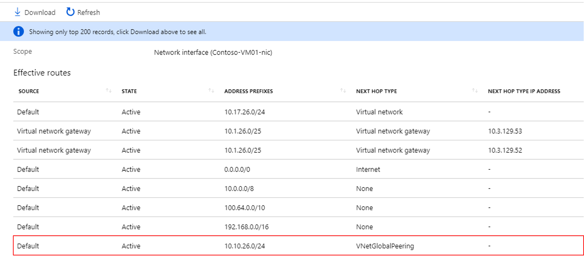
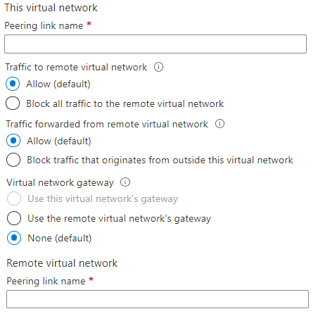

Organizations with large scale operations will often need to create connections between different parts of their virtual network infrastructure. Virtual network peering enables you to seamlessly connect separate VNets with optimal network performance, whether they are in the same Azure region (VNet peering) or in different regions (Global VNet peering). Network traffic between peered virtual networks is private. The virtual networks appear as one for connectivity purposes. The traffic between virtual machines in peered virtual networks uses the Microsoft backbone infrastructure, and no public Internet, gateways, or encryption is required in the communication between the virtual networks.

Virtual network peering enables you to seamlessly connect two Azure virtual networks. Once peered, the virtual networks appear as one, for connectivity purposes. There are two types of VNet peering.

- **Regional VNet peering** connects Azure virtual networks in the same region.

- **Global VNet peering** connects Azure virtual networks in different regions. When creating a global peering, the peered virtual networks can exist in any Azure public cloud region or China cloud regions, but not in Government cloud regions. You can only peer virtual networks in the same region in Azure Government cloud regions.

The benefits of using virtual network peering, whether local or global, include:

- A low-latency, high-bandwidth connection between resources in different virtual networks.

- The ability to apply network security groups in either virtual network to block access to other virtual networks or subnets. 

- The ability to transfer data between virtual networks across Azure subscriptions, Azure Active Directory tenants, deployment models, and Azure regions.

- The ability to peer virtual networks created through the Azure Resource Manager.

- The ability to peer a virtual network created through Resource Manager to one created through the classic deployment model. 

- No downtime to resources in either virtual network is required when creating the peering, or after the peering is created.

The following diagram shows a scenario where resources on the Contoso VNet and resources on the Fabrikam VNet need to communicate. The Contoso subscription in the US West region, is connected to the Fabrikam subscription in the US West region.

The routing tables show the routes known to the resources in each subscription. The following routing table shows the routes known to Contoso, with the final entry being the Global VNet peering entry to the Fabrikam 10.10.26.0/24 subnet.

The following routing table shows the routes known to Fabrikam. Again, the final entry is the Global VNet peering entry, this time to the Contoso 10.1.26.0/25 subnet.

## Configure VNet Peering

Here are the steps to configure VNet peering. Notice you will need two virtual networks. To test the peering, you will need a virtual machine in each network. Initially, the VMs will not be able to communicate, but after configuration the communication will work. The step that is new is configuring the peering of the virtual networks.

1.  Create two virtual networks.
2.  **Peer the virtual networks**.
3.  Create virtual machines in each virtual network.
4.  Test the communication between the virtual machines.

To configure the peering use the **Add peering** page. There are only a few optional configuration parameters to consider.

**Note:** When you add a peering on one virtual network, the second virtual network configuration is automatically added.

## Gateway Transit and Connectivity

When virtual networks are peered, you configure a VPN gateway in the peered virtual network as a transit point. In this case, a peered virtual network uses the remote gateway to gain access to other resources. A virtual network can have only one gateway. Gateway transit is supported for both VNet Peering and Global VNet Peering.

When you Allow Gateway Transit the virtual network can communicate to resources outside the peering. For example, the subnet gateway could:

- Use a site-to-site VPN to connect to an on-premises network.

- Use a VNet-to-VNet connection to another virtual network.

- Use a point-to-site VPN to connect to a client.

In these scenarios, gateway transit allows peered virtual networks to share the gateway and get access to resources. This means you do not need to deploy a VPN gateway in the peer virtual network.

> [!NOTE]
>
> Network security groups can be applied in either virtual network to block access to other virtual networks or subnets. When configuring virtual network peering, you can either open or close the network security group rules between the virtual networks.

## Use service chaining to direct traffic to a gateway

Suppose you want to direct traffic from the Contoso VNet to a specific network virtual appliance (NVA). Create user-defined routes to direct traffic from the Contoso VNet to the NVA in the Fabrikam VNet. This technique is known as service chaining. 

To enable service chaining, add user-defined routes pointing to virtual machines in the peered virtual network as the next hop IP address. User-defined routes can also point to virtual network gateways.

Azure virtual networks can be deployed in a hub-and-spoke topology, with the hub VNet acting as a central point of connectivity to all the spoke VNets. The hub virtual network hosts infrastructure components such as an NVA, virtual machines and a VPN gateway. All the spoke virtual networks peer with the hub virtual network. Traffic flows through network virtual appliances or VPN gateways in the hub virtual network. The benefits of using a hub and spoke configuration include cost savings, overcoming subscription limits, and workload isolation.

The following diagram shows a scenario in which hub VNet hosts a VPN gateway that manages traffic to the on-premises network, enabling controlled communication between the on-premises network and the peered Azure VNets.

## Check your knowledge

Choose the best response for each of the questions below. When you're done, select **Check your answers**.