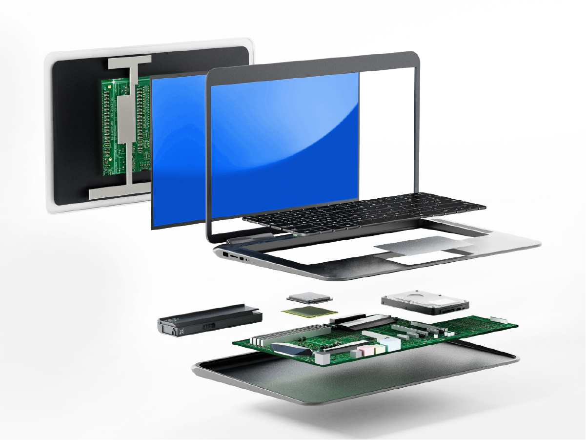

Programming computers has changed a lot since computers first were made. Most people rarely use large programs that do everything. Instead, programs have gotten smaller and call other programs on the internet when they need to. Programmers can spread or "distribute" the work programs need to do around the internet.

The same kind of model can be used for hardware like the CPU, hard disks, and memory. The cloud has made this possible.

## Spread around the Cloud

Just as software can be broken apart and linked together, the hardware that makes up the computers that run the cloud can be separated. If you have a desktop or a laptop, it has everything it needs to work. It has a central processor. It has memory and storage. It has a screen and a keyboard. It has a network adapter and Bluetooth. The computer works as a single unit.

In the cloud, things work differently. Like modern programs, the functions of a computer can be isolated. The storage (the disks) can be separated from the brains or central processing unit. Even the networking function can be separate from the rest of the functions.

## More Power

Separating these functions makes it easier to add power to specific functions when they're needed. For example, if you need to solve really hard math problems, you may need more brain power. In the cloud, you can choose to increase the amount of calculating power available to the work you're doing. If you're collecting a lot of data, you may need more storage. Cloud computing enables you to add (or reduce) storage as needed.

Suppose you have a small car that does fine for driving to and from work. If you need power and storage to haul something, you may have to borrow or rent a truck. If cars worked like the cloud, you could add to the size and power of your car when you need to haul an appliance or a few yards of dirt. When you're done, you can go back to your commuter car.

The cloud scales resources like this but goes even further. The cloud supports autoscaling, which means it can provide more space and power on-demand, or when it's needed. It monitors the work being done (called *workloads*), and if more power or storage is needed, it adds it. When the need goes away, it scales things down.

This type of hardware and device model works hand-in-hand with modern software programming. This type of computing enables people to use only what they need when they need it. It also means people don't have to buy computers and write programs they don't need. They can purchase the power as they need it and stop using it when they don't.
