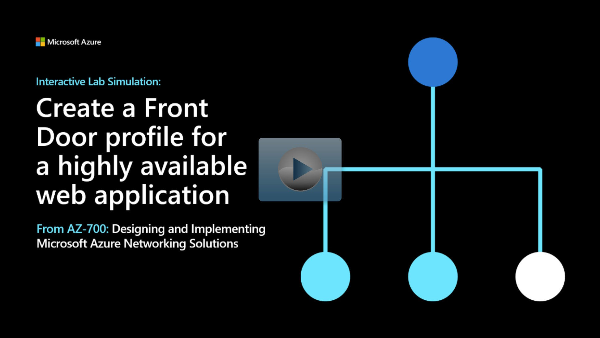

## Lab scenario

In this lab, you will set up an Azure Front Door configuration that pools two instances of a web application that runs in different Azure regions. This configuration directs traffic to the nearest site that runs the application. Azure Front Door continuously monitors the web application. You will demonstrate automatic failover to the next available site when the nearest site is unavailable. 

## Architecture diagram
:::image type="content" source="../media/6-exercise-create-front-door-for-highly-available.png" alt-text="Network configuration for Azure Front Door.":::

## Objectives

 -  **Task 1**: Create two instances of a web app
 -  **Task 2**: Create a Front Door for your application
 -  **Task 3**: View Azure Front Door in action

> [!NOTE]
> Click on the thumbnail image to start the lab simulation. When you're done, be sure to return to this page so you can continue learning. 

> [!NOTE]
> You may find slight differences between the interactive simulation and the hosted lab, but the core concepts and ideas being demonstrated are the same.

