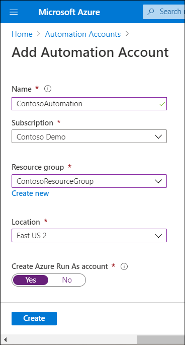
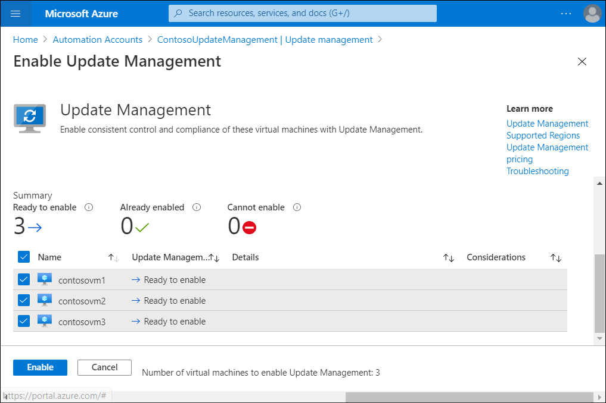

*Azure Automation* is a cloud-based service that provides process automation, configuration management, update management, and other management features for both Azure and non-Azure environments, including on-premises environments. Contoso can use Update Management, which is a free service in Automation to manage OS updates for Windows and Linux computers, both in the cloud and on-premises.

> [!NOTE]
> The associated Azure Log Analytics log storage does incur a charge based on the usage.

To implement Update Management in a hybrid environment, complete the following high-level steps:

1. Create an Automation account.
1. Enable Update Management.
1. Onboard your on-premises servers.
1. Schedule updates.

## Create an Automation account

When creating an Automation account, you'll choose an Azure region for the account. While the resources that are associated with the account are located in that region, the Automation account can manage any resources in your subscription. You can also choose to create a Run As account, which is a way to manage authentication for runbooks that use PowerShell. You don't need to create a Run As account to enable Update Management.

To create an Automation account, perform the following steps:

1. In the Azure portal, on the home page, search for and select **Automation Accounts**.
2. On the **Automation Accounts** blade, select **Create automation account**.
3. Enter the **Name**, and then select **Subscription**, **Resource group**, and **Location**.
4. In **Create Azure Run As account**, be sure to select **Yes**, and then select **Create**.

## Enable Update Management

To enable Update Management, in addition to having an Automation account you also must have an Azure Log Analytics workspace that's linked to that Automation account. The Log Analytics workspace must exist before enabling Update Management.

You can enable Update Management in Azure by using the:

- Azure Resource Manager template. Use a Resource Manager template to create a Log Analytics workspace, create an Automation account, link the Automation account to the Log Analytics workspace, and enable Update Management as one operation.
- Virtual machines dashboard in the Azure portal. You can enable Update Management and onboard Azure VMs from multiple resource groups and regions at the same time in the Virtual machines dashboard. When choosing this option, let Azure configure Log Analytics automatically, or create a custom configuration.
- **Virtual machine** page in the Azure portal. You can onboard a single VM and enable Update Management at the same time by selecting **Update management** from the options in the **Operations** section, and then selecting **Enable**.
- Automation account. You can enable **Update Management** from within an Automation account. With this option, you can automatically onboard Azure VMs and provide instructions for onboarding non-Azure VMs such as on-premises servers. You can also use an Azure runbook to onboard Azure VMs to Update Management. To do this, you must first onboard at least one VM.

To enable Update Management from your Automation Account, use the following procedure:

1. In the Azure portal, select your **Automation Account**.
2. In the **Automation Account** blade, select **Update Management**.
3. On the **Update Management** blade, you can verify that the Log Analytics workspace location, the Log Analytics workspace subscription, and the Automation account are already selected.
4. In the Log Analytics workspace list, select a suitable workspace, or select **Create New Workspace**, and then select **Enable**.

## Onboard your servers

The next step is to onboard your Azure VMs and on-premises machines. To complete this task, return to your Automation Account, and then select **Update management**. You can review the details, and then select the **+ Add Azure VMs**, **Add non-Azure machine**, and **Manage machines** links from the menu.

### Onboard Azure VMs

To add Azure VMs to Update management, use the following procedure:

1. In your Automation Account, select **Update management**.
2. Select  **+ Add Azure VMs**.
3. Select the VMs you want to onboard, and then select **Enable**.

> [!NOTE]
> The VMs must use the Log Analytics workspace that you have configured for your Automation account, otherwise you cannot onboard the VMs.

### Onboard on-premises servers

You must manually add your on-premises servers to Update Management in Automation. Before doing that, you must install the Log Analytics agent for Windows on the servers or VMs that you want to manage. Run the installation file interactively, or from the command line if you want to use Group Policy or other options to install the agent at scale. After the agent installs and starts reporting to your Automation account, choose which computers you want to manage in the **Update management** blade of your Automation account.

## Schedule updates

To schedule updates, navigate to your Automation account, select **Update management**, and then select **Schedule update deployment**. You can then add a name for the scheduled update deployment, and configure the properties for the update deployment.  

> [!NOTE]
> If you want to try configuring Update Management, refer to [Exercise: Use Update Management on a virtual machine](https://aka.ms/exercise-use-update-management-on-vm?azure-portal=true). You can use a trial Azure account to complete the exercise.

## Additional reading

You can learn more by reviewing the following documents:

- [Supported regions for linked Log Analytics workspace](https://aka.ms/region-mappings?azure-portal=true).
- [Enable Update Management from a runbook](https://aka.ms/automation-onboard-solutions?azure-portal=true).
- [Install the agent using the command line](https://aka.ms/install-agent-using-command-line?azure-portal=true).
- [Log Analytics agent overview](https://aka.ms/log-analytics-agent?azure-portal=true).
- [Update Management overview](https://aka.ms/update-management?azure-portal=true).