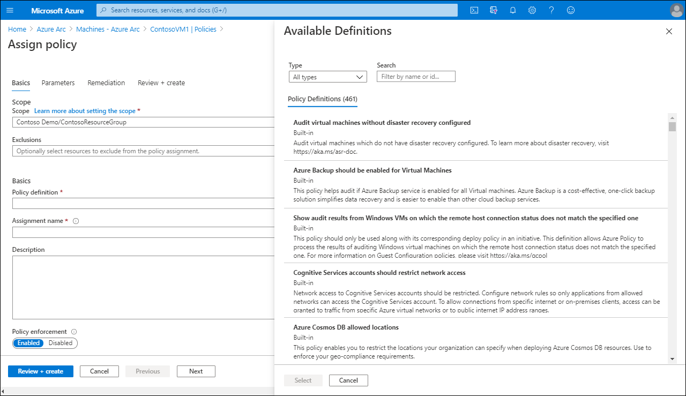
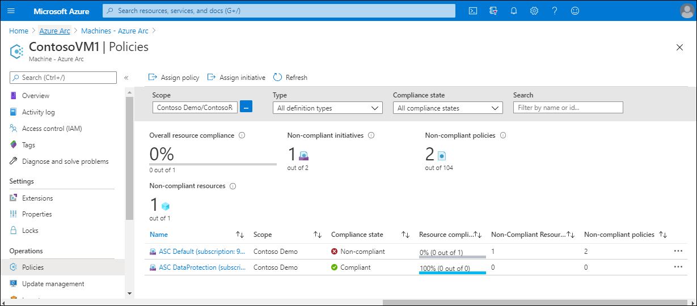

<!-- Editor, please update design doc with this revised topic title: Use Azure Arc to manage Windows Server instances. -->

<!--12 minutes minutes to read-->

After you have onboarded a Windows Server computer, you can use Azure Arc to manage and configure that device. A number of options are available, including those described in the following table.

|Option|Explanation|
|-----------------------------|------------------------------------------------------------|
|Overview|Enables you to review basic information about the VM, including status, location, subscription, computer name, operating system, and tags.|
|Activity log| Enables you to review a list of activities performed against the VM, and by whom the event was performed.|
|Access control|Enables you to review and manage access to Azure resources for users, groups, service principals. and managed identities at this scope by creating role assignments.|
|Tags|Name/value pairs that enable you to categorize resources.|
|Extensions|Enables you to add and remove extensions for the VM.|
|Policies| Enables you to add, configure, and remove policies for the VM.|
|Update management|Enables you to maintain consistent control and compliance of the VM with Update Management.|
|Change Tracking and Inventory|Enables you to review change tracking and inventory configuration for the VM. Change Tracking and Inventory help to enable consistent control and compliance of your resources.|
|Insights|Enables you to use Azure Monitor to review host CPU, disk, and up/down state of your Azure Arc VMs.|
|Logs|Enables you to run queries against logs to gather information about the VM.|

## Manage extensions

*VM extensions* are small apps that provide post-deployment configuration and automation tasks on Azure VMs. For example, if Contoso required that a VM needed some new software to be installed, or wanted to enable antivirus protection, or IT staff needed to run a script inside of the VM, they could use a VM extension. Azure Arc for servers enables you to deploy Azure VM extensions to both non-Azure Windows and Linux VMs; this can help to simplify management of those computers.

You can add the extensions listed and described in the following table, to an Azure Arc VM.

|Extension|Additional information|
|--------------------------|------------------------------------------------------------|
|CustomScriptExtension|Downloads and executes scripts on Azure VMs. Learn more at [Custom Script Extension for Windows](https://aka.ms/custom-script-windows?azure-portal=true).|
|DSC|Uploads and applies a PowerShell DSC Configuration on Azure VMs. Learn more at [PowerShell DSC Extension](https://aka.ms/PowerShell-DSC-Extension?azure-portal=true).|
|Log Analytics agent|Installs the Log Analytics agent on Azure VMs, and enrolls VMs into an existing Log Analytics workspace. Learn more at [Log Analytics virtual machine extension for Windows](https://aka.ms/log-analytics-vm-extension-windows?azure-portal=true).|
|Microsoft Dependency agent|Installs the Dependency agent on Azure VMs. Learn more at [Azure Monitor Dependency virtual machine extension for Windows](https://aka.ms/dependency-agent?azure-portal=true).                |

## Manage Azure Policy

*Azure Policy* is a service that can help organizations to manage and evaluate compliance for their Microsoft Azure environment's organizational standards. Azure Policy uses declarative rules based on properties of target Azure resource types. These rules form policy definitions, which administrators can apply through policy assignment to a scope such as an individual Azure resource, resource group, subscription, or management group.

For example, to simplify management of policy definitions, Contoso could consider combining multiple policies into initiatives, and then create a few initiative assignments in lieu of multiple policy assignments.

Azure Policy functionality can be grouped into four main categories:

- Enforcing compliance when provisioning new Azure resources
- Auditing compliance of existing Azure resources
- Remediating non-compliance of existing Azure resources
- Auditing compliance of the OS, application configuration, and environment settings within Azure VMs

> [!TIP]
> The last of these categories is implemented by using the Azure Policy Guest Configuration client, which is available as an Azure VM extension. Azure Arc for servers leverages the same client to provide the auditing functionality in hybrid scenarios.

Specifically, Contoso could use Azure Policy to implement the following rules:

- Restricting Azure regions into which they can deploy resources
- Restricting types of resources that they can deploy
- Restricting Azure VM sizes that they can deploy
- Assigning tags to resources during their deployment
- Installing Microsoft Antimalware extension to Azure VMs
- Identifying Azure VMs without Microsoft Antimalware extension installed

Azure Arc allows you to extend some capabilities of Azure Policy to operating systems of computers running in on-premises datacenters or hosted by third-party cloud providers. This functionality applies to auditing compliance of settings for the OS, applications, and environment. In addition, you have the ability to configure the time zone on servers running the Windows Server OS.

> [!NOTE]
> Enabling this functionality requires that the Azure Connected Machine agent be installed on each computer in the scope of management.

After you install the agent, it requires outbound connectivity to Azure Arc over Transmission Control Protocol (TCP) port 443. At that point, any Azure Policy Guest Configuration client-based configuration included in the assigned policy or initiative definition will automatically take effect.

In particular, Contoso could use the **[Preview] Audit Windows VMs that do not match Azure security baseline settings** policy initiative to audit compliance against Azure Security Center baselines. They also have the ability to set the time zone on target servers by assigning the policy definition **[Preview] Configure time zone on Windows machines**. When auditing target computers, Contoso would have the option of reviewing the logs either locally or remotely via the **Azure VM Run** command, which is available from the Azure portal.

> [!NOTE] 
> To identify whether a particular policy definition supports Azure Policy Guest Configuration client, you must determine whether it includes a reference to the Microsoft.HybridCompute/machines resource type.

### Assign Azure Arc policies

To manage and assign Azure Arc policies for a computer:

1. From the Azure portal, navigate to Azure Arc, and then select **Manage servers**.
2. From the returned list of managed servers, select the appropriate server, and then in the navigation pane, under **Operations**, select **Policies**.
3. To assign a policy, on the toolbar, select **Assign policy**.
4. On the **Assign policy** page, select the following information:
   - Scope and any exclusions from the scope of the policy
   - Policy definition.
   - Assignment name.
   - Description.
   - Policy enforcement (Enabled or Disabled)

5. Select either **Review + create**, or the **Parameters** and **Remediation** tabs to configure additional behaviors.

After you have assigned policies, from the Azure Arc homepage, on the selected VM, you can review the policy settings.

## Additional reading

You can learn more by reviewing the following documents.

- [Azure Policy built-in definitions for Azure Arc for servers](https://aka.ms/azure-policy-definitions?azure-portal=true)
- [Quickstart: Create a policy assignment to identify non-compliant resources](https://aka.ms/assign-policy-portal?azure-portal=true)
