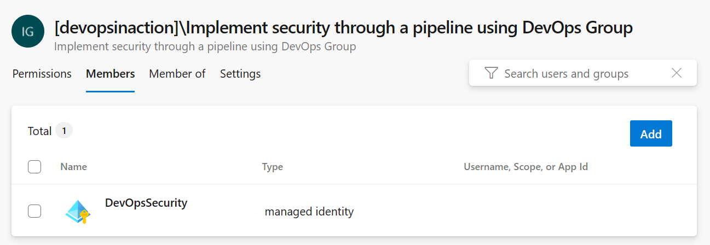

In this unit, learn how to configure self-hosted agent identities using Managed Identities. These features provide a secure alternative to personal access tokens (PATs) for authentication and authorization in Azure DevOps.

## Understanding agent identities

An agent identity is a security principal that represents the agent in Azure DevOps. It's used to authenticate the agent with Azure DevOps and determine the agent's permissions and access levels.

There are two types of agent identities:

- **User identity:** The agent identity is the same as the user identity that installed the agent. This is the default agent identity.
- **Managed identity:** The agent identity is a managed identity created by Azure for the agent. Managed identities are automatically managed by Azure, reducing the overhead of identity management.

## Benefits of using managed identities

Managed identities provide several benefits when used in Azure DevOps:

- **Improved security:** They eliminate the need to store sensitive credentials in your pipeline, reducing the risk of credential exposure.
- **Simplified management:** You can manage identities through Azure, reducing the overhead of identity management in Azure DevOps.
- **Fine-grained access control:** Managed identities allow you to define the exact permissions and access levels required for your pipelines and agents.
- **Auditing and monitoring:** Authentication and authorization events are logged, making it easier to track access and detect potential security threats.

## Create a managed identity and add it to Azure DevOps

Create your Managed Identity in Azure and assign the appropriate permissions to it. Then, configure the agent to use the Managed Identity.

1. In the Azure portal, navigate to the Managed Identities resource.
2. Click + Create and configure the Managed Identity as appropriate.

    

3. Assign the necessary permissions to the Managed Identity, following the principle of least privilege.
4. In Azure DevOps, navigate to your organization and select Organization settings.
5. Click Users under general.
6. Add the Managed Identity as a user.

    

7. Choose the appropriate access level for the Managed Identity and projects.
8. Click to Add.
9. Click in Security under Pipelines.
10. Click to Add a new security group or choose an existing one.
11. Add the Managed Identity to the security group.

    

## Configuring agent identities

1. In Azure DevOps, navigate to your project and select Project settings.
2. Under Pipelines, click Agent pools.
3. Select the agent pool containing the agent you want to configure.
4. Select the agent you want to configure.
5. Click the Security tab.
6. Click to Add, select the security group you added the Managed Identity and the role you want to provide.
7. Click to Add.

    

## Challenge yourself

To practice configuring agent identities:

1. Choose a project in your Azure DevOps environment and determine the required identity for the agent.
2. Configure the agent identity as appropriate, using a managed identity.
3. Update the pipeline YAML file to use your agent.
4. Review the agent identity's permissions and ensure that they follow the principle of least privilege.
5. Execute the pipeline and verify that it runs successfully using the chosen agent.

For more information about agents identities, see:

- [Use Azure Active Directory service principals & managed identities](https://learn.microsoft.com/azure/devops/integrate/get-started/authentication/service-principal-managed-identity)
- [Azure Pipelines agents.](https://learn.microsoft.com/azure/devops/pipelines/agents/agents/)
- [Microsoft-hosted agents.](https://learn.microsoft.com/azure/devops/pipelines/agents/hosted/)
- [Create and manage agent pools.](https://learn.microsoft.com/azure/devops/pipelines/agents/pools-queues/)
