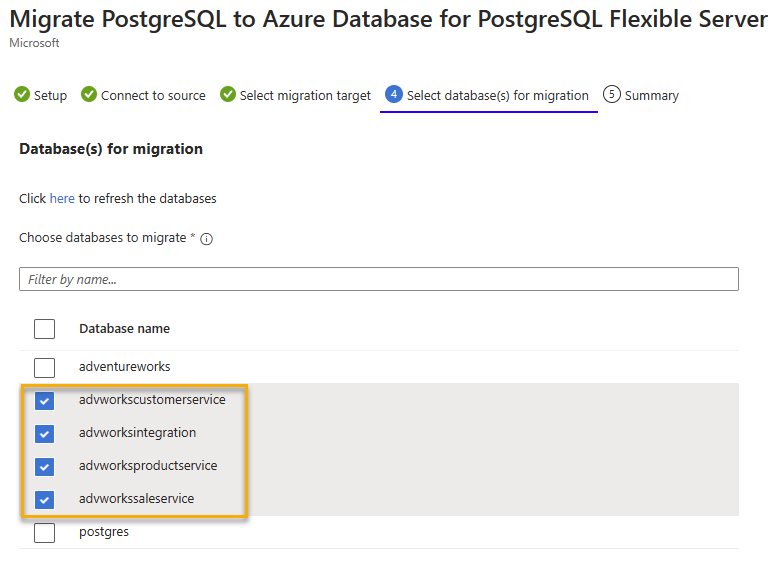
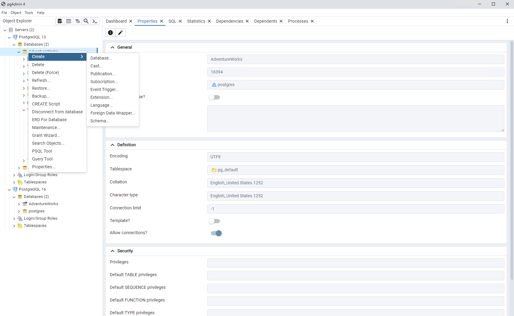

There are many options available to perform a migration from a PostgreSQL server to Azure Database for PostgreSQL Flexible Server. There are native PostgreSQL tools such as pg_dump, pgadmin, and pg_restore. There are Microsoft Azure cloud services such as the Database Migration Service and the migration option in Azure Database for PostgresSQL - Flexible Server, which can largely automate the overall data transfer process from source to target.

## Azure Database for PostgreSQL Flexible Server - migration

Within the Azure Database for PostgreSQL - Flexible Server service, there's a native capability to support the migration of databases from other PostgreSQL instances to the Azure based service. This option is geared towards the offline migration of databases from source to target. To use this option, we need to use the pg_dumpall and psql tools discussed earlier to migrate the server level objects databases migrating to the flexible server.

This feature is designed with external PostgreSQL instances as the source and the Flexible Server on which the migration project was created as the target. Essentially for pulling data into the flexible server. The benefits of using this service over performing a manual dump and restore process is the managed nature of the migration. Once configured, it monitors the process for all fo the tables being migrated into the Flexible Server, so we can easily see when the cut-over at application level can be performed.

### Migration Projects

Once we have connectivity sorted, then all we need to do is select the database or databases that we want to migrate to the new server. In the following screenshot, notice that if there are multiple databases that back several services that form part of a larger system then we can select to migrate them as a group rather than one at a time. This database grouping can really help not only speed up migrations but also to maintain logical consistency during migration activities.



When we start the validate and migration process, then we can review the overall progress of the process using the project dashboard. This dashboard shows us as the databases are validated and then as they're migrated to the new server.


This information will be retained after the migration, allowing us to track overall progress. The information also provides any evidence needed to change control processes about the success and duration of any work that is undertaken.

## PostgreSQL tools

Here we explore the main tools that can be used for migrating data from a PostgreSQL server to Azure Database for PostgreSQL Flexible Server.

### pgcopydb

[Pgcopydb](https://pgcopydb.readthedocs.io/en/latest/index.html) is an open source project that can automate the process of copying a database between PostgreSQL servers. There are several benefits to using pgcopydb over the native tooling provided when installing PostgreSQL, these benefits include.

- Removing the need for intermediate files using pg_backup and pg_restore.
- Create Index Concurrency to parallelize the creation of indexes on tables by using the synchronize__seqscans capability within PostgreSQL.
- Multi-threaded table copying to partition data and transfer larger tables in parallel.
- Change Data Capture for data synchronization to minimize the need for prolonged downtime windows.

There are two main options within pgcopydb that can be used for database and data migration from a source server to target. These options are clone and copy.

#### pgcopydb clone

Clone is the primary option for copying an entire database from a source server to a target. This command has several switches that are available that allow us to configure a basic clone operation, through to automating the configuration of change data capture to synch data to minimize migration downtime. We can also specify the options to parallelize data transfer by table and parallel transfer options for tables, indexes, and large objects.

#### pgcopydb copy

Copy is an option that allows for greater granularity of control when it comes to migrating the database or parts of it. We can use this command option to pick which schemas, tables, roles, etc. to transfer from a source server database to the target server and database. This command is useful in the scenarios where one large database is being decomposed into smaller ones as part of an application modernization migration activity. Alternatively, a consolidation migration activity allows us to migrate the content of one database into schemas within another.

These options are just some of the ways in which pgcopydb can help us improve the process of migrating databases to Azure Database for PostgreSQL Flexible Server. This process provides a migration way that minimizes risk and maximizes our chances of success.

### pgAdmin

[pgAdmin](https://www.pgadmin.org/) is a widely used management tool that can be used to interact with PostgreSQL databases. This tool allows for the creation and execution of pgsql scripts. The tool contains an array of useful GUI tools that can be used to configure, backup, and restore PostgreSQL databases. Typically, install pgAdmin on administrative workstations. This tool makes it possible to register and connect to multiple PostgreSQL servers, making it a key part of our migration tool set.



### pg_dump, pg_restore, and psql

[pg_dump](https://www.postgresql.org/docs/current/app-pgdump.html) is a command line tool that installed alongside a PostgreSQL instance, and can be installed as needed on an administrative workstation. It allows the creation of consistent database backups from PostgreSQL even when there's a concurrent workload taking place. It works with individual databases and allows us to back up an entire database or parts of it.

If using pg_dump to export schema objects, then we can use psql to run the resultant .sql file on the target database to create the objects. After this step, we can look at ways to move the data from the source to the target system. The commands to use for exporting a database schema from one database and creating it in another can be seen in the following example.

```bash

pg_dump -O --host=MyServerName --port=5432 --username=adminuser --dbname=AdventureWorks --schema-only > adventureWorks.sql

psql --host=MyFlexibleServer --username=demo --dbname=AdventureWorks < adventureWorks.sql

```

If we're creating a full dump of the source database, we look to use pg_restore to read the resultant file and restore the database to the target PostgreSQL instance. There are several determining factors for how long these activities take when performing a backup and restore to dump. Notably the size of the database, the performance of the storage subsystem, and the network bandwidth and latency between the processing components.

The following example shows how we can create a database dump into a custom  and then restore it to another server.

```bash

pg_dump -Fc --host=MyServerName --port=5432 --username=adminuser --dbname=AdventureWorks > db.dump

pg_restore -Fc --host=MyServerName --port=5432 --create --username=adminuser --dbname=AdventureWorks db.dump

```

### pg_dumpall

Whereas pg_dump is used to dump a single database, [pg_dumpall](https://www.postgresql.org/docs/current/app-pg-dumpall.html) is used to dump all databases out to a single script file that psql reads into a new instance of PostgreSQL.

Additionally, pg_dumpall can be used to generate script files for global server level objects like roles which databases can depend on when being migrated between servers.

## Next: Select the migration mode and tools
