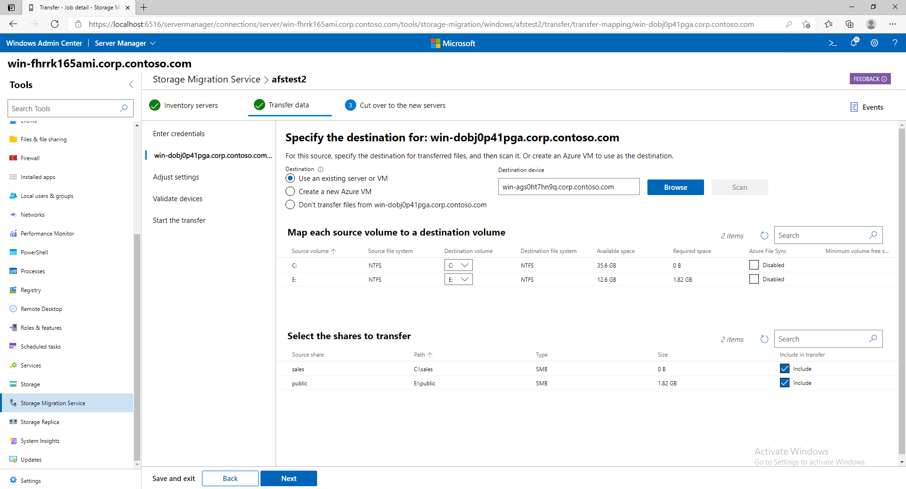

After you have prepared all the servers for the data migration, you can begin to perform the migration. You perform all tasks by using Storage Migration Service in Windows Admin Center. As part of your preparation, you can use this tool to install the Storage Migration Service on the orchestrator server.

> [!NOTE]
> You can include multiple source and destination servers in a migration job, but there's a one-to one relationship between source and destination servers.

## Inventory source servers

All phases of the migration are controlled by a job that you create for the purpose. The first stage in the job is inventorying source servers. You can identify whether Windows servers or Linux servers are being migrated, and you'll be prompted for credentials to gather information from the source servers.

After you've provided the basic information, add the servers to be inventoried. If you know the server names, enter them in directly. Otherwise, you can search for servers in Active Directory Domain Services (AD DS). After all the servers are added, start a scan.

The scan of the source servers identifies:

- Shares

- Server configuration

- Network adapter configuration

- Volumes

## Migrate data

To transfer data, you must enter credentials that have administrative permissions on the destination server. After you enter the credentials, add the destination server, and scan it to identify the volumes present on the destination server.

If you want to create an Azure virtual machine (VM) instead of specifying an existing server, the following are required:

- A valid Azure subscription.

- An existing Azure Compute resource group where you have Create rights.

- An existing Azure Virtual Network (VNet) and subnet.

- An Azure Express Route or virtual private network (VPN) solution tied to the VNet and subnet that allows connectivity from this Azure infrastructure as a service (IaaS) VM to your on-premises network and all the computers being used for migration.

To identify where the source data is to be migrated, you must map source volumes to the volumes on the destination servers. You also must identify which shares you want to migrate. In most cases, you won't want to migrate administrative shares.

You can choose to migrate local users and groups from source servers to the destination server. If there are naming conflicts with existing local users and groups, you can specify whether to reuse existing accounts or rename existing accounts on the destination. If you're migrating data from a domain controller, you must specify that local users and groups won't be transferred.

> [!NOTE]
> Migrated local users are assigned a randomly generated 127-character password. 

After you have specified the options for data transfer, you can perform a validation. The validation ensures that everything is properly configured for the migration.

Storage Migration Service is designed to allow the transfer process to be performed multiple times. The first time transfers a full copy of the data, and subsequent transfers copy only changed files. You can use this functionality to perform an initial large copy and then perform a final transfer during a maintenance window.

> [!NOTE]
> If files are found on the destination server during the initial file copy, they must be moved to a backup folder.

After the file transfer is complete, the files, shares, and their security permissions are migrated to the destination server. If you don't want to migrate the source server identities to the destination server, you can mark the migration complete at this point.

## Cut over to the destination server

Cutting over to the destination server moves the identity information from the source server to the destination server. This includes the server name and IP address.

When you perform the cutover, you must specify:

- Which adapter on the destination server will be configured with the source IP addresses.

- The IP address to assign to the source server.

- The name to assign to the source server.

When you perform the cutover, user access to the migrated data will be interrupted as the servers are renamed and restarted. This process is typically performed during a maintenance window. After the cutover is complete, users and apps can access the data by using the same server names, IP addresses, and share names as they used before the migration.

After a cutover, there's no automated way to roll back to the source server. You can manually reconfigure the computer names and IP addresses on the source and destination servers to roll back.

