In this exercise, we'll introduce using *Azure Database Migration Services* (***DMS***) to migrate to an Azure Cosmos DB API for MongoDB account. 

> [!NOTE]
> To complete this exercise, you'll need a Microsoft Azure subscription. If you don't already have one, you can sign up for a free trial at ***https://azure.microsoft.com/free***. You cannot use a Microsoft Learn sandbox subscription for this exercise..

## Prerequisites for this exercise

You'll need to complete some steps before we can create our DMS migration project and start our migration. Some steps will be performed on your local client machine others will be prerequisites on the Azure portal. Logically if you already completed some of these prerequisites, just move to the next step.

### Download and setup Visual Studio Code and Visual Studio Code Azure CLI tools extension

Azure DMS has three different modes to select your source for the migration. The ***Standard mode*** is used to input your MongoDB server address, port and sign-in information. The ***connection string mode*** contains a connection string to a server. Finally the ***data from Azure storage mode*** points to an Azure Blob Storage container. For this lab, we'll use a MongoDB backup so we'll choose the *data from Azure storage mode*.

> [!NOTE]
> While we will use a MongoDB Backup for this migration exercise, a similar set of steps will be taken to migrate from a live MongoDB database. The main difference will be the options we will input when selecting the source mode.

Let's prepare our environment to move the backup to the Azure Storage account. In this exercise, we'll use Visual Studio Code to copy the files to the Azure Storage account. If you've previously completed any of these steps, just move to the next step.

1. Download and setup [Visual Studio Code][/products/visual-studio-code/] in your client environment.

    1. [Download][/download] Visual Studio Code.
    1. [Install/Setup][/docs/setup/setup-overview] Visual Studio Code.

1. Once Visual Studio Code has been installed on your client, let's go ahead and open it. The Bash script we'll run need to connect and run Azure CLI commands, so we'll need to add the Azure Extensions to your Visual Studio Code environment. Let's search for Azure or cloud extensions in the VS Code Extensions view (**Ctrl**+**Shift**+**X**) and type ***Azure CLI Tools***. If the extension is already installed, go to the next section.

1. Select **Azure CLI Tools** from the list and select **Install** on the *Extension: Azure CLI Tools* tab.

    > [](../media/6-visual-studio-code-azure-cli-extensions.png#lightbox)

1. Once the Install icon in the tab changes for a *Disable* and *Uninstall* button, you can close the tab since that means the extension is now installed.

### Download the GitHub repository using Visual Studio

Let's put Visual studio Code to some good use, first, we need to clone the lab repo.

1. Once Visual Studio Code has been installed on your client, let's go ahead and open it.
1. Press ***Ctrl***+***Shift***+***P*** to *Show All Commands*.
1. On the text box that opens on the top, type **Git:Clone** to clone the repository.
1. Input the git URL

    > ```bash
    > https://github.com/MicrosoftLearning/mslearn-cosmosdb.git
    > ```

    1. Choose a folder to copy the repository to. It might be a good idea to create a new empty directory for this clone, that you can easily find later.
    1. Once it has completed downloading the repository it will ask ***Would you like to open the clone repository?***, select the **Open** button.

    > [!NOTE]
    > If you did not selected the ***Open*** button, select ***File*** -> ***Open folder*** and select the folder where you cloned the repo to open it.

    1. If a dialog pops-up asking if you trust the authors, just check the checkbox, and select ***Yes, I trust the authors***.
    1. You can close any other pop-ups that might have appeared on the lower right hand side.
    1. You can close the ***Get Started*** tab if it's opened.

You should have now installed Visual Studio Code, and cloned the lab repo. Time to run some setup scripts.

> [!NOTE]
> The Bash script in the following section will use the **unzip** command so make sure it's installed and mapped in your client machine, if you have not install it, do so now and restart Visual Studio Code.

### Download and install AzCopy

There are many ways we can get our Backup files to the Azure Blob Storage Account we'll create in this lab. For this exercise, we'll use [AzCopy][/azure/storage/common/storage-use-azcopy] to copy those files from our client to the Cloud.

- [Download][/azure/storage/common/storage-use-azcopy#download-azcopy] the AzCopy program to your client.
- Use your favorite decompressing tool to expand the compressed file.
- Move the **azcopy.exe** file (or **azcopy** under Linux) to the ***mslearn-cosmosdb*** directory created when we cloned the repo in the previous section. The *init.sh* script will expect to find the *azcopy* file in that directory.

### Create your Azure Cosmos DB account, Azure Storage Account, and upload the backup files to Azure storage

We'll run a script that will create the Azure storage and Azure Cosmos DB account. The script will then copy the database backup files from the client to our Azure blob storage account.

1. Open Visual Studio Code and open the cloned repository folder if not already opened. 
1. Right-click on the **api-for-mongo-db** folder and select ***Open in integrated Terminal***.

    > [](../media/6-visual-studio-code-integrated-terminal.png#lightbox)

1. The terminal might have opened by default in PowerShell mode, if so let's change it to Bash. On the upper right hand side of the terminal, select the pulldown to the right of ***`pwsh +`*** and select **Git Bash** from the menu.

    > [](../media/6-visual-studio-code-select-bash.png#lightbox)

1. In Visual Studio Code Bash terminal, copy and paste the following commands.

    1. If you already have a resource group you want to use, replace the string ***YOURRESOURCEGROUPHERE*** below for the name of your resource group. If you want the script to create a resource group for you, use the next step. *This script will open a browser window to sign in to your Azure account.*

    > ```bash
    > GitRepositoryRoot=$(pwd)
    > # Open a browser window to login to Azure, once you are logged in,
    > # close the browser window and continue running the script.
    > az login
    >
    > # Create an Azure Cosmos DB API for MongoDB account and add the customer collection
    > # replace YOURRESOURCGROUPNAMEHERE with your Resource Group Name 
    > bash $GitRepositoryRoot/api-for-mongodb/03-migrating-to-azure-cosmos-db-using-dms/init.sh -r YOURRESOURCEGROUPNAMEHERE
    > ```

    1. If you want the script to create a resource group for you, run the following script. *This script will open a browser window to sign in to your Azure account.*

    > ```bash
    > GitRepositoryRoot=$(pwd)
    > cd $GitRepositoryRoot/api-for-mongodb/03-migrating-to-azure-cosmos-db-using-dms
    > # Open a browser window to login to Azure, once you are logged in,
    > # close the browser window and continue running the script.
    > az login
    >
    > # Create an Azure Cosmos DB API for MongoDB account and add the customer collection
    > bash $GitRepositoryRoot/api-for-mongodb/03-migrating-to-azure-cosmos-db-using-dms/init.sh
    > ```

    > [!Tip]
    > When the script completes it will return several of the account names and ids, you will need some of those later in the lab so store them somewhere.

    > [!NOTE]
    > This bash script will create the Azure Cosmos DB API for MongoDB account, create an Azure blob storage and copy the MongoDB backup into the blob storage. ***It can take 5-15 minutes to create these accounts*** and moved the files so it might be a good time to get a cup of coffee or tea.

    1. Don't close Visual Studio Code, we'll need it in a few minutes.

## Set up the Azure Database Migration Service

Now that we've created our Azure Cosmos DB account, created an Azure Blob Storage account, and move our MongoDB backup files to that account its time to take care of our Azure Database Migration Service.

1. If you haven't done so, open a browser window and sign in to ***https://portal.azure.com*** using the same account your used in the previous sections.

1. Select ***+ Create Resource***.

1. Search for ***Azure Migration Service*** and select it.

    > [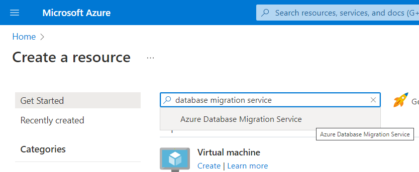](../media/6-create-resource-database-migration-service-search.png#lightbox)

1. Select ***Create***.

    > [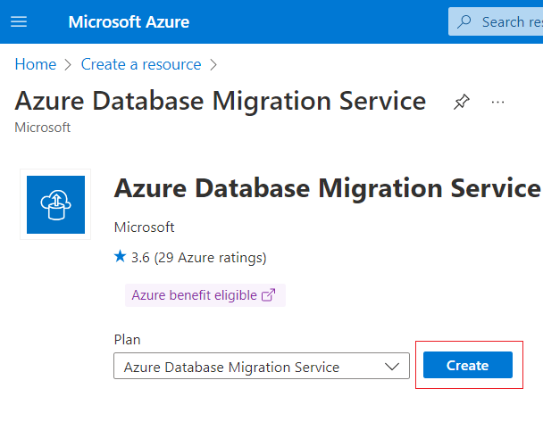](../media/6-database-migration-service-create.png#lightbox)

1. Select the radio button that includes the option ***MongoDB database(s) to ... Azure Cosmos DB*** and then select the ***Select*** button.

    > [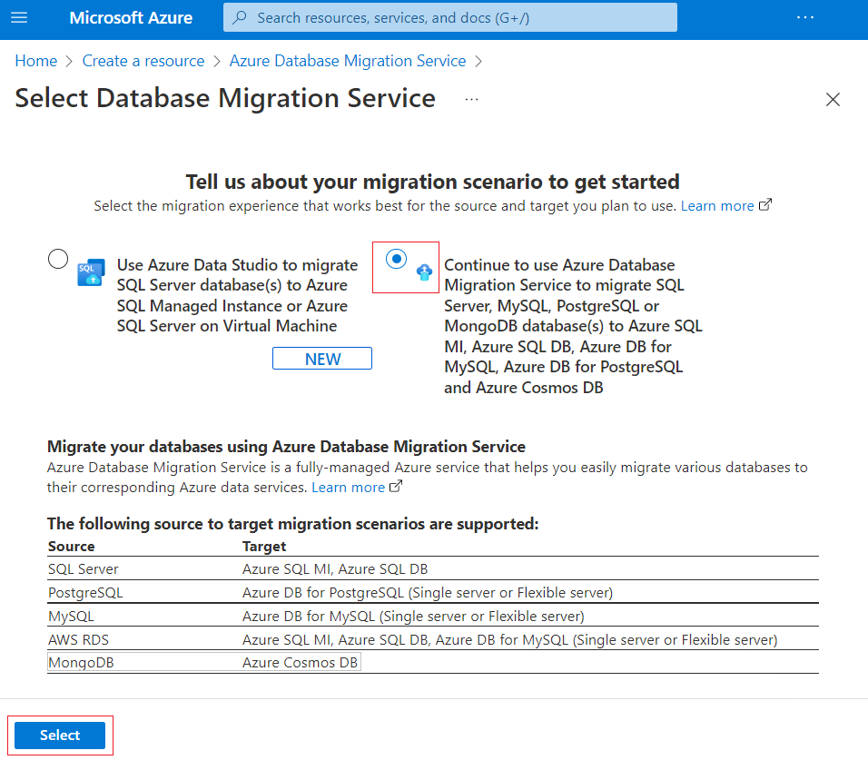](../media/6-select-database-migration-service-for-mongodb.png#lightbox)

1. Enter the following information on the ***Basic*** tab of the *Create Migration Service* page.

    | **Setting** | **Value** |
    | ---: | :--- |
    | **Subscription** | *Your existing Azure subscription* |
    | **Resource group** | *Select the resource group we used in the previous sections* |
    | **Migration service name** | *Enter a globally unique name* |
    | **Location** | *Choose the location we used in the previous section* |
    | **Service mode** | *Leave it as Azure* |
    | **Pricing tier** | *Leave it as Standard 1 vCores* |

    > [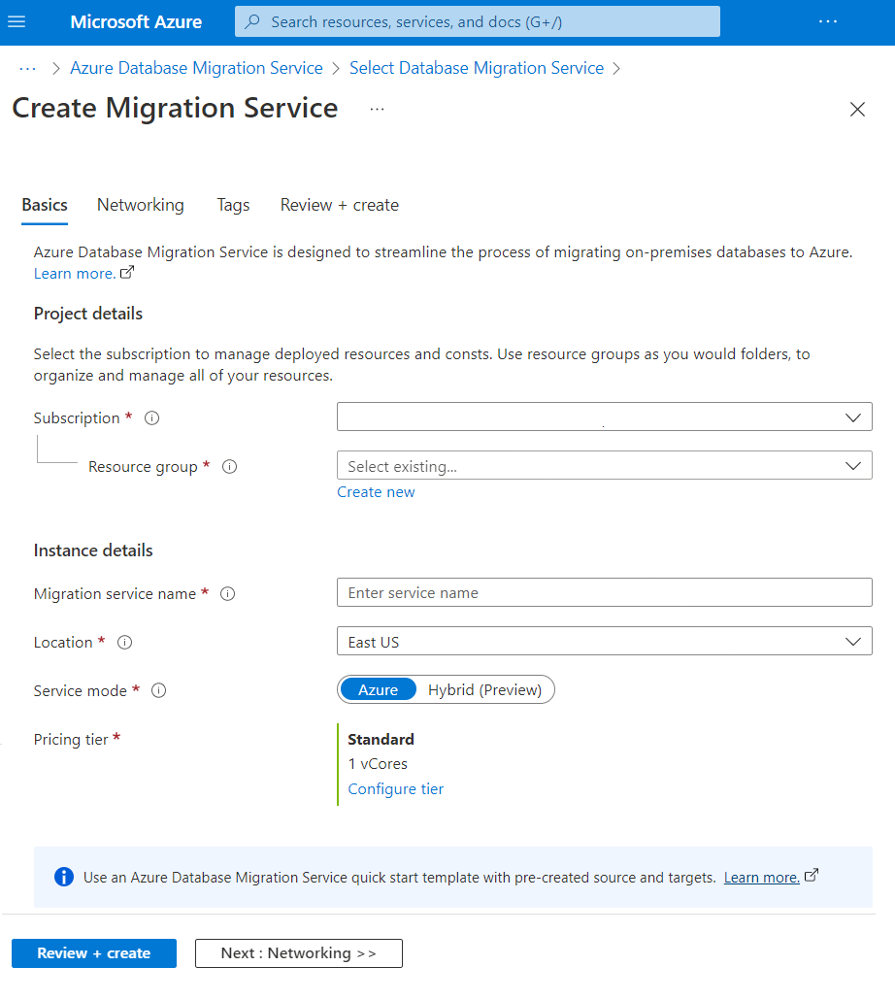](../media/6-create-migration-service-basic-tab.png#lightbox)

1. Select the ***Networking*** tab.  While they might be existing virtual networks listed, let's create a new one. Give the network a name under the **Virtual Network Name** textbox. *If you can't create a virtual network in your environment, ask an Azure Administrator to provide you one*.

    > [](../media/6-create-migration-service-network-tab.png#lightbox)

1. Select the **Review and Create** button and then select the **Create** button to create the *Database Migration Service*.

    > [!NOTE]
    > The creation of Database Migration Service, creates several resources behind the scenes that take care of the migration process. This means that it will take some time to create those resources. ***It can take 10-25 to create the Database Migration Service environment***, so it might be a good time to get another cup of coffee or tea.

## Create a New Migration Project under Azure DMS

Now that we've create our Azure DMS, we can create as many migration projects as we need. The projects will define what is the source, what is the destination, and what databases and collections will we migrate.

For this exercise, our project will use a MongoDB `mongodump` backup of four databases and migrate them to an Azure Cosmos DB account.  Those backup files were moved to an Azure Blob Storage account earlier in the exercise. Before we create our migration project, we'll need to get a connection string to the blob container where we stored the backup files. Let's do that first.

### Retrieving the Azure Blob Storage connection string

Azure Blob Storage connections strings are in a URI format. Additionally, these connection strings usually are in a shared access signature ([SAS][/rest/api/storageservices/delegate-access-with-shared-access-signature]) format, which is a URI that grants restricted access rights to Azure Storage resources.

1. Sign in to the Azure portal, https://portal.azure.com.

1. Search for *Storage Accounts*, select it and select the Storage Account name we created earlier in the lab.

1. If you haven't done so, on the *Azure portal*, search for **Azure Database Migration** on your search bar, select it, and select the Azure DMS we just created to open its page.

1. On the Storage account left hand menu, under the *Data Storage* section, select **Containers**.

1. Select the ***`mongodbbackupdirectory`*** container.

1. On the *`mongodbbackupdirectory`* container left hand menu, under the Settings section, select ***Shared access*** tokens.

    > [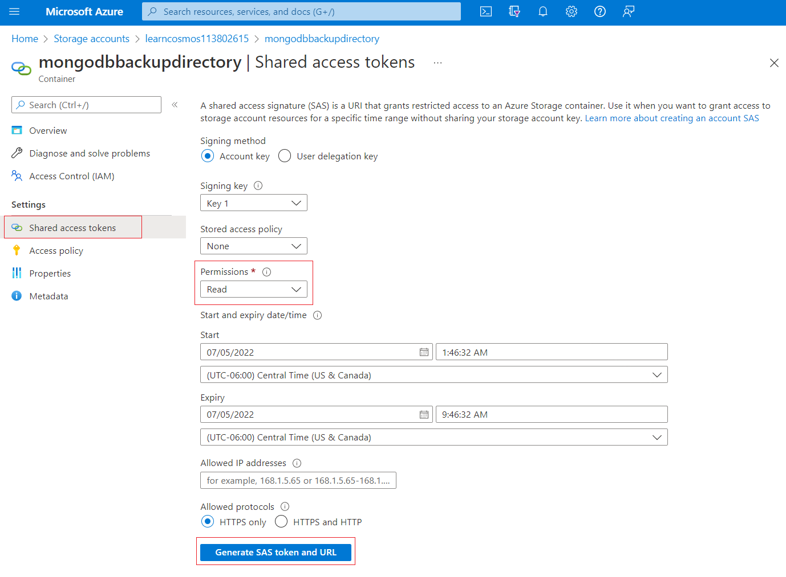](../media/6-sas-page-set-permissions.png#lightbox)

    > [!NOTE]
    > The actual settings of this page are way beyond the scope of this lesson, your can read further on this topic under the [Create an account SAS][/rest/api/storageservices/create-account-sas] article.

1. Since we're going to perform this migration in a few minutes, we only need to set one setting, the ***Permissions*** setting. Select the **Permissions** pulldown, and select **Read** and **List**.

    > [](../media/6-sas-page-permissions-selected.png#lightbox)

1. Finally, select the **Generate SAS token and URL** button to generate the URI we need. A  ***Blob SAS token***, and a ***Blob SAS URL*** will be generated. Copy the **Blob SAS URL** because we'll need it in the next steps.

    > [](../media/6-sas-url.png#lightbox)

### Migration Project general information

Now that we have our SAS URL, let's create the Migration Project.

1. If you haven't done so yet, on the *Azure portal*, search for ***Database Migration Service***, select it, and select the DMS we created earlier.

1. Under the Overview section, select **+ New Migration Project**.

    > [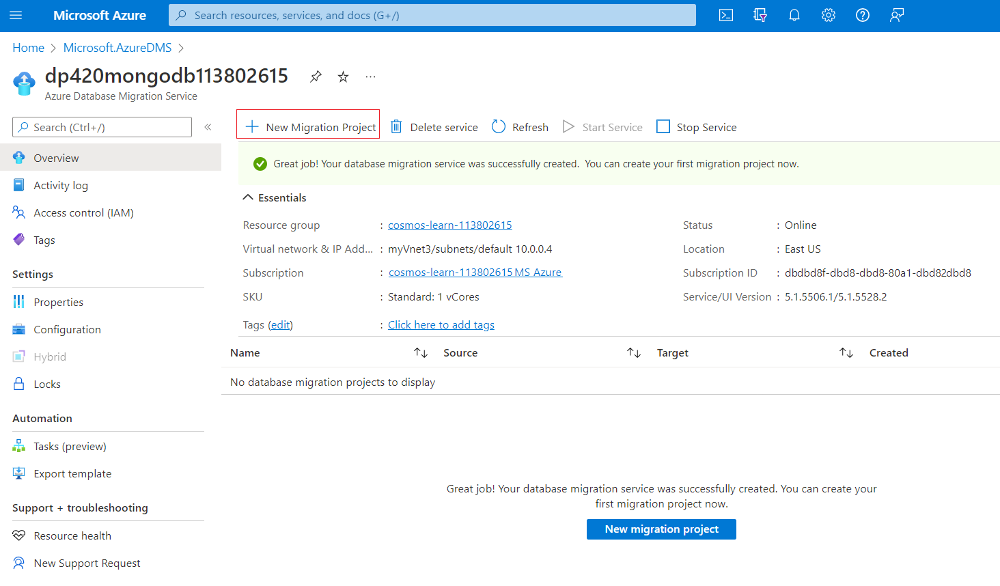](../media/6-new-migration-project.png#lightbox)

1. Let's define the general information about our project, input the following data into the ***New migration project*** page.

    | **Setting** | **Value** |
    | ---: | :--- |
    | **Project name** | *Give the project a descriptive name* |
    | **Source server type** | *MongoDB* |
    | **Target server type** | *Cosmos DB (MongoDB API)* |
    | **Migration activity type** | *Offline data migration* |

    > [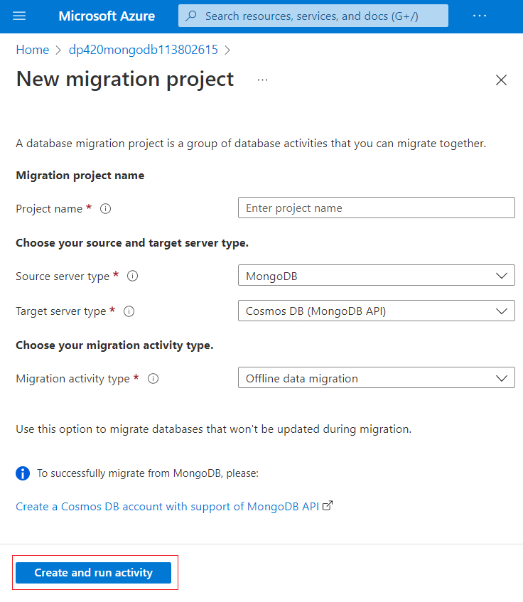](../media/6-new-migration-project-general.png#lightbox)

1. Select the **Create and run activity** button.

### Migration Project Offline Migration Wizard

Now we should have everything we need to define the migration details of our project.

1. On the ***Select source*** tab, insert the following data.

    | **Setting** | **Value** |
    | ---: | :--- |
    | **Mode** | *Data from Azure storage* |
    | **Blob contains BSON dumps** | *Select it since our files are a `monogdump` backup* |
    | **Connection String** | *Copy the BLOB SAS URL we created earlier* |

    > [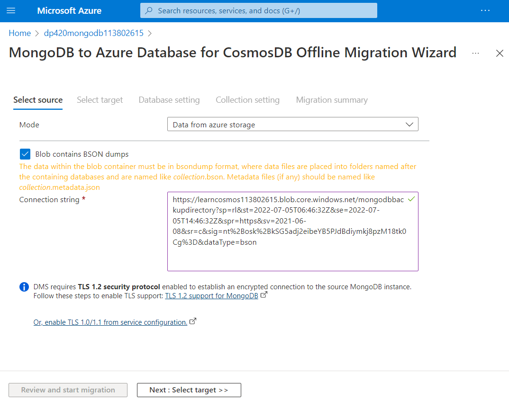](../media/6-migration-project-source-tab.png#lightbox)

    > [!NOTE]
    > While in this exercise we are migrating from a backup, the subsequent steps would have been very similar regardless if you had chosen the **Standard mode** or the **Connection String mode** to connect directly to a MongoDB server.

1. Select the **Next: Select target >>** button. If you made a mistake with the Connection String, or if your SAS URL expired, you won't be able to select the target until you fix the issue.

1. On the ***Select target*** tab, insert the following data.

    | **Setting** | **Value** |
    | ---: | :--- |
    | **Mode** | *Select Cosmos DB Target* |
    | **Subscription** | *Your current subscription* |
    | **Select Cosmos DB Name** | *The name of the Cosmos DB Account our script created earlier in this exercise* |
    | **Connection String** | *This setting should auto-populate one you choose the Cosmos DB name* |

    > [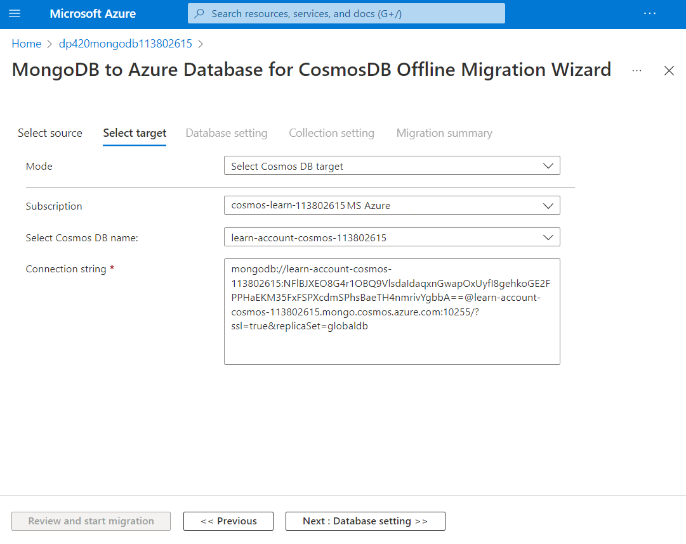](../media/6-migration-project-target-tab.png#lightbox)

    > [!NOTE]
    > While in this exercise we are migrating to an Azure Comos DB account, the subsequent steps would have been very similar if you had chosen the **Standard mode** or the **Connection String mode** to connect directly to a MongoDB server.

1. Select the **Next: Database Settings >>** button.

1. This tab was populated from your source, it gives you the ability to choose which databases to migrate and define the database shared throughput. In our case, we want to migrate all databases and not define any database shared throughput. Select the *checkbox* right besides the *Source Database* title. This checkbox should have selected everything.

    > [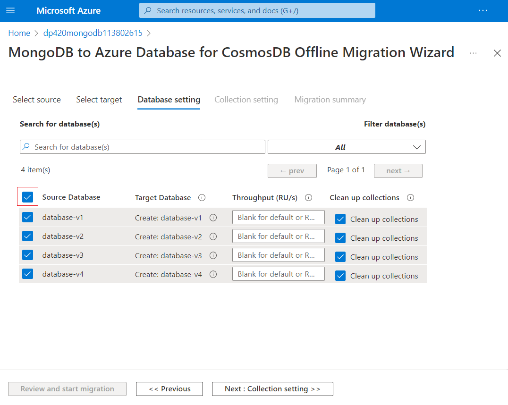](../media/6-migration-project-database-tab.png#lightbox)

1. Select the **Next: Collection Settings >>** button.

    > [](../media/6-migration-project-collection-tab.png#lightbox)

1. We'll spend a few more minutes on the Collection tab.  Expand all your database to list the collections under each database.  All our collections will be pre-selected, that is fine because we'll migrate all of them. Also note that it gives us options to change the Throughput, the Shard key and set the documents as Unique. In this exercise, we'll ignore both the *Throughput* and the *Unique* settings. We'll concentrate on the Shard key. You'll notice that all of the Shard Keys are prepopulated with the `_id` column. Allowing this column to become the shard key, will most likely lead to terrible performance and not take advantage of a good shard key. Let's fix that.

    1. Go back to Visual Studio Code.
    1. Open the file ***config.json*** under the **data/dump** directory. This file lists the shard key (labeled as ***pk***) of every one of those collections.
    1. Change all the **Shard Keys** in the **Collection Setting** tab for their corresponding ***pk*** field in the json file. The `_id` field isn't the same as `id`, so you'll need to change those shard keys too.

    > [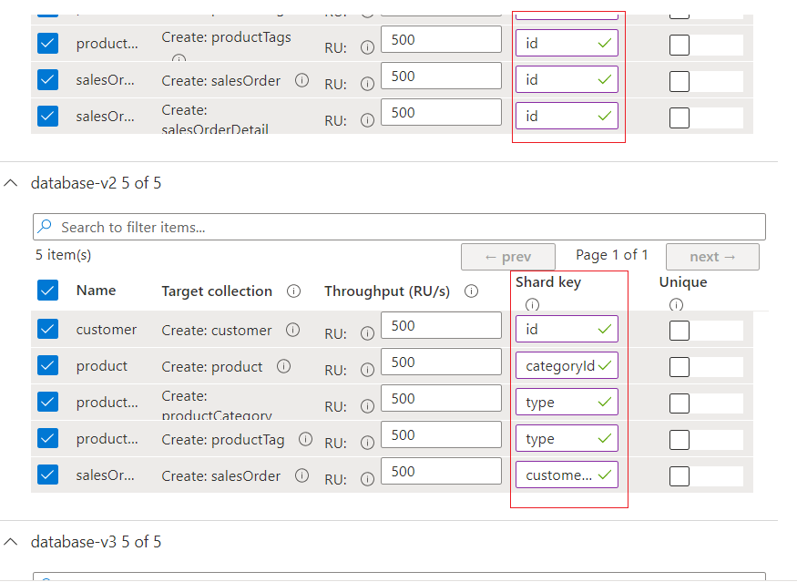](../media/6-migration-project-shard-key.png#lightbox)

1. Once you're done changing all your Shard Keys, we're finally ready to start our migration. Select the **Next: Migration summary >>** button.

1. Give your activity a name under **Activity Name**, then select the **Start migration** button. The **Boost RUs during migration** checkbox is already selected, leave it selected.

1. On the status page, select Refresh often to see the progress of your migration. It can take up to a minute for your migration to actually start, but you should see it processing documents once it starts.

    > [!NOTE]
    > Since we chose a **1 vCore Standard** *price tier*, our migration ***can take 5-15 minutes to complete***, so it might be a good time to take another short break.

1. A few minutes later you should see a status of Completed for all your databases.

## Our documents have now been migrated to Azure Cosmos DB

So the last thing we need to do, is check out the fruits of all this labor.

1. If you haven't done so, on the Azure portal, search for Azure Cosmos DB on your search bar, select it, and select the Azure Cosmos DB our script created at the beginning of this exercise.

1. Go to the **Data Explorer**.

1. The four databases should be there. Expand them and you'll see their respective collections. Expand the collections and you'll see their documents. The collection's throughput and Shard Key will have the setting we selected in the migration wizard collection tab.

    > [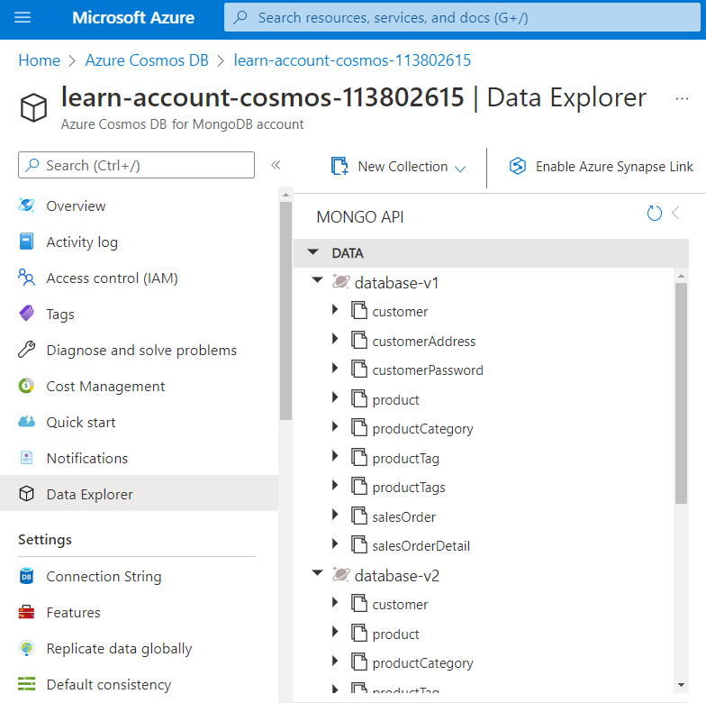](../media/6-data-explorer.png#lightbox)

In this exercise, we've introduced how to migrate MongoDB data into Azure Cosmos DB using the Azure Database Migration Service. Azure DMS, is just one of several options we have to migrate your MongoDB databases into Azure Cosmos DB. To learn more on online and offline migration take a look at the [Options to migrate your on-premises or cloud data to Azure Cosmos DB][/azure/cosmos-db/cosmosdb-migrationchoices#azure-cosmos-db-mongo-api] article.

[/products/visual-studio-code/]: https://azure.microsoft.com/products/visual-studio-code/
[/download]: https://code.visualstudio.com/download
[/docs/setup/setup-overview]: https://code.visualstudio.com/docs/setup/setup-overview
[/azure/storage/common/storage-use-azcopy]: https://docs.microsoft.com/azure/storage/common/storage-use-azcopy
[/azure/storage/common/storage-use-azcopy#download-azcopy]: https://docs.microsoft.com/azure/storage/common/storage-use-azcopy#download-azcopy
[/rest/api/storageservices/delegate-access-with-shared-access-signature]: https://docs.microsoft.com/rest/api/storageservices/delegate-access-with-shared-access-signature
[/rest/api/storageservices/create-account-sas]: https://docs.microsoft.com/rest/api/storageservices/create-account-sas
[/azure/cosmos-db/cosmosdb-migrationchoices#azure-cosmos-db-mongo-api]: https://docs.microsoft.com/azure/cosmos-db/cosmosdb-migrationchoices#azure-cosmos-db-mongo-api