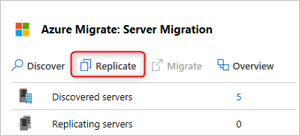
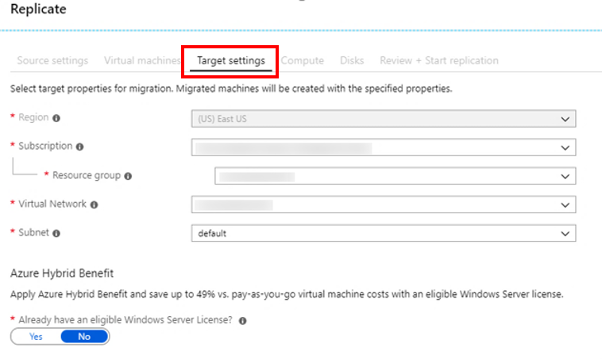

You’ve completed discovery and assessment and have identified the specific servers you plan to migrate for the pilot. You’ve also ensured that required prerequisites are in place for the Azure Migrate project and your on-premises VMs.

Having completed these preparations, you’re ready to migrate your selected Hyper-V workloads to Azure.

In this unit, you'll review Azure Migrate Server Migration and how to configure replication for specific workloads to Azure.

## Set up replication

The first step in migrating servers is to replicate them. In this task, you configure and enable the replication of your on-premises virtual machines from Hyper-V to the Azure Migrate Server Migration service.

In the Azure Migrate Server Migration tool, click **Replicate**.

In **Source settings**, select the Hyper-V workload.

Although you can import migration settings from an existing assessment, you decide to specify the migrations settings for the VMs manually. This lets you change VM sizing and OS disk settings as needed.

In Virtual Machines, select the VMs you plan to migrate. You can replicate  up to 10 machines together. You’ve selected 20 machines for the pilot, so you’ll replicate them in 2 batches of 10.

### Configure Target settings

To complete setting up replication, you configure target, compute, and disk settings.
 
In **Target settings**, choose target properties for the migrated machines.

- The target region is the region machines will be migrated to.
- The subscription is the Azure subscription used for the pilot.
- The resource group is your target resource group.
- The replication storage account is used to store replication data in Azure.
- The network selection is the target network that you want migrated VMs to connect to.
- The subnet is that of the target network.

Note that once you confirm the target region for migration, the Server Migration tool only allows replication and migration to the selected target region. This setting cannot be changed for the project.

### Configure Compute settings

Next, in **Compute**, configure your VM settings. Verify the VM size, OS type and OS disk. You’ve already confirmed that your on-premises VMs conform to the Azure VM requirements.

As you’ve chosen to specify your on-premises VM sizes manually, Azure Migrate looks for the closest match in your Azure subscription. If you need to, you can pick a different size for individual VMs. Let’s say one of your on-premises VMs requires more data disks than the suggested Azure VM size supports. In that case, pick a different size that supports your configuration.

You could also specify if a VM should be in an Azure availability set after the migration. The pilot migration doesn’t have specific high availability requirements. However, later phases of the migration will require availability sets.

### Configure Disk settings

Next, in **Disks**, specify whether the VM disks should be replicated to Azure. Select the managed disk type to use for the disks of the migrated machine. For the pilot, Standard HDD will provide sufficient capacity for the workloads you plan to migrate

You can also exclude specific disks to replicate to Azure. For example, you can save storage and network resources by not replicating data you don’t need. Keep in mind if you exclude some data disks, it could impact functionality of the operating system of the migrated VM. Before excluding disks, be aware of any possible adverse effects.

You can update replication settings any time before replication starts, but not after.

In **Review and start replication**, review the settings, and click **Replicate** to start the initial replication of the servers.