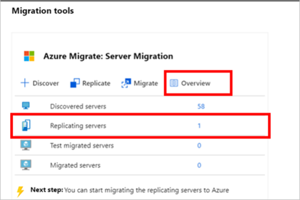
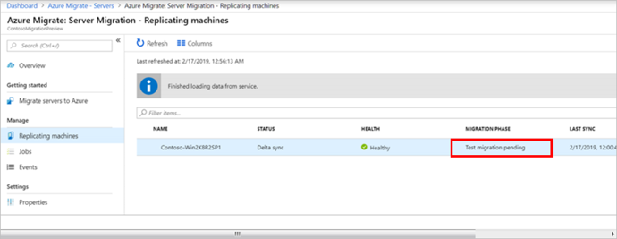

Migrating your on-premises workloads to Azure involves various phases. You’ve completed the planning and assessment, and prepared the environment and VMs for migration.

The next phase is to track and monitor the replication process, before running a full migration to Azure. You’ll run a test migration in a non-production environment to ensure that your VMs can successfully migrate to Azure before finally cutting over to a full migration.

In this unit, you'll review the replication process and components involved. You’ll also learn how to track and monitor each phase of the migration process.

## Replication process

The replication process consists of several steps, beginning with a Start Replication job.

1. On successful completion of the Start Replication job, the VMs start their initial replication to Azure.

2. During initial replication, a Hyper-V VM snapshot it taken. The Azure Site Recovery provider and Azure Recovery Service agent work together to replicate data from Hyper-V VMs to Azure. The replicated data is uploaded to a storage account in the Azure subscription.

3. Disk data from the snapshot is replicated to Hyper-V Replica managed disks in Azure. The replica disks are used to create the Azure VMs when you migrate.
4. Hyper-V Replica tracks disk changes during initial replication, and changes are stored in log files.

5. On completion of initial replication, the VM snapshot is deleted, and delta replication starts.
6. The Recovery Services agent periodically uploads replication logs to a log storage account.

## Required components for replication

The first time you replicate any VMs, Azure Migrate Server Migration sets up additional resources in the Azure Migrate project’s resource group. These resources are used to manage and orchestrate the replication process, and store replication information. 

The resources used by Azure Migrate Server Migration are

- **Service bus**: Sends replication orchestration information to the Azure Migrate appliance
- **Gateway storage account**: Stores VM state information
- **Log storage account**: stores replication logs
- **Key vault**: Manages connection strings for the service bus, and access keys for the storage accounts used in replication

### Track replication job status

During the replication process, you can track when initial replication changes to delta replication. You can also monitor the status of the replicating machines by clicking on **Replicating servers** in **Azure Migrate: Server Migration**.

Azure Migrate Server Migration indicates the status of the replicating machines. Each Replication job has successfully completed, and three machines are now replicating. Each machine shows a status of healthy with no issues needing attention.

### Complete initial replication

The length of time to complete replication depends on factors that include VM size, available space on the host for log file storage, network bandwidth and target storage in Azure. You have already accounted for this in the planning phase.

Initial replication completes when the status of each machine changes from **In progress** to **Protected**. 

1. Click **Replicating machines**.
2. Refresh occasionally until all machines show status of **Protected**.

## Run a test migration

Before completing a full migration, you’ll run a test migration for each VM. This lets you see if the migration works as you expected. As part of the preparation to migrate, you’ve already set up a non-production Azure virtual network for testing. A test migration creates a set of Azure VMs from the replicated data and migrates them to the non-production VNet.

You can run the test migration when delta replication begins, allowing replication of the on-premises machines to continue without impact. You use the replicated test Azure VMs to confirm the migration works correctly, and address any issues before full migration.

1. **In Migration goals > Servers > Azure Migrate: Server Migration**, click **Test migrated servers**.
2. Right-click the VM to test, and click **Test migrate**.

Newly-created Azure VMs are migrated to your non-production Azure VNet. You can monitor the test migration job in the portal notifications. After the test migration completes, view the migrated VMs in the Azure portal. You’ll notice that new VMs with a **-Text** suffix have been created. 

After verifying the test migration results, perform a test migration cleanup. Under Migration Phase, status changes to **Test clean up pending**.

## Migrate the VMs

Having verified that your migration works as expected, you’re ready to complete the migration of your on-premises servers. The final migration is very similar to the test migration process.

You can choose to have Azure Migrate shut down the on-premises VMs and run an on-demand replication to synchronize any VM changes that occurred since the last replication occurred. As you’re running a small pilot migration to learn more about using Azure Migrate, there’s no requirement to keep your on-premises VMs running. This prevents any data loss.

Like the previous phases, a migration job starts for each VM. You can track and monitor progress as before. Wait till all Planned failover jobs show a status of **Successful**.

Navigate to the resource group associated with the Azure Migrate project and verify that the VM, network interface, and disk resources have been created for each of the virtual machines being created.

### Complete post migration tasks

When complete, you’ll stop the migration. Azure Migrate stops replication and cleans up replication state information for the VMs.

After migrating your VMs, you want to be able to perform common tasks, like installing and configuring software. This requires enabling and running Azure virtual machine extensions. To do this, you’ll need to install an Azure Virtual Machine agent on the migrated machines. The Azure documentation provides information about the Azure VM agents for [Windows](/azure/virtual-machines/extensions/agent-windows) and [Linux](/azure/virtual-machines/extensions/agent-linux).

You didn’t migrate any databases for the pilot, but had you done so, this is the time to update any database connection strings, or web server configurations.

After your stakeholders perform final application and migration acceptance testing, cut over traffic to the migrated Azure VM instances. Finally, remove on-premises VMs from your local VM inventory and local backups.

In the next unit, you’ll look at some best practices you can do to increase the security of your VMs that are now running in Azure.
