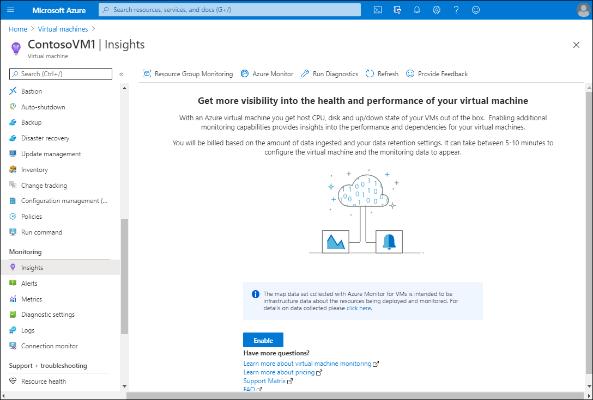
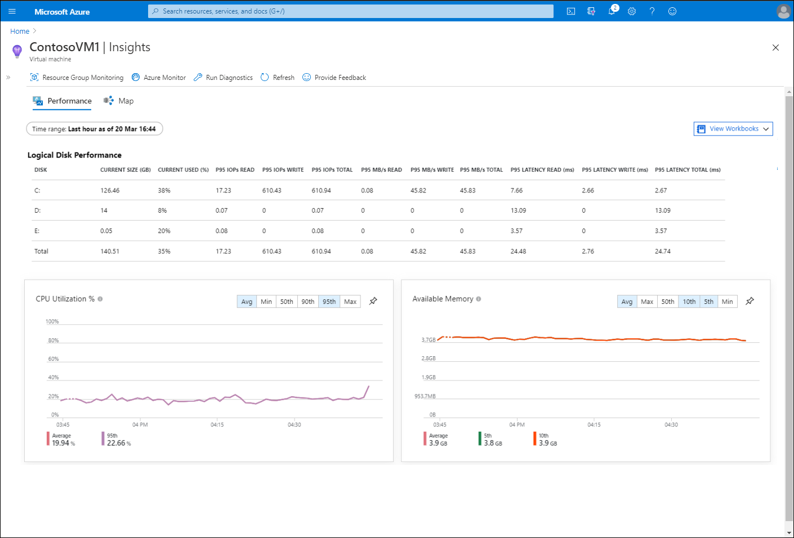

<!-- Editor, please update design doc with this revised topic title: Enable Azure Monitor for VMs -->

<!-- 12 minutes minutes to read -->

Azure Monitor is a core component of the Microsoft strategy to extend comprehensive, cloud-based monitoring functionality beyond Azure to on-premises datacenters and non-Microsoft cloud providers. Customers such as Contoso that are maintaining their on-premises infrastructure can benefit from this functionality when tracking, auditing, or troubleshooting past events.

## What is Azure Monitor?

You can use Azure Monitor to optimize administration of your existing deployments and forecast capacity requirements for future deployments. Azure Monitor provides three main capabilities described in the following table.

|Capability|Description|
|------------------------------------|------------------------------------------------------------|
|Monitoring and metrics visualization|*Metrics* are numerical values that represent the health status of monitored systems.|
|Querying and analyzing logs|Logs include activity, diagnostic, and telemetry. Their analysis provides deep insights into the state of monitored systems, and helps facilitate troubleshooting.|
|Alerting and remediation|You can configure alerting and remediation to automatically trigger corrective actions to remediate any issues.|

Azure Monitor delivers focused, in-depth monitoring capabilities through:

- Deep infrastructure monitoring. This category includes Log Analytics in combination with monitoring solutions such as Service Map, and network monitoring tools such as Network Watcher and ExpressRoute Monitor.
- Deep application monitoring. This category includes Application Insights, which facilitates monitoring of performance, availability, and web-based application usage regardless of their locations.

Both infrastructure and application monitoring services share a number of capabilities that provide a consistent approach to configuring alerts, including:

- Common action groups that designate alert-triggered actions, and recipients of the alerts.
- Designing custom dashboards.
- Analyzing metrics by leveraging tools such as Metrics Explorer or Microsoft Power BI.

Azure Monitor supports collecting and monitoring metrics, activity and diagnostics logs, and events from a wide range of Azure services and computers residing both in on-premises datacenters and with third-party cloud providers. It provides a quick way to assess the status of your environment by using the Azure portal. Azure Monitor presents a summary of triggered alerts, logs, metrics, and application-related telemetry originating from Application Insights.

> [!NOTE]
> You can also access Azure Monitor data by using Azure PowerShell, Azure Command-Line Interface (Azure CLI), REST API, and the `Microsoft.NET` SDK.

Additionally, Azure Monitor enables you to archive collected data in Azure Storage for long-term analysis or compliance purposes. You can also route the data to Azure Stream Analytics, or to third-party services using Azure Event Hubs. You set up and use alerts to:

- Trigger notifications via SMS or email.
- Trigger a remediation action implemented by Azure Logic Apps, Azure Functions, or a runbook in Azure Automation.
- Raise an incident and work items by leveraging integration between Azure Monitor and your internal IT service Management (ITSM) platform.

You can also store and analyze near real-time and historical data by using Log Analytics. For on-premises computers and Azure VMs, this requires installing the Log Analytics agent, and in some cases the Dependency Agent as well. This agent-based approach enables you to monitor the operating system and its workloads using Azure Automation or Azure Monitor–based solutions such as Update Management or Change Tracking and Inventory. You can also leverage Azure Security Center to identify vulnerabilities and potential threats.

To learn more, review this five minute tutorial video on Azure Monitoring:

>[!VIDEO https://www.microsoft.com/videoplayer/embed/RE4qXeL]

## Monitor VMs

Azure Monitor for VMs enables you to monitor your Windows Server IaaS VMs. But before you can enable and configure Azure Monitor for your IaaS VMs, you must ensure that your environment meets the prerequisites outlined in the following table.

|Requirement|Description|
|----|----|
|Log analytics|You must set up a Log Analytics workspace and configure the workspace for Azure Monitor for VMs. Azure Monitor for VMs currently supports a Log Analytics workspace only in certain regions. You can read more about supported regions at [Enable Azure Monitor for VMs overview](https://aka.ms/azure-monitor-log-analytics?azure-portal=true).|
|Supported Windows operating systems|Supported Windows operating systems include Windows Server 2008 R2 and later, and Windows 10 1803 and later. Azure Monitor for VMs can also monitor Linux VMs.|
|Dependency Agent|This agent provides data to the Map feature in Azure Monitor for VMs, and relies on the Log Analytics agent for its connection to Log Analytics. You must install the Log Analytics agent and configure it with the Dependency Agent on all monitored VMs.|
|Security|To enable and access the features in Azure Monitor for VMs, you must have the Log Analytics contributor role. To review performance, health, and map data, you must have the Monitoring Reader role for the Azure VM.|

### Procedure to enable monitoring of a single VM

To enable monitoring of a single VM, use the following procedure:

1. Sign in to the Azure portal, and select **Virtual machines**.

> [!TIP]
> Make sure your VM is running.

2. If necessary, connect to your VM and install the Azure Monitor for VMs Map Dependency Agent. You can download the agent from [here](https://aka.ms/dependencyagentwindows), and install it by running `InstallDependencyAgent-Windows.exe` on your VM.
3. Select the appropriate VM, and then under **Monitoring**, select **Insights**.
4. In the details pane, select **Enable**.

## Review monitored data

After you have enabled Insights, you can monitor your VM. In the Azure portal, navigate to and select the appropriate VM. Then, under **Monitoring**, select **Insights**. This will open the **Map** tab for your VM.

Within the map, you can select items to retrieve additional details. For example, to review connections to DNS servers, select the Port: 53 node. This action displays current connections over port 53 (the port used for DNS name resolution).

You can also use the icons on the right of the Map to access the information described in the following table.

|Control|Explanation|
|-----------|------------------------------------------------------------|
|Properties|Provides more detailed information about the selected item. For example, by selecting the VM in the central pane, you can review details such as Fully Qualified Domain Name (FQDN), OS, and links to access Health, Machine properties, and Azure VM properties.|
|Log Events|Displays a list of recent events in the details pane. If you select a specific event type, the underlying Log Analytics workspace opens, and detailed event data displays.|
|Alerts|Displays events that have occurred on the VM. These are listed in severity order from 0 through 4. Selecting an alert displays additional details.|
|Connections|Displays all active connections to the VM. You can access additional details by selecting a connection in the returned output.|

To review performance data, select the **Performance** tab in **Insights**. The main pane displays performance data relating to the following:

- CPU Utilization %
- Available Memory
- Logical disk IOPS
- Logical disk MB/s
- Max Logical Disk Used %
- Bytes Sent Rate
- Bytes Received Rate

