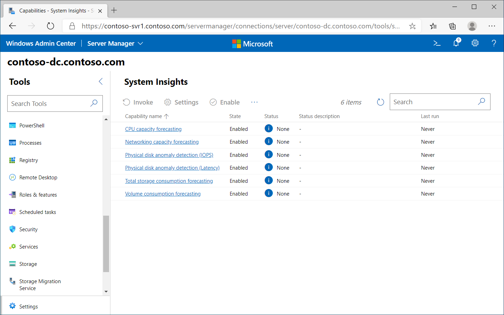

You can also use System Insights in Windows Admin Center to both measure performance, and to gain insights into future capacity needs. You can install System Insights from Server Manager, or by using the WAC console.

> [!TIP]
> You can also install System Insights using the following PowerShell command: `Add-WindowsFeature System-Insights -IncludeManagementTools`. 
## What are capabilities?

After you've installed the System Insights extension, the System Insights node displays a number of capabilities. By default, these are:

- **CPU capacity forecasting**, which forecasts expected processor usage. This is based on the % Processor Time counter.

- **Network capacity forecasting**, which forecasts network usage for each installed NIC. This is based on the Bytes Total/Sec for installed NICs.

- **Total storage consumption forecasting**, which forecasts total storage usage across all local drives. Based on Maximum daily usage.

- **Volume consumption forecasting**, which forecasts storage usage per volume. Based on Maximum daily usage.

You can also add the following additional capabilities:

- Physical disk anomaly detection (IOPS)

- Physical disk anomaly detection (Latency)

> [!TIP]
> You can add capabilities from WAC, but you can also use the `Add-InsightsCapability` cmdlet. 
After you have installed the required capabilities, you must enable them. You can do this in the Windows Admin Center console.

> [!TIP]
> You can also enable or disable capabilities by using the `Enable-InsightsCapability` or `Disable-InsightsCapability` cmdlets.
After you've added and enabled the capabilities, you can use them to gain insights into future capacity needs. The following screenshot displays the System Insights details on a server in Windows Admin Center.

## What are the capability outputs?

To use a capability to gain insights, you must invoke it. When you invoke a capability, it provides a output that identifies the result of its analysis. These outputs are:

- Ok. The selected capability looks fine. No action is required.

- Warning. Although no action is immediately required, you should investigate the capability more closely.

- Critical. You should investigate the capability as a matter of urgency.

- Error. The capability failed. The reason for failure isn't known.

- None. There is no prediction available. This might be due to lack of data.

> [!NOTE]
> If there is only between 0-5 days of available data, no prediction can be made. 
You can invoke a capability using Windows Admin Center, or else by using the `Invoke-InsightsCapability` PowerShell cmdlet.

## Retrieve capability results

You can review capability results from Windows Admin Center, by using the `Get-InsightsCapabilityResult` Windows PowerShell cmdlet, or else by reviewing the System Insights log in Event Viewer. The following table displays the Event ID associated with each prediction status.

| Prediction status| Event ID|
| :--- | :--- |
| Ok| 151|
| Warning| 148|
| Critical| 150|
| Error| 149|
| None| 132|

