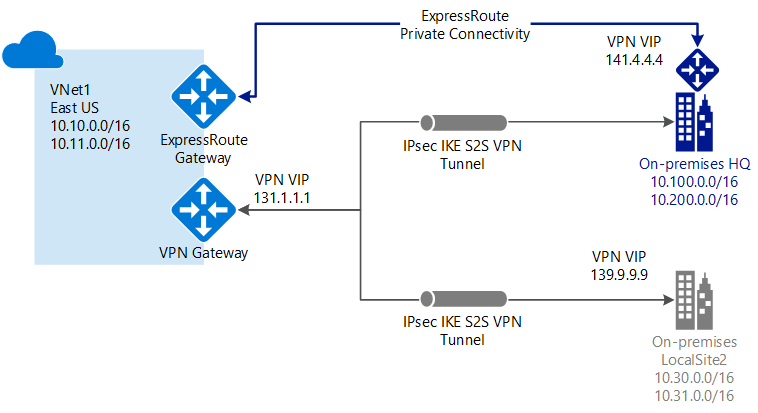
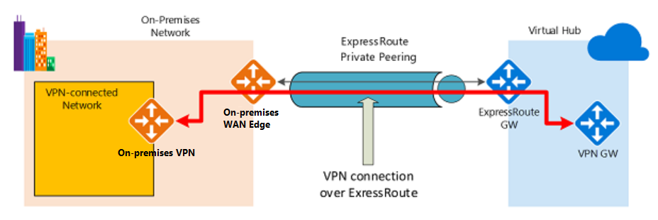

**ExpressRoute** is a direct, private connection from your WAN (not over the public Internet) to Microsoft Services, including Azure. Site-to-Site VPN traffic travels encrypted over the public Internet. Being able to configure Site-to-Site VPN and ExpressRoute connections for the same virtual network has several advantages.

You can configure a Site-to-Site VPN as a secure failover path for ExpressRoute, or use Site-to-Site VPNs to connect to sites that are not part of your network, but that are connected through ExpressRoute. Notice that this configuration requires two virtual network gateways for the same virtual network, one using the gateway type 'Vpn', and the other using the gateway type 'ExpressRoute'.

## ExpressRoute encryption

### IPsec over ExpressRoute for Virtual WAN

Azure Virtual WAN uses an Internet Protocol Security (IPsec) Internet Key Exchange (IKE) VPN connection from your on-premises network to Azure over the private peering of an Azure ExpressRoute circuit. This technique can provide an encrypted transit between the on-premises networks and Azure virtual networks over ExpressRoute, without going over the public internet or using public IP addresses.
The following diagram shows an example of VPN connectivity over ExpressRoute private peering.

The diagram shows a network within the on-premises network connected to the Azure hub VPN gateway over ExpressRoute private peering. The connectivity establishment is straightforward:
1.	Establish ExpressRoute connectivity with an ExpressRoute circuit and private peering.
2.	Establish the VPN connectivity.

An important aspect of this configuration is routing between the on-premises networks and Azure over both the ExpressRoute and VPN paths.

ExpressRoute supports a couple of encryption technologies to ensure confidentiality and integrity of the data traversing between your network and Microsoft's network.

### Point-to-point encryption by MACsec
MACsec is an IEEE standard. It encrypts data at the Media Access control (MAC) level or Network Layer 2. You can use MACsec to encrypt the physical links between your network devices and Microsoft's network devices when you connect to Microsoft via ExpressRoute Direct. MACsec is disabled on ExpressRoute Direct ports by default. You bring your own MACsec key for encryption and store it in Azure Key Vault. You decide when to rotate the key.

### End-to-end encryption by IPsec and MACsec
IPsec is an IETF standard. It encrypts data at the Internet Protocol (IP) level or Network Layer 3. You can use IPsec to encrypt an end-to-end connection between your on-premises network and your virtual network (VNET) on Azure.

MACsec secures the physical connections between you and Microsoft. IPsec secures the end-to-end connection between you and your virtual networks on Azure. You can enable them independently.

## ExpressRoute Direct

ExpressRoute Direct gives you the ability to connect directly into Microsoft’s global network at peering locations strategically distributed across the world. ExpressRoute Direct provides dual 100 Gbps or 10 Gbps connectivity, which supports Active/Active connectivity at scale

Key features that ExpressRoute Direct provides include, but aren't limited to:
* Massive Data Ingestion into services like Storage and Cosmos DB
* Physical isolation for industries that are regulated and require dedicated and isolated connectivity like: Banking, Government, and Retail
* Granular control of circuit distribution based on business unit

ExpressRoute Direct supports massive data ingestion scenarios into Azure storage and other big data services. ExpressRoute circuits on 100 Gbps ExpressRoute Direct now also support 40 Gbps and 100 Gbps circuit SKUs. The physical port pairs are 100 or 10 Gbps only and can have multiple virtual circuits.

ExpressRoute Direct supports both QinQ and Dot1Q VLAN tagging.
* **QinQ VLAN Tagging** allows for isolated routing domains on a per ExpressRoute circuit basis. Azure dynamically allocates an S-Tag at circuit creation and cannot be changed. Each peering on the circuit (Private and Microsoft) will utilize a unique C-Tag as the VLAN. The C-Tag is not required to be unique across circuits on the ExpressRoute Direct ports.
* **Dot1Q VLAN Tagging** allows for a single tagged VLAN on a per ExpressRoute Direct port pair basis. A C-Tag used on a peering must be unique across all circuits and peerings on the ExpressRoute Direct port pair.

ExpressRoute Direct provides the same enterprise-grade SLA with Active/Active redundant connections into the Microsoft Global Network. ExpressRoute infrastructure is redundant and connectivity into the Microsoft Global Network is redundant and diverse and scales accordingly with customer requirements.
