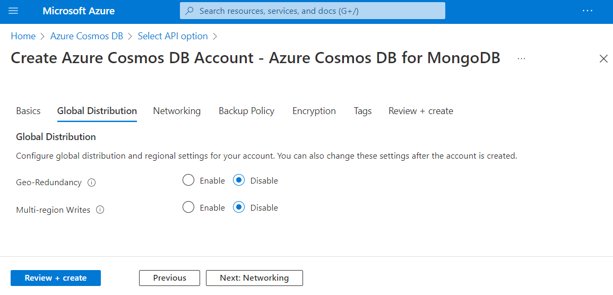
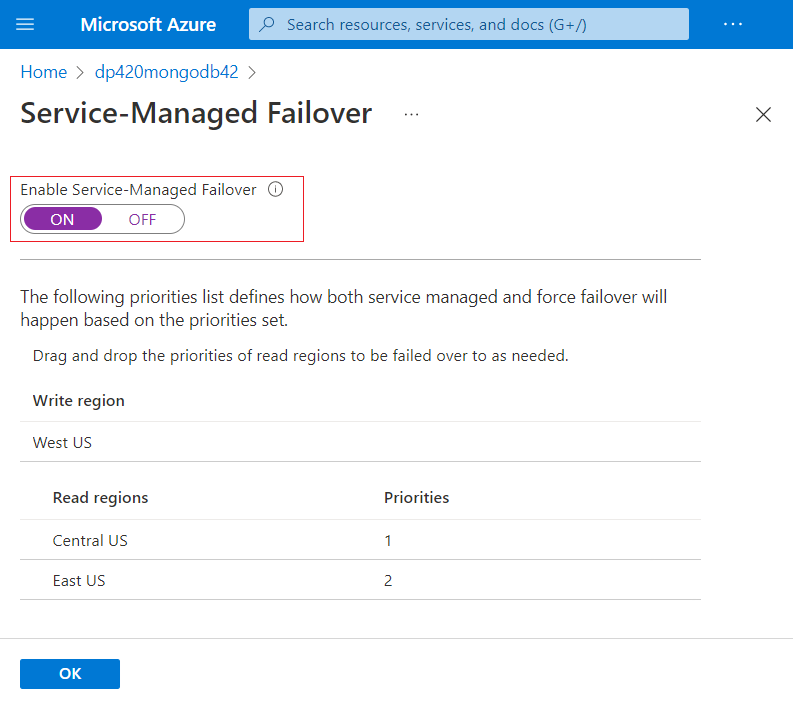
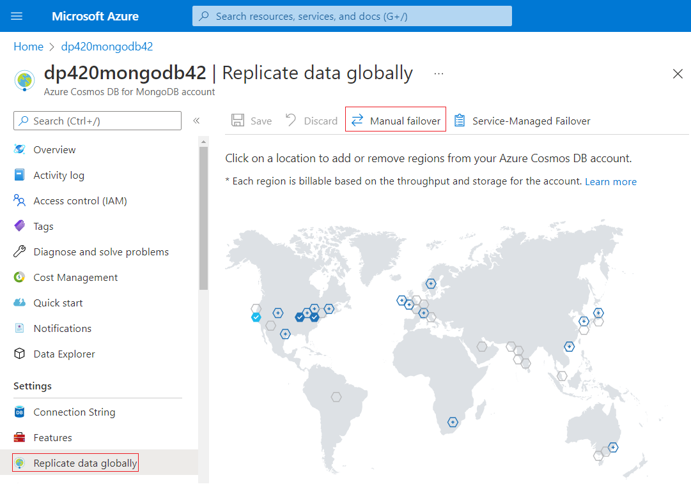
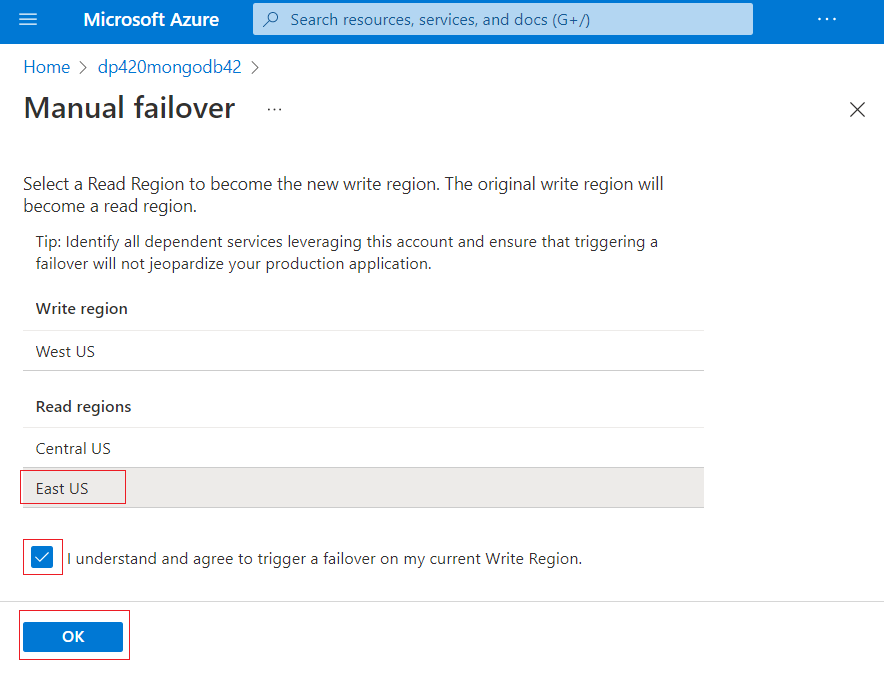

Azure Cosmos DB is a foundational service in Azure, so it's deployed across all Azure regions worldwide. This availability of the Azure Cosmos DB service in all regions, means that we can easily replicate our Azure Cosmos DB account across all desired regions.

## Replication in Azure Cosmos DB

Replication in Azure Cosmos DB has the following properties:

- Data within an Azure Cosmos DB region is stored in 4 replicas that comprise a replica-set for that region. The four copies provide greater availability for your applications within that region, 99.99% availability at P99.
- When data is written, it's written to a majority quorum, three out of four, replicas within that region before being recognized as committed locally.
- Data can be replicated to other regions for greater availability, up to 99.999% availability at P99, or for lower latency for clients separated by large distances.
- When configured for multiple regions, data is replicated based upon the consistency model chosen for the account.
- Strong consistency performs synchronous replication and enforces a global quorum of data. Data isn't recognized as committed back to the user until it has been replicated and committed in each configured region for an RPO = 0.
- The remaining consistency models are relaxed and perform asynchronous replication that provides a continuum of trade-offs between consistent data and throughput.

> [!div class="mx-imgBorder"]
> [](../media/2-replica-sets.png#lightbox)

> [!NOTE]
> The direction that data flows between replica sets is contingent on whether the account is configured with a single-write region or with multi-region write enabled.

Let's take a closer look on how we manage this replication in the Azure portal.

## Distribute data across regions

Configuring global distribution in Azure Cosmos DB is a turnkey operation that is performed on a new or existing account.

### Configuring geo-redundancy for a new account

In the ***Create Azure Cosmos DB Account*** wizard, the ***Basics*** tab will require you to select a location for the new Azure Cosmos DB account. This location is referred to as the primary region. If multi-region write isn't enabled, this location is the only location where you can perform write operations.

The creation wizard includes a ***Global Distribution*** tab where the **Geo-Redundancy** option should be enabled to add extra geo-redundant read-only regions. Enabling this setting will add the Azure region pair as your first replica for your data in Azure Cosmos DB. Additionally, you can enable **Multi-region** Writes in this tab.

> [!div class="mx-imgBorder"]
> [](../media/2-geo-redundancy-full.png#lightbox)

### Configuring geo-redundancy for an existing account

For existing Azure Cosmos DB accounts, the Replicate data globally pane is used to add or remove regions. Each region is added using a map, and then replication only occurs once the changes are saved. This pane can also be used to remove existing regions where data is currently replicated.

> [!div class="mx-imgBorder"]
> [](../media/2-replication-map-full.png#lightbox)

## Evaluate the cost of distributing data globally

When evaluating the cost of a database account that replicates across multiple regions, you should calculate the cost as a multiple of the single-region cost relative to the number of regions.

The core formula is **`RUs x Number of Regions`**. For example, consider a solution that uses approximately **1,000 RUs** in writes to one Azure region at any given point, and replicated to five more regions. Plugging in the numbers to the formula would be:

``` 
    1,000 x (1+5) = 6,000
```

The account would be billed for **6,000 RUs**.

## Define service managed failover policies

An Azure Cosmos DB account with a single write region provides 99.99% availability at P99. While a complete data center outage is rare, many organizations like to have a contingency plan in place. In the context of Azure Cosmos DB, a service managed failover plan can transfer the write region to one of the read regions if such an outage occurs.

By default, a service managed failover isn't enabled for an Azure Cosmos DB account. Service managed failover must be enabled before defining a plan. Once enabled, the read regions can then be sorted by order of failover priority. Once the priority order has been defined, the new priority list can then be persisted and applied to the account.

> [!div class="mx-imgBorder"]
> [](../media/2-service-managed-failover-full.png#lightbox)

As an illustrative example, an Azure Cosmos DB account is configured with a write region, **West US 2**, and two read regions of **East US** and **UK South**. The service managed failover priorities are provided in this table:

| **Region** | **Priority** |
| :--- | :--- |
| **West US 2** | (N/A - write region) |
| **East US** | 1 |
| **UK South** | 2 |

If the **West US 2** region experiences a data center outage, the **East US** region will first become the new write region. If **East US** experiences an outage, then **UK South** will become the new write region.

## Perform a manual failover

As part of your organization’s disaster recovery exercises, you may wish to test the failover capabilities in Azure Cosmos DB. A manual failover can be invoked using the Azure portal to validate the entire process.

To start the manual failover process Select **Manual Failover** in the Azure portal.

> [!div class="mx-imgBorder"]
> [](../media/2-manual-failover-option.png#lightbox)

On the *Manual Failover* page, choose the read region you would like to failover to, a checkbox will then appear for confirmation of the failover, select it, and select the **Ok** button to start the failover.

> [!div class="mx-imgBorder"]
> [](../media/2-manual-failover.png#lightbox)

The failover process requires connectivity between the two regions to ensure that it will succeed and maintain consistency in the data. For this reason, a manual failover shouldn't be triggered during a service-wide Azure Cosmos DB outage.

## Multi-region write in Azure Cosmos DB

With Azure Cosmos DB, every region supports both writes and reads. Enabling the ability to write to any region is a turnkey operation that doesn’t interrupt the application’s availability. With the combination of Azure Cosmos DB’s global geo-replication functionality, and the ability to write to any region, Azure Cosmos DB can be used in application scenarios with significant write performance and scalability demands.

With multi-region write enabled, many of the features associated with a single-region Azure Cosmos DB account are still available:

- Sliding scale of well-defined consistency models.
- Low latency write operations across the globe.
- High availability with financially backed SLA.

> [!NOTE]
> Strong consistency is not supported in a multi-region write scenario.

If a data center outage occurs, accounts with multiple write-regions will continue to be available for read and write operations, as the SDK will automatically attempt requests at another region from the preferred regions list.

Multi-region write can be configured using the Azure CLI, PowerShell, code, Azure Resource Manager templates (JSON/Bicep), or the Azure portal.

> [!div class="mx-imgBorder"]
> [](../media/2-enable-write.png#lightbox)

Once the multiple write-region functionality is enabled, all replica regions associated with the account will automatically become writable regions.

## Understand conflict resolution policies when using multi-region writes

Out of the box, Azure Cosmos DB’s multi-region write feature has automatic conflict management built in. Conflicts can occur when clients concurrently update the same document in multiple regions. There are three types of conflicts:

| **Type** | **Description** |
| ---: | :--- |
| **Insert** | This conflict occurs when more than one document is inserted simultaneously with the same unique identifier in multiple regions |
| **Replace** | Replace conflicts occur when multiple client applications update the same document concurrently in separate regions |
| **Delete** | Delete conflicts occurs when a client is attempting to update a document that has been deleted in another region at the same time |

The conflict resolution policy in Azure Cosmos DB for MongoDB is **Last Write Wins**. This policy uses the timestamp (_ts) to determine which document wrote last. In simple terms, if multiple documents are in conflict, the document with the largest value for the **_ts** property will win. If a delete conflict occurs, the operation to delete a document will always win out over any other operation.

Now that we have introduced multi-region writes, let's discuss the consistency levels in the next unit.
