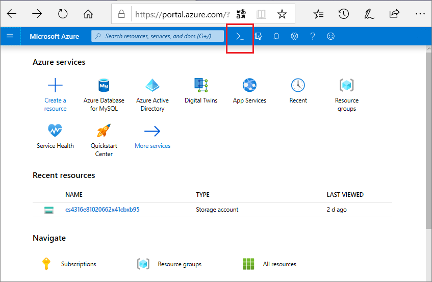

The easiest way to get started with Azure PowerShell is by trying it out in an Azure Cloud Shell environment. Azure Cloud Shell is an interactive, browser-accessible shell for managing Azure resources. It provides the flexibility of choosing the shell experience that best suits the way you work. Linux users can opt for a Bash experience, while Windows users can opt for PowerShell.

Cloud Shell enables access to a browser-based, command-line experience built with Azure management tasks in mind. You can use Cloud Shell to work untethered from a local machine in a way only the cloud can provide.

The main characteristics of Azure Cloud Shell are that it:

- Is a temporary environment that requires a new or existing Azure file share to be mounted.
- Offers an integrated graphical text editor based on the open-source Monaco Editor.
- Authenticates automatically for instant access to your resources.
- Runs on a temporary host provided on a per-session, per-user basis.
- Times out after 20 minutes without interactive activity.
- Requires a resource group, storage account, and Azure file share.
- Uses the same Azure file share for both Bash and PowerShell.
- Is assigned to one machine per user account.
- Persists $HOME using a 5-GB image held in your file share.
- Has permissions that are set as a regular Linux user in Bash.

You can access the Cloud Shell in three ways:

- Direct link. Open a browser and refer to **https://shell.azure.com**.
- Azure portal. Select the Cloud Shell icon on the Azure portal.
- Code snippets. In [Microsoft Learn](/?azure-portal=true) documentation and training, select the **Try It** option that displays with the Azure CLI and Azure PowerShell code snippets:

  ```powershell
  az account show
  Get-AzSubscription
  ```

  The **Try It** option opens the Cloud Shell directly alongside the documentation using Bash (for Azure CLI snippets) or PowerShell (for Azure PowerShell snippets).

  To run the command:

  1. Use **Copy** in the code snippet.
  1. Use **Ctrl+Shift+V** (Windows/Linux) or **Cmd+Shift+V** (macOS) to paste the command.
  1. Select Enter.

## Selecting your preferred shell experience

To choose between Bash or PowerShell, refer to the Azure portal and select the Cloud Shell icon, as the following screenshot depicts.



*Figure 1: Azure Cloud Shell icon*

In the **Welcome to Azure Cloud Shell** dialog box, select **Bash** or **PowerShell**, as the following screenshot depicts.


*Figure 2: Bash and PowerShell options*

After the first launch, you can use the shell type drop-down list to switch between **Bash** and **PowerShell**.

Microsoft manages Azure Cloud Shell, so it comes with popular command-line tools and language support. Cloud Shell also helps securely authenticate automatically, so that you can instantly access your resources through the Azure CLI or Azure PowerShell cmdlets. Cloud Shell also offers an integrated graphical text editor based on the open-source Monaco Editor.

Cloud Shell machines are temporary, but your files are persisted in two ways: through a disk image, and through a mounted file share named **clouddrive**. On the first launch, Cloud Shell prompts to create a resource group, storage account, and Azure file share on your behalf. This is a one-time step and will be automatically attached for all sessions. A single file share can be mapped and will be used by both Bash and PowerShell in Cloud Shell.
