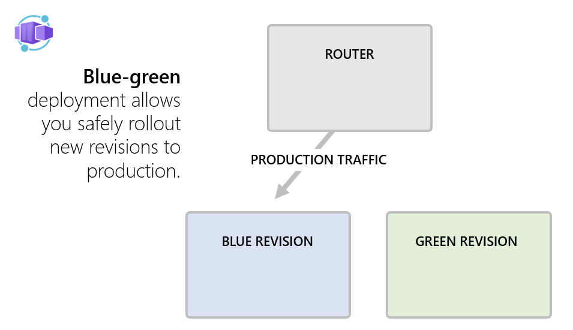

Azure Container Apps allows you to expose your container app to the public web, your virtual network (VNET), and other container apps within your environment by enabling ingress. Ingress settings are enforced through a set of rules that control the routing of external and internal traffic to your container app. When you enable ingress, you don't need to create an Azure Load Balancer, public IP address, or any other Azure resources to enable incoming HTTP requests or TCP traffic.

Ingress supports:

- External and internal ingress
- HTTP and TCP ingress types
- Domain names
- IP restrictions
- Authentication
- Traffic splitting between revisions
- Session affinity

## Enable ingress

You can configure ingress for your container app using the Azure CLI, an ARM template, or the Azure portal.

You can enable ingress when you create your container app, or you can enable ingress for an existing container app.

- To configure ingress when you create your container app, select Ingress from the App Configuration tab of the container app creation wizard.
- To configure ingress for an existing container app, select Ingress from the Settings menu of the container app resource page.

## Traffic splitting

By default, when ingress is enabled, all traffic is routed to the latest deployed revision. When you enable `Multiple` revision mode in your container app, you can split incoming traffic between active revisions.

Traffic splitting is useful for testing updates to your container app. You can use traffic splitting to gradually phase in a new revision in blue-green deployments or in A/B testing.

Traffic splitting is based on the weight (percentage) of traffic that is routed to each revision. The combined weight of all traffic split rules must equal 100%. You can specify revision by revision name or revision label.

## Blue-Green deployment

Blue-Green Deployment is a software release strategy that aims to minimize downtime and reduce the risk associated with deploying new versions of an application. In a blue-green deployment, two identical environments, referred to as "blue" and "green," are set up. One environment (blue) is running the current application version and one environment (green) is running the new application version.

Once green environment is tested, the live traffic is directed to it, and the blue environment is used to deploy a new application version during next deployment cycle.

You can enable blue-green deployment in Azure Container Apps by combining container apps revisions, traffic weights, and revision labels.

