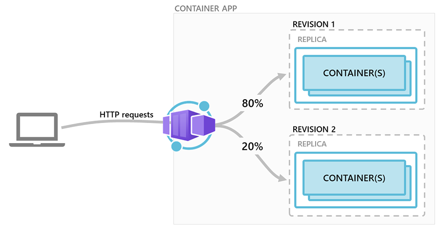

Azure Container Apps allows you to expose your container app to the public web, your virtual network (VNET), and other container apps within your environment by enabling ingress. Ingress settings are enforced through a set of rules that control the routing of external and internal traffic to your container app. When you enable ingress, you don't need to create an Azure Load Balancer, public IP address, or any other Azure resources to enable incoming HTTP requests or TCP traffic.

Ingress supports:

- External and internal ingress.
- HTTP and TCP ingress types.
- Domain names.
- IP restrictions.
- Authentication.
- Traffic splitting between revisions.
- Session affinity.

## Enable ingress

You can configure ingress for your container app using the Azure CLI, an ARM template, or the Azure portal.

You can enable ingress when you create your container app, or you can enable ingress for an existing container app.

- To configure ingress when you create your container app, select Ingress from the App Configuration tab of the container app creation wizard.
- To configure ingress for an existing container app, select Ingress from the Settings menu of the container app resource page.

## Single revision mode

In single revision mode, Container Apps ensures that your app experiences zero downtime when creating a new revision. The existing active revision remains operational until the new revision is ready. Key conditions for a new revision to be considered ready include:

- Successful provisioning.
- Scaling to match the previous revision's replica count (considering min and max replica counts).
- Successful completion of startup and readiness probes by all replicas.

## Traffic splitting

By default, when ingress is enabled, all traffic is routed to the latest deployed revision. When you enable `Multiple` revision mode in your container app, you can split incoming traffic between active revisions.

Traffic splitting is useful for testing updates to your container app. You can use traffic splitting to gradually phase in a new revision in blue-green deployments or in A/B testing.

Traffic splitting is based on the weight (percentage) of traffic that is routed to each revision. The combined weight of all traffic split rules must equal 100%. You can specify revision by revision name or revision label. Consider this example:

- Revision 1 receives 80% of requests
- Revision 2 receives 20% of requests

### Direct revision access

You can make specific revisions available for requests targeting a particular URL without the need for complex routing rules. This approach can simplify how you manage requests to your domain.

### Activation state

When the revision mode is set to multiple, you have the ability to activate or deactivate revisions as needed. Active revisions handle requests, while inactive ones remain dormant. It's important to note that Container Apps doesn't charge for inactive revisions, but there's a cap on the total number of available revisions (typically 100), with the oldest revisions being purged once this limit is reached.

## Blue-Green deployment

Blue-Green deployment is a software release strategy that aims to minimize downtime and reduce the risk associated with deploying new versions of an application. In a blue-green deployment, two identical environments, referred to as "blue" and "green," are set up. One environment (blue) is running the current application version and one environment (green) is running the new application version.

Once green environment is tested, the live traffic is directed to it, and the blue environment is used to deploy a new application version during next deployment cycle.

You can enable blue-green deployment in Azure Container Apps by combining container apps revisions, traffic weights, and revision labels.

## Change types

Changes to a container app can be categorized as either revision-scope changes or application-scope changes.

### Revision-scope changes

Revision-scope changes trigger the creation of a new revision when you deploy your app. These changes are specific to the revision in which they're deployed. Revision-scope changes include alterations to:

- Revision suffix.
- Container configuration and images.
- Scale rules for the container application.

### Application-scope changes

Application-scope changes, on the other hand, apply globally to all revisions. Deploying an application-scope change doesn't create a new revision. Such changes encompass alterations to:

- Secret values (note that revisions must be restarted for containers to recognize new secret values).
- Revision mode.
- Ingress configuration, including turning ingress on or off, defining traffic splitting rules, labels, credentials for private container registries, and Dapr settings.

This categorization helps you manage changes effectively, whether they affect specific revisions or apply across all of them.
