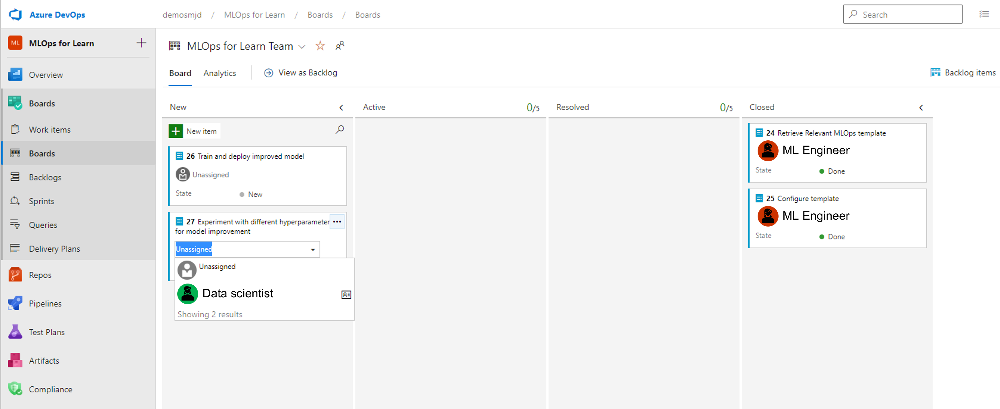
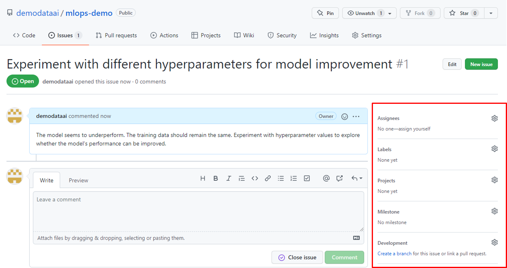
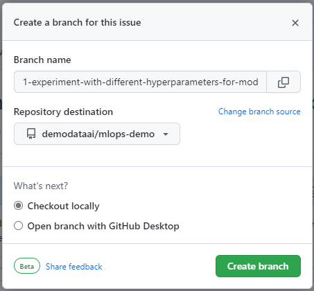
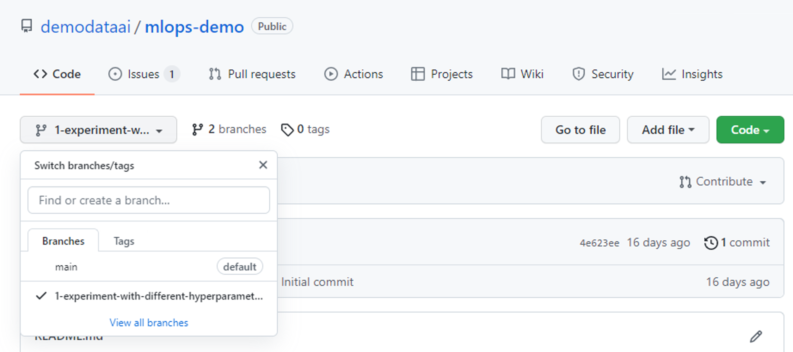

Although you can make changes directly to the main code, it's best practice to use trunk-based development. By working with branches, it's easier to verify whether your changes work as expected before merging them with the main code.

To learn how trunk-based development will work in practice, you'll explore the process of updating code with both **Azure DevOps** and **GitHub**. A need to change the code for your machine learning workflows may happen at any time. Therefore, you'll use **agile planning** to decide when to update the code and to organize your work.

## Agile planning

After the initial model development, you'll have a model in production. Just like any application, a model isn't static and may require small or large tweaks over time to ensure it's up-to-date. A reason for updating and retraining the model may be detected data drift causing the model to not perform as expected anymore. Data can change over time, and accordingly, models may need to change over time too.

To plan and organize the work you need to do as a data scientist, you can use **Azure Boards** in Azure DevOps or **GitHub issues**.

## Azure DevOps

Azure Boards organizes agile planning by work item tracking, visualization, and reporting. You can customize many things to make it fit your project planning. 

> [!TIP]
> If you want to explore how to set up and customize Azure Boards, you can learn more about using [Azure Boards for agile workloads](/learn/modules/choose-an-agile-approach/), or [review the Azure Boards documentation](/azure/devops/boards/get-started/what-is-azure-boards). 

Most importantly for a data scientist, you'll get a work item assigned to you to inform you on what you need to do to contribute to the machine learning project. To organize your work, *you'll link a work item to a new branch*.

Imagine you're a data scientist working on a machine learning project. The team has a **backlog** of *work items* or product backlog items, which are grouped by *feature* or machine learning lifecycle phase. 

Another way to view the work items for this project is by navigating to **Boards**. Typically, you'll have columns for new, active, and closed work items. Or tasks that you still need to do, that you're doing, or that are done.

To pick up a work item and to let your team know you're working on it, you (or someone else) can assign a work item to you. Select the *Unassigned* box and select your name. 

By selecting the work item, you can also view the details.

In the **Development** control pane, you can select **create a branch** to create a new branch in the repo, which will automatically be linked to your work item. Once created, you'll be redirected to the new branch where you can view all assets stored in your repository. 

Now that the branch is created, you can work in the branch to make any changes to the code. It's common practice that you clone the branch to an Integrated Development Environment (IDE) like **Visual Studio Code** to develop and test locally before committing and pushing the changes to the main repo.

## GitHub

GitHub is an open-source platform on which all tools are organized per repository. Once you've created a repository, you can use GitHub issues to track your work items, feedback, and bugs. 

When opening a repo in GitHub, you can navigate to the **Issues** tab to view all *open* and *closed* issues. You can select an issue to view its details. The person creating the issue can describe the problem, adding code snippets or screenshots. 

After an issue is created, you'll be able to assign the work to yourself or another GitHub user. If you want to work on the issue, you can create a branch from the **Development** control.

A pane will open to help you create a branch that will be linked to the issue. Automatically, the branch will have the name of the issue's title. You can change the branch name if you want.

If you navigate back to the **Code** tab to view your repo, you'll be able to switch between branches and see the new branch you've created.

Once you've picked up a work item in Azure DevOps or an issue in GitHub, and created a branch to edit the code, you'll want to develop the code locally. You can **clone** the Git repo from either Azure DevOps or GitHub and work from any IDE you prefer. 