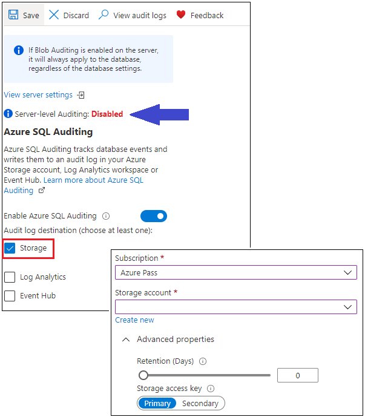

Auditing for Azure SQL Database and Azure Synapse Analytics tracks database events and writes them to an audit log in your Azure storage account, Log Analytics workspace or Event Hubs.

Auditing also:
* Helps you maintain regulatory compliance, understand database activity, and gain insight into discrepancies and anomalies that could indicate business concerns or suspected security violations.
* Enables and facilitates adherence to compliance standards, although it **doesn't guarantee compliance**.

## Overview
You can use SQL database auditing to:
* **Retain** an audit trail of selected events. You can define categories of database actions to be audited.
* **Report** on database activity. You can use pre-configured reports and a dashboard to get started quickly with activity and event reporting.
* **Analyze** reports. You can find suspicious events, unusual activity, and trends.

## Define server-level vs. database-level auditing policy

An auditing policy can be defined for a specific database or as a default server policy:
* A server policy applies to all existing and newly created databases on the server.
* If server auditing is enabled, it always applies to the database. The database will be audited, regardless of the database auditing settings.
* Enabling auditing on the database or data warehouse, in addition to enabling it on the server, does not override or change any of the settings of the server auditing. Both audits will exist side by side. In other words, the database is audited twice in parallel; once by the server policy and once by the database policy.

Shown below is the configuration of auditing using the Azure portal.

## Summary of database auditing 

* Retain an audit trail of selected events​
* Report on database activity and analyze results​
* Configure policies for the server or database level​
* Configure audit log destination​
* A new server policy applies to all existing and newly created databases
