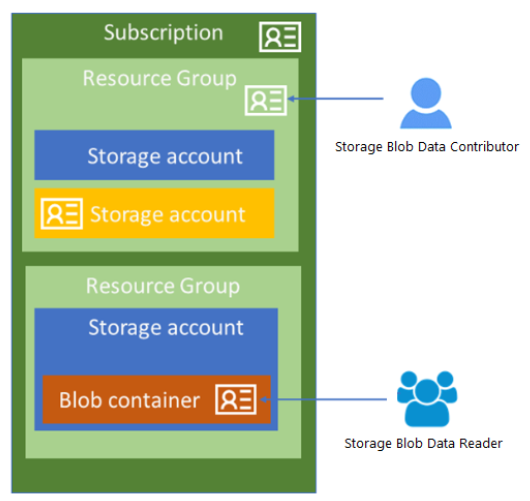

In addition to Shared Key and Shared Access Signatures, Azure Blob and Queue storage support using Azure Active Directory (Azure AD) to authorize storage requests. With Azure AD, you can use role-based access control (RBAC) to grant permissions to a security principal, which may be a user, group, or application service principal. The security principal is authenticated by Azure AD to return an OAuth 2.0 token. The token can then be used to authorize a request against Blob or Queue storage.

* Authorization with Azure AD is available for all general-purpose and Blob storage accounts in all public regions and national clouds. 

* Built-in storage roles are provided including Owner, Contributor, and Reader.

* The role can be scoped from Management Group to individual blob or queue. Best practices dictate granting only the narrowest possible scope.

* RBAC role assignments may take up to five minutes to propagate.

**A few more details**

When a security principal (a user, group, or application) attempts to access a blob or queue resource, the request must be authorized, unless it is a blob available for anonymous access. This is a two-step process, authentication and authorization. 

First, the authentication step requires that an application request an OAuth 2.0 access token at runtime. If an application is running from within an Azure entity such as an Azure VM, a virtual machine scale set, or an Azure Functions app, it can use a managed identity to access blobs or queues. 

Second, the authorization step requires that one or more RBAC roles be assigned to the security principal. Azure Storage provides RBAC roles that encompass common sets of permissions for blob and queue data. The roles that are assigned to a security principal determine the permissions that the principal will have. 

For more information,

[Authorize access to blobs and queues using Azure Active Directory](/azure/storage/common/storage-auth-aad)
