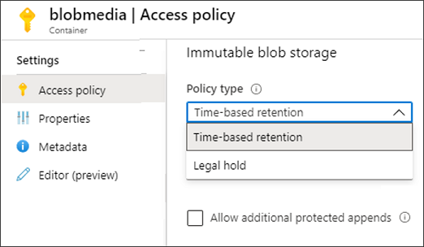

Immutable storage for Azure Blob storage enables users to store business-critical data objects in a WORM (Write Once, Read Many) state. This state makes the data non-erasable and non-modifiable for a user-specified interval. For the duration of the retention interval, blobs can be created and read, but cannot be modified or deleted. Immutable storage is available for general-purpose v2 and Blob storage accounts in all Azure regions.

## Time-based vs Legal hold policies

> [!div class="mx-imgBorder"]
> 

* **Time-based retention policy support**: Users can set policies to store data for a specified interval. When a time-based retention policy is set, blobs can be created and read, but not modified or deleted. After the retention period has expired, blobs can be deleted but not overwritten. When a time-based retention policy is applied on a container, all blobs in the container will stay in the immutable state for the duration of the effective retention period. The effective retention period for blobs is equal to the difference between the blob's creation time and the user-specified retention interval. Because users can extend the retention interval, immutable storage uses the most recent value of the user-specified retention interval to calculate the effective retention period.
* **Legal hold policy support**: If the retention interval is not known, users can set legal holds to store immutable data until the legal hold is cleared. When a legal hold policy is set, blobs can be created and read, but not modified or deleted. Each legal hold is associated with a user-defined alphanumeric tag (such as a case ID, event name, etc.) that is used as an identifier string. Legal holds are temporary holds that can be used for legal investigation purposes or general protection policies. Each legal hold policy needs to be associated with one or more tags. Tags are used as a named identifier, such as a case ID or event, to categorize and describe the purpose of the hold.

## Other immutable storage features

* **Support for all blob tiers**: WORM policies are independent of the Azure Blob storage tier and apply to all the tiers: hot, cool, and archive. Users can transition data to the most cost-optimized tier for their workloads while maintaining data immutability.
* **Container-level configuration**: Users can configure time-based retention policies and legal hold tags at the container level. By using simple container-level settings, users can create and lock time-based retention policies, extend retention intervals, set and clear legal holds, and more. These policies apply to all the blobs in the container, both existing and new.
* **Audit logging support**: Each container includes a policy audit log. It shows up to seven time-based retention commands for locked time-based retention policies and contains the user ID, command type, time stamps, and retention interval. For legal holds, the log contains the user ID, command type, time stamps, and legal hold tags. This log is retained for the lifetime of the policy, in accordance with the SEC 17a-4(f) regulatory guidelines. The Azure Activity Log shows a more comprehensive log of all the control plane activities; while enabling Azure Resource Logs retains and shows data plane operations. It is the user's responsibility to store those logs persistently, as might be required for regulatory or other purposes.

>[!IMPORTANT]
>A container can have both a legal hold and a time-based retention policy at the same time. All blobs in that container stay in the immutable state until all legal holds are cleared, even if their effective retention period has expired. Conversely, a blob stays in an immutable state until the effective retention period expires, even though all legal holds have been cleared.
