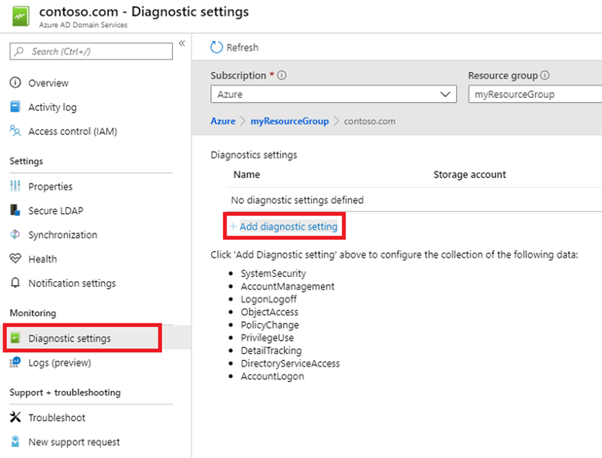
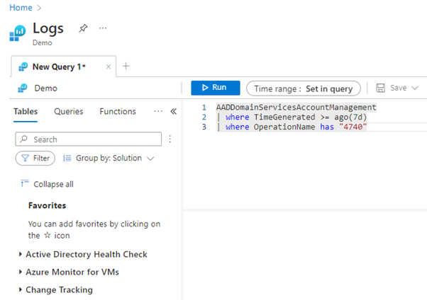

Before troubleshooting Azure AD authentication, you should consider that there are four editions of Azure AD: Free, Office 365 Apps, Premium P1, and Premium P2. The free edition is included with other software products and packages including Azure, Intune, and Office 365. Office 365 Enterprise editions (E1, E3, E5, F1, and F3) include the Office 365 Apps edition, while the Premium editions are available as an additional product.

## The difference between Azure AD editions

The following table shows the high-level difference between Azure AD editions. For more information, see [Azure Active Directory pricing](https://www.microsoft.com/security/business/identity-access-management/azure-ad-pricing).

| Feature name| Free| Office 365| Azure Active Directory Premium P1| Azure Active Directory Premium P2|
| :--- | :--- | :--- | :--- | :--- |
| Authentication, single sign-on and multifactor authentication (MFA)| Partially included | Partially included | Included| Included|
| Applications access| Partially included | Partially included | Included| Included|
| Authorization and conditional access| Partially included | Partially included | Partially included | Included|
| Administration and hybrid identity| Partially included | Partially included | Included| Included|
| End-user self-service| Partially included | Partially included | Partially included | Included|
| Identity governance| Partially included | Partially included | Partially included | Included|
| Event logging and reporting| Partially included | Partially included | Partially included | Included|
| Frontline workers| not included| not included| Included| Included|

## Troubleshoot self-service password reset issues

Azure AD self-service password reset (SSPR) enables users to change or reset their password without the help of an administrator. If a user forgets the password or becomes locked out of their account, they can resolve the issue by following on-screen prompts.

When you enable SSPR, many prerequisites must be met:

- You must have a working Azure AD tenant.

- You must be using an account with global administrator privileges.

- You must enable SSPR. This is done in the Azure portal, in **Azure Active Directory**, in **Password reset**.

- In the **Password reset pages**, you must select all the methods that you wish to be available to users. These are:

- Mobile app notification

- Mobile app code

- Email

- Mobile phone

- If you want notifications when SSPR is used, in the **Password reset** pages on the **Notifications** page, you must choose whether to notify the user and if you should notify all admins.

If you want to test SSPR for a specific user, you should open a browser window using InPrivate or Incognito mode and go to [https://aka.ms/ssprsetup](https://aka.ms/ssprsetup). Sign in as a locked-out user and you should be prompted to reset the password.

For more information on setting up and troubleshooting SSPR, see [How it works: Azure AD self-service password reset](/azure/active-directory/authentication/concept-sspr-howitworks).

## Troubleshoot multifactor authentication issues

Multifactor authentication (MFA) improves security because it requires you to use an additional authentication method and a password.

There are several common issues that you should resolve when troubleshooting MFA:

- You don't receive a voice call or text message with the verification code. If this occurs:

- Select **Other verification options** and then try again. If this succeeds, check that your phone numbers are correct in user settings.

- If there are no other verification options, ask a global admin to check that your phone numbers are correct in user settings.

- If you still can't connect, ask a global admin to go to the **Users** page in Azure Active Directory, in the Azure portal. Disable **Block sign in** for the user if it's enabled.

- You receive a "Sorry! We can't process your request" error when you try to set up SSPR. If this happens, ensure that you complete the setup process in less than 10 minutes.

- You lose your phone or your phone number has changed, preventing you from using MFA. If this occurs, you need to ask a cloud services admin to select **Require selected users to provide contact methods again** in **Manage user settings** on the multifactor authentication settings.

- You receive a "We didn't receive the expected response" error message. Ensure that you enter the correct code or select **Verify** in the mobile app.

- You receive an "Account verification system is having trouble" error message. Ensure that you enter the correct verification code and, if using the call option, you must press the pound (#) key.

For more information, see [Troubleshoot Azure Active Directory Multifactor Authentication issues](/troubleshoot/azure/active-directory/troubleshoot-azure-mfa-issue).

## Review customer access level to enterprise apps in Azure

Applications are registered in Azure AD and users can then be assigned to them.

### Registering applications

If you're setting up a cloud application such as Office 365, the steps are straightforward. For detailed information on setting up each individual cloud app, see [Tutorials for integrating SaaS applications with Azure Active Directory](/azure/active-directory/saas-apps/tutorial-list).

If you've an application that you've developed in-house, you can register it when you add the application or register it in Enterprise Applications, in the **Azure Active Directory Admin Center**. For more information, see [Quickstart: Add an enterprise application](/azure/active-directory/manage-apps/add-application-portal).

If you want to combine an on-premises application with Azure AD security, you should connect it using [Azure AD Application Proxy](/azure/active-directory/app-proxy/application-proxy).

### Managing access to apps in Azure

Apps can access user and organizational data if they're given consent. You should control the user consent settings to ensure the correct level of access is set. For more information, see [Configure how users consent to applications](/azure/active-directory/manage-apps/configure-user-consent?tabs=azure-portal).

The default access level is to allow access to all enterprise applications for every user. However, applications can be assigned to just a subset of users. In Azure Active Directory admin center, select **Enterprise applications**. Select the relevant application and select **Users and groups**. You can now see a list of assigned users and groups and, if necessary, add more.


Troubleshoot issues where users become locked out of their account

To protect the Azure AD domain, an account will be locked out after a defined number of incorrect log in attempts. This could be caused by a brute force malicious attack, or by a user repeatedly entering the wrong password.

You should check whether a user could be using an incorrect password, or whether an app might be using an old or incorrect password. It may be that a password has recently changed in on-premises Active Directory Services (AD DS) and might not have had time to synchronize with Azure AD.

### Use security audits to troubleshoot account lockouts

To preemptively log account lockout issues, you should enable security audits for Azure AD DS. You can enable security audits in the Azure portal. Search for Azure AD Domain Services, select it and select your managed domain. **Select Diagnostic settings** then select **Add diagnostic setting**.



For more information on enabling security audits, see [Enable security audits for Azure Active Directory Domain Services](/azure/active-directory-domain-services/security-audit-events).

When you've enabled security events, in the Azure portal, you can select **Monitor, Log Analytics workspaces**. Select your workspace then select **Logs**. You can then write queries using the Kusto querying language.

To search for lockout entries, you should use the filter where **OperationName has "4740"**.



For example, you could run this kusto query to find account lockout data for the last seven days:

```
AADDomainServicesAccountManagement

| where TimeGenerated >= ago(7d)

| where OperationName has "4740"
```


For more information, see [Troubleshoot account lockout problems with an Azure Active Directory Domain Services managed domain](/azure/active-directory-domain-services/troubleshoot-account-lockout).
