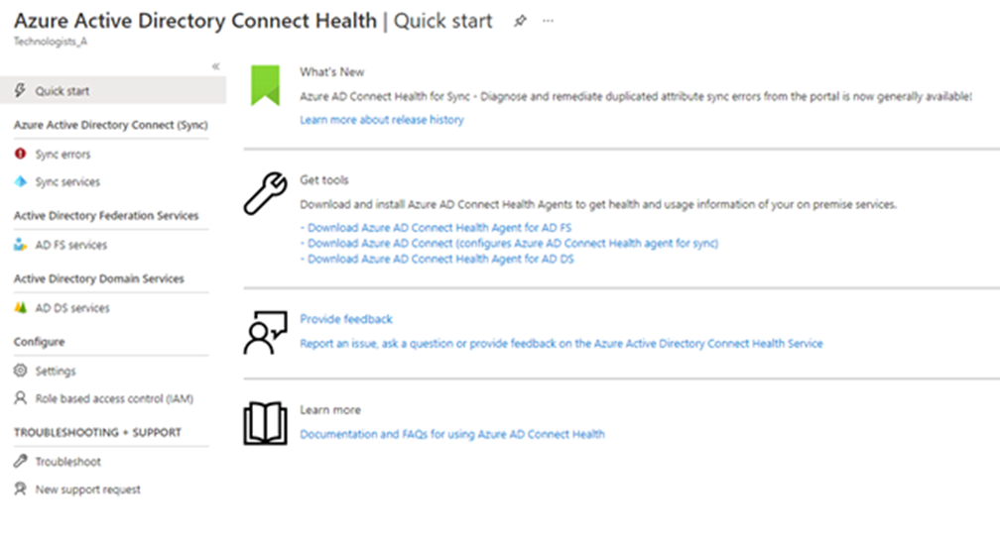
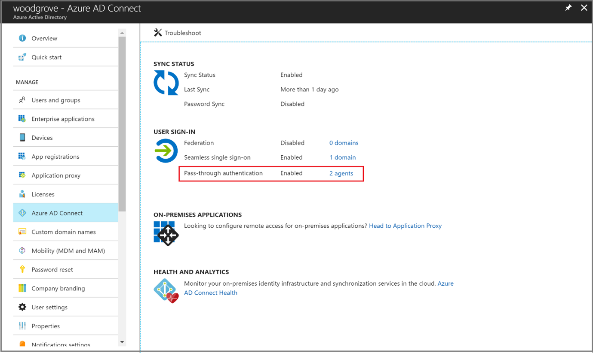
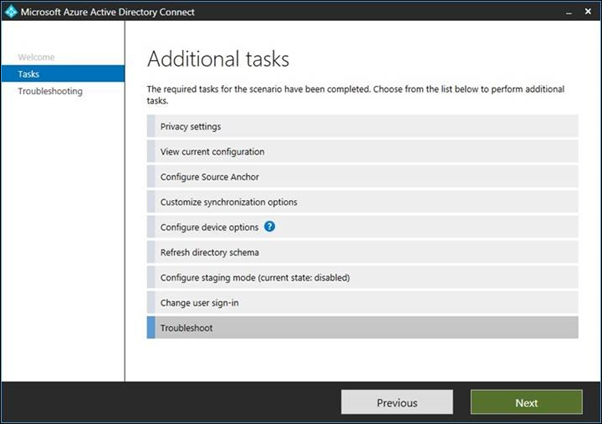
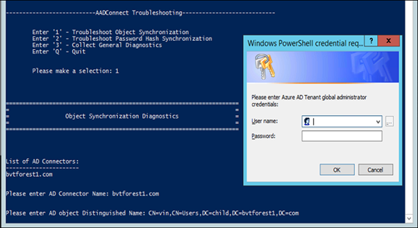

Many systems have a mixture of Azure and on-premises and use a hybrid identity solution. Azure AD Connect is an on-premises application that synchronizes Azure AD with on-premises Active Directory.

Determine why on-premises systems cannot connect to Azure AD resources

To troubleshoot Azure AD Connect, you should use the Azure AD Connect Health portal at [Azure Active Directory Connect Health](https://portal.azure.com/) to view performance monitors and alerts.

:::image type="content" source="../media/3-connect-health.png" alt-text="Screen shot of the Azure AD Connect Health screen.":::

You can also install the Azure AD Connect Administration Agent on an Azure Active Directory Connect server. The Azure AD Connect Administration Agent presents diagnostic data to Microsoft support engineers. Azure AD Connect Administration Agent is not installed by default and doesn’t store any data. It is specifically intended for live troubleshooting. You can disable the reporting of data by the Azure AD Connect Administration Agent if you edit the service config file. For more information on the Azure AD Connect Administration Agent and how to install and disable it, see [What is the Azure AD Connect Admin Agent](/azure/active-directory/hybrid/whatis-aadc-admin-agent)?

To troubleshoot connectivity issues, you should install Azure AD Connect Health agents. There are Azure AD Connect Health agents for AD FS, Azure ADFS, and Sync. For detailed steps on installing the Azure AD Connect Health agents, see [Azure AD Connect Health agent installation](/azure/active-directory/hybrid/how-to-connect-health-agent-install).

To troubleshoot connectivity issues, you must first have installed AD Connect in your on-premises environment. For more information on installing Azure AD Connect, see [Azure AD Connect and Azure AD Connect Health installation roadmap](/azure/active-directory/hybrid/how-to-connect-install-roadmap).

## Troubleshoot pass-through authentication and password hash sync issues

To troubleshoot pass-through authentication, you should first check that it is enabled and that the authentication agents are **Active**. To view the status, go to **Azure Active Directory Admin** Center and select **Azure AD Connect**.

You should then check if the user is getting errors, or if errors are reported in the **Azure Active Directory admin center**. For more information, see [Troubleshoot Azure Active Directory Pass-through Authentication](/azure/active-directory/hybrid/tshoot-connect-pass-through-authentication).

Troubleshooting password hash synchronization with Azure AD Connect sync depends on the version you use. There are different steps depending on whether one or many objects have password synchronization issues. Detailed steps for each scenario are available at [Troubleshoot password hash synchronization with Azure AD Connect sync](/azure/active-directory/hybrid/tshoot-connect-password-hash-synchronization).

## Review and resolve object synchronization with Azure AD Connect sync

To resolve object sync issues, start by running the troubleshooting task in the wizard. You should complete the following steps:

- On your Azure AD Connect server, start a Windows PowerShell with the Run as Administrator option and run Set-ExecutionPolicy RemoteSigned.

- Start the Azure AD Connect wizard, select **Tasks**, select **Troubleshoot** then select **Next**.

- Click **Launch** and type **1** to **Troubleshoot Object Synchronization**.

For more information, see [Troubleshoot object synchronization with Azure AD Connect sync](/azure/active-directory/hybrid/tshoot-connect-objectsync).

## Troubleshoot Azure AD Application proxy connectivity issues

To troubleshoot Azure AD Application proxy connectivity issues, do the following steps:

On your on-premises Active Directory server, open the Windows Services console and ensure that the **Microsoft AAD Application Proxy Conne**ctor service is enabled and running.

To discover events that could be causing problems, open Event Viewer and look for Application Proxy connector events in **Applications and Services** **Logs** > **Microsoft** > **AadApplicationProxy** > **Connector** > **Admin**.

For more information, see [Troubleshoot Application Proxy problems and error messages](/azure/active-directory/app-proxy/application-proxy-troubleshoot).

## Troubleshoot Active Directory Domain Service

When troubleshooting Azure AD to Active Directory Domain Service integration, you need to troubleshoot Azure Active Directory Domain Services. Common issues for Azure AD DS include:

- Problems enabling Azure AD DS.

- Microsoft Graph is disabled—this must be enabled to synchronize your Azure AD tenant.

- Users in your Azure AD tenant are unable to sign into the managed domain.

- There are alerts in your managed domain.

For more information, see [Common errors and troubleshooting steps for Azure Active Directory Domain Services](/azure/active-directory-domain-services/troubleshoot).
