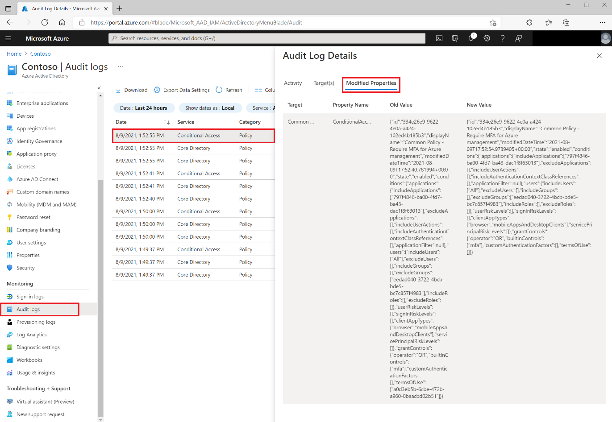

When a user has been authenticated, they must be authorized to carry out actions. If a user can't complete a required action, but their identity is correctly authenticated, you need to troubleshoot authorization issues.

## Troubleshoot Conditional Access

Conditional Access policies use numerous signals to decide whether a user should have access to a resource. For example, the user’s geographic location, type of device, and application being used can all be considered, alongside the user’s identity.

### Troubleshoot Conditional Access policy changes

If Conditional Access was previously working successfully, but is now not functioning as expected, you should investigate policy changes. Audit log data is held for 30 days and this can be increased in Azure Active Directory Diagnostic settings.

To view the audit log in the Azure portal, select **Azure Active Directory** then select Audit logs. Select the relevant date range and, in **Activity**, select **Add conditional access policy**, or **Update conditional access policy**, or **Delete conditional access policy**.

### Troubleshoot sign-in problems with Conditional Access

To avoid sign-in problems with Conditional Access, be very cautious if policies apply to all users, all cloud apps, or all devices. These policies could potentially block the entire organization.

To troubleshoot sign-in problems, you should initially review the error message. This will typically list the policy that is causing the problem and allow you to identify the policy to update. By clicking **More details** on the error message you can find the specific sign-in event.

When you have the details of the sign-in event, you can open the Azure portal, select **Azure Active Directory** then select **Sign-ins**. Add filters to find the correct type of events, such as Conditional Access failures, and find the specific event.

You can then select the event to view more details and the policy details for that event.

### The What If tool

The What If tool is also available to help with troubleshooting.

Open the Azure portal, select **Azure Active Directory**, select **Conditional Access** then select **What If.** You can now add conditions and see which Conditional Access policies will be applied.

For more information, see [Azure AD Conditional Access documentation](/azure/active-directory/conditional-access/).

## Troubleshoot role-based access control

A wide range of issues could affect role-based access control (RBAC). These issues include:

- A limit to the number of role assignments.

- Having correct permissions to work with roles.

- Losing role assignments when subscriptions are transferred to a different Azure AD directory, or resources are moved.

- Security principals deleted or only recently created.

- Management capabilities requiring write access.

For more information, see [Troubleshoot Azure RBAC](/azure/role-based-access-control/troubleshooting).

## Troubleshoot issues when storing encrypted passwords in Azure Key Vault

Azure Key Vault uses access policies to authorize user actions. There are many steps to troubleshoot Azure Key Vault access policy issues. For more information, see [Troubleshooting Azure key vault access policy issues](/azure/key-vault/general/troubleshooting-access-issues).
