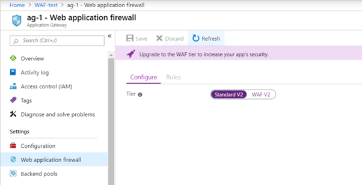
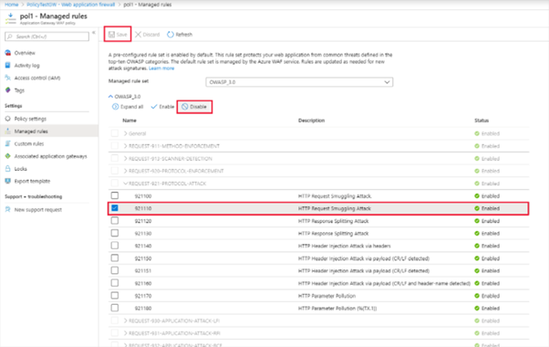
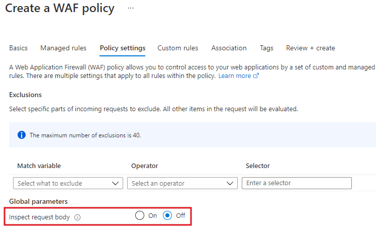
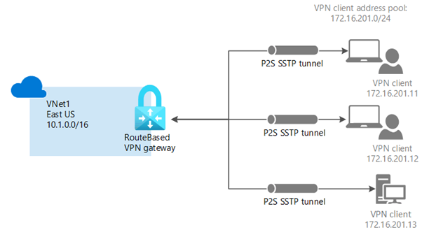

## Determine why Web Application Firewall (WAF) is blocking wanted traffic

There are occasions where the requests that should pass through your Web Application Firewall (WAF) are blocked.

To tune the strict Open Web Application Security Project (OWASP) rulesets as per the needs of the application or organization, WAF helps you to customize, or disable the rules, or create exclusions, that may be causing issues or false positives. This can be done on a per-site and per-URI basis, that is, the changes to the policies will only affect specific sites/URIs and wouldn’t affect other sites that may not be having the same issues.

The following articles help gain understanding of how the WAF functions and how the WAF rule sets and logs work:

- [WAF overview](/azure/web-application-firewall/ag/ag-overview)

- [WAF configuration](/azure/web-application-firewall/ag/application-gateway-waf-configuration)

- [WAF monitoring](/azure/application-gateway/application-gateway-diagnostics)

## Understanding WAF logs

WAF logs work as a statement of all evaluated requests that are matched or blocked. It shows every request that is matched or blocked by the WAF. If you notice a false positive, meaning, if the WAF blocks a request that it shouldn’t, you can perform the following steps:

- First, find the specific request.

- Next, examine the logs to find the specific URI, timestamp, or transaction ID of the request.

- Finally, fix the false positives.

## Viewing WAF logs

To view WAF logs, preform the following steps:

1. In the Azure portal, select **All resources** and select the **Application Gateway WAF policy**.

1. Select **Activity log**.

1. Select individual operations for more information.

1. You can download the Activity log by selecting **Download as CSV**.

1. To stream the Activity log events to another service, select **Export Activity Logs**.

   1. Select **Add diagnostic setting**.

   1. Type a **Diagnostic setting name**.

   1. Select the relevant log categories to stream in **Categories**. For example, select **Security**, **Policy**, and **Alert**.

   1. Select the streaming destination in **Destination details**. For example, select **Send to Log Analytics workspace**.

   1. Enter additional destination details. For example, the relevant **Subscription** and **Log Analytics workspace**.

   1. Select **Save**.

## Anomaly scoring mode

Anomaly Scoring mode is one of the modes used by OWASP when deciding whether to block traffic. In Anomaly Scoring mode, traffic that matches any rule isn't instantly blocked when the firewall is in Prevention mode. Rules have a certain criterion: Critical, Error, Warning, or Notice. Each criterion has a numeric value associated with it, which is called Anomaly Score. The numeric value indicates the severity of a request.

For more information, see [Anomaly scoring mode](/azure/web-application-firewall/ag/ag-overview).

## Fixing false positives

To fix the false positives and to avoid the issues of blocked traffic, you can:

Use an Exclusion List: Using an Exclusion List is applicable to only a specific part of a request, or a ruleset that is being disabled. You can decide to exclude either body, headers, or cookies for a certain condition instead of excluding the whole request. In a global setting environment, the specific exclusion applies to all traffic passing through your WAF.


Refer to [WAF configuration](/azure/web-application-firewall/ag/application-gateway-waf-configuration) for more information about exclusion lists.

**To configure exclusion lists using the Azure portal**

1. Go to WAF portal.

1. Select **Manage exclusions** under **Managed rules**.


An example exclusion list:


- **Disable the rule**: Disabling a rule allows to treat a certain condition as a non-threat, that would otherwise be flagged as malicious and be blocked. In a global setting environment, disabling a rule for the entire WAF is a risk and can weaken your security.

**To disable rule groups or specific rules**

1. Browse to the application gateway, and then select **Web application firewall**.

1. Select your **WAF Policy**.

1. Select **Managed Rules**.



1. Search for the rules or rule groups that you want to disable.

1. Select the check boxes for the rules that you want to disable.

1. Select the action at the top of the page (**Enable**/**Disable**) for the selected rules.

1. Select **Save**.



There is a third-party tool called Fiddler that can provide additional information. Fiddler is a useful tool that can help you in:

- **Finding request attribute names**: Review individual requests and determine what specific fields of a web page are called. It also helps to exclude certain fields from inspection using Exclusion List.

- **Finding request header names**: View request and response headers inside the developer tools of Chrome or see the headers for the GET request.

- **Finding request cookie names**: View cookies, by selecting the Cookies tab in Fiddler.

## Restrict global parameters to eliminate false positives

- **Disable request body inspection**: Certain bodies that are not a threat to your application can be turned off from being evaluated by your WAF by setting **Inspect request body** to off. This way only the request body is not inspected. The headers and cookies will still be inspected, unless excluded under the exclusion list functionality.



- **File size limits**: The possibility of an attack to your web servers and applications can be reduced by limiting the file size for your WAF. Permitting large files increases the risk of your backend being exhausted. To prevent attacks, it is advisable to limit the file size to a typical case for your application.

**Note:**

Firewall Metrics (WAF_v1 only)

For v1 Web Application Firewalls, the following metrics are now available in the portal:

- **Web Application Firewall Blocked Request Count **The number of requests that were blocked.

- **Web Application Firewall Blocked Rule Count **All rules that were matched and the request was blocked.

- **Web Application Firewall Total Rule Distribution **All rules that were matched during evaluation

To enable metrics, select the **Metrics** tab in the portal, and select one of the three metrics.

## Determine which version of TLS a customer is running

If the client is using a version of Transport Layer Security (TLS)that is lower than the minimum required version, all calls to Azure Storage will fail. Therefore, from the security point of view, an Azure Storage account may require that clients use a minimum version of TLS to send requests. For example, a request sent by a client who is using TLS 1.1 will fail, if a storage account requires TLS 1.2.

The article [Configure minimum required version of Transport Layer Security (TLS) for a storage account](/azure/storage/common/transport-layer-security-configure-minimum-version?tabs=portal) explains how to configure the minimum TLS version for an Azure Storage account that may affect client applications.

## Configure the client TLS version

For the client, sending a request with a particular version of TLS is only possible if the operating system and the .NET Framework used by the client supports that version.

To enable TLS 1.2 in a PowerShell client:

```powershell
# Set the TLS version used by the PowerShell client to TLS 1.2.

[System.Net.ServicePointManager]::SecurityProtocol = [System.Net.SecurityProtocolType]::Tls12;

# Create a new container.

$storageAccount = Get-AzStorageAccount -ResourceGroupName $rgName -Name $accountName

$ctx = $storageAccount.Context

New-AzStorageContainer -Name "sample-container" -Context $ctx

```

To enable TLS 1.2 in a .NET client using version 12 of the Azure Storage client library:

```csharp
public static async Task ConfigureTls12()

{

    // Enable TLS 1.2 before connecting to Azure Storage

    System.Net.ServicePointManager.SecurityProtocol = System.Net.SecurityProtocolType.Tls12;

    // Add your connection string here.

    string connectionString = "";

    // Create a new container with Shared Key authorization.

    BlobContainerClient containerClient = new BlobContainerClient(connectionString, "sample-container");

    await containerClient.CreateIfNotExistsAsync();

}

```

To enable TLS 1.2 in a .NET client using version 11 of the Azure Storage client library:

```csharp
static void EnableTls12()

{

    // Enable TLS 1.2 before connecting to Azure Storage

    System.Net.ServicePointManager.SecurityProtocol = System.Net.SecurityProtocolType.Tls12;

    // Add your connection string here.

    string connectionString = "";

    // Connect to Azure Storage and create a new container.

    CloudStorageAccount storageAccount = CloudStorageAccount.Parse(connectionString);

    CloudBlobClient blobClient = storageAccount.CreateCloudBlobClient();

    CloudBlobContainer container = blobClient.GetContainerReference("sample-container");

    container.CreateIfNotExists();

}

```

For more information, refer to [Support for TLS 1.2](/dotnet/framework/network-programming/tls).

> [!NOTE]
> Note: Fiddler or a similar tool can help you verify the specified version of TLS was used by the client to send a request.
## Troubleshoot encryption/certificate-related issues for point-to-site scenarios

A point-to-site (P2S) VPN connection is initiated by a single endpoint and is useful when you want to connect to your VNet from a remote location. Point-to-site is a better option when you have only a few clients that need to connect to a VNet. P2S connections do not require a VPN device or a public network or IP address.

P2S VPN supports SSTP (Secure Socket Tunnelling Protocol), and IKEv2. You can securely connect different clients running Windows, Linux, or macOS to an Azure VNet through point-to-site connection.



## Generate Certificates

- Generate a root certificate

First, obtain the public key (.cer file) for a root certificate. After creating the root certificate, export the public certificate (not the private key). Then this file is uploaded to Azure. The root certificate acts as a trusted source by Azure for connection over P2S to the virtual network. There are two ways to generate a root certificate, enterprise certificate, or self-signed certificate. To create a self-signed root certificate, consider the following steps:

1. Open a Windows PowerShell console.

1. The following example creates a self-signed root certificate named 'P2SRootCert' that is automatically installed in 'Certificates-Current User\Personal\Certificates'. You can view the certificate by opening *certmgr.msc*, or *Manage User Certificates*.

You can modify and run the following command.

```powershell
$cert = New-SelfSignedCertificate -Type Custom -KeySpec Signature `

-Subject "CN=P2SRootCert" -KeyExportPolicy Exportable `

-HashAlgorithm sha256 -KeyLength 2048 `

-CertStoreLocation "Cert:\CurrentUser\My" -KeyUsageProperty Sign -KeyUsage CertSign

```

1. Leave the PowerShell console open and proceed with the next steps to generate a client certificate.

- Generate client certificates

A client certificate is automatically installed on the computer where it is generated from a self-signed root certificate. For installing a client certificate on another client computer, you need to export it as a .pfx file, along with the entire certificate chain. The .pfx file will contain the root certificate information required for client authentication. There are two methods to create client certificates, enterprise certificate, or self-signed root certificate.

It is recommended to generate a unique certificate for each client instead of using the same certificate. This is because if you want to revoke a particular client certificate, you don’t need to generate and install a new certificate for every client that uses the same certificate. To generate client certificate, consider the following steps:

1. Use the following example if the PowerShell console session still open.

```powershell
New-SelfSignedCertificate -Type Custom -DnsName P2SChildCert -KeySpec Signature `

-Subject "CN=P2SChildCert" -KeyExportPolicy Exportable `

-HashAlgorithm sha256 -KeyLength 2048 `

-CertStoreLocation "Cert:\CurrentUser\My" `

-Signer $cert -TextExtension @("2.5.29.37={text}1.3.6.1.5.5.7.3.2")

```

1. If it’s a new PowerShell console session, consider the following steps:

   1. Identify the self-signed root certificate that is installed on the computer. This cmdlet returns a list of certificates that are installed on your computer.

```powershell
Get-ChildItem -Path "Cert:\CurrentUser\My"

```

   1. Locate the subject name from the returned list, then copy the thumbprint that is located next to it to a text file. In this case 'P2SRootCert'.

```console
Thumbprint                                Subject

----------                                -------

7181AA8C1B4D34EEDB2F3D3BEC5839F3FE52D655  CN=P2SRootCert

```

   1. Declare a variable for the root certificate using the thumbprint from the previous step.

```powershell
$cert = Get-ChildItem -Path "Cert:\CurrentUser\My\<THUMBPRINT>"

```

   1. Replace THUMBPRINT with the thumbprint of the root certificate from which you want to generate a child certificate.

```powershell
$cert = Get-ChildItem -Path "Cert:\CurrentUser\My\7181AA8C1B4D34EEDB2F3D3BEC5839F3FE52D655"

```

   1. In this example, a client certificate 'P2SChildCert' is generated. The client certificate that you generate is automatically installed in 'Certificates - Current User\Personal\Certificates' on your computer.

You can modify and run the following command to generate a client certificate.

```powershell
New-SelfSignedCertificate -Type Custom -DnsName P2SChildCert -KeySpec Signature `

-Subject "CN=P2SChildCert" -KeyExportPolicy Exportable `

-HashAlgorithm sha256 -KeyLength 2048 `

-CertStoreLocation "Cert:\CurrentUser\My" `

-Signer $cert -TextExtension @("2.5.29.37={text}1.3.6.1.5.5.7.3.2")

```

To learn about exporting the root certificate and the client certificate, see [Generate and export certificates for User VPN connections](/azure/virtual-wan/certificates-point-to-site).

To configure a Point-to Site connection using Azure certificate, you need to:

1. Add the VPN client address pool.

1. Specify tunnel type and authentication type.

1. Upload root certificate public key information.

1. Install exported client certificate.

1. Configure settings for VPN clients.

1. Connect to Azure.

For detailed steps to configure a Point-to Site connection using Azure certificate, refer to [Connect to a VNet using P2S VPN & certificate authentication: portal - Azure VPN Gateway](/azure/vpn-gateway/vpn-gateway-howto-point-to-site-resource-manager-portal)

To verify your VPN connection is active (Windows clients), open an elevated command prompt, and run ipconfig/all.

To Connect to a virtual machine (Windows clients):

1. Locate the private IP address.

1. Verify that you're connected to your VNet.

1. Open Remote Desktop Connection by typing "RDP" or "Remote Desktop Connection" in the search box on the taskbar, then select Remote Desktop Connection. You can also open Remote Desktop Connection using the 'mstsc' command in PowerShell.

1. In Remote Desktop Connection, enter the private IP address of the VM. You can select Show Options to adjust additional settings, then connect.

## Troubleshoot a connection

If you're having trouble connecting to a virtual machine over your VPN connection, read the following:

- Check that your VPN connection is successful.

- Ensure that you're connecting to the private IP address for the VM.

- If you can connect to the VM using the private IP address, but not the computer name, check DNS configuration.

- For more information about RDP connections, see [Troubleshoot Remote Desktop connections to a VM](/troubleshoot/azure/virtual-machines/troubleshoot-rdp-connection).

- Verify that the VPN client configuration package was generated after the DNS server IP addresses were specified for the VNet. If you updated the DNS server IP addresses, generate, and install a new VPN client configuration package.

- Ensure that there is no overlapping address space. For example, if the IP address is within the address range of the VNet that you are connecting to, or within the address range of your VPNClientAddressPool. Use 'ipconfig' to check the IPv4 address assigned to the Ethernet adapter on the computer from which you are connecting.

To add a trusted root certificate, refer to [Upload a trusted root certificate](/azure/vpn-gateway/vpn-gateway-howto-point-to-site-resource-manager-portal).

To remove a trusted root certificate:

- Navigate to the Point-to-site configuration page for your virtual network gateway.

- In the Root certificate section of the page, locate the certificate that you want to remove.

- Select the ellipsis next to the certificate, and then select Remove.

## Revoke a client certificate

Revoking a client certificate is different from removing a trusted root certificate. Removing a trusted root certificate .cer file from Azure, revokes all the client certificates generated/authenticated by the root certificate. Whereas, revoking a client certificate, allows other certificates associated with the same root certificate to continue working.

To revoke a client certificate, add the thumbprint to the revocation list.

- Retrieve the client certificate thumbprint. See [How to retrieve the Thumbprint of a Certificate](/dotnet/framework/wcf/feature-details/how-to-retrieve-the-thumbprint-of-a-certificate).

- Copy the information to a text editor and remove all spaces so that it is a continuous string.

- Navigate to the virtual network gateway Point-to-site-configuration page. This is the same page that you used to upload a trusted root certificate.

- In the Revoked certificates section, input a friendly name for the certificate.

- Copy and paste the thumbprint string to the Thumbprint field.

- The thumbprint validates and is automatically added to the revocation list. A message appears on the screen that the list is updating.

- After updating has completed, the certificate can no longer be used to connect. Clients that try to connect using this certificate receive a message saying that the certificate is no longer valid.

## Troubleshoot connectivity to secure endpoints

Azure Private Endpoint is a network interface that uses a private IP address from your virtual network and connects you privately and securely to a private link service.

The following are the connectivity scenarios available with Private Endpoints:

- Virtual network from the same region.

- Regionally peered virtual networks.

- Globally peered virtual networks.

- Customer on-premises over VPN or Azure ExpressRoute circuits.

## Diagnose connectivity problems

The given steps will guide you to ensure that all the required configurations are in place, to resolve connectivity problems with your private endpoint setup. For detailed steps, see [Diagnose connectivity problems](/azure/private-link/troubleshoot-private-endpoint-connectivity).

1. Review Private Endpoint configuration by browsing the resource.

1. Use Azure Monitor to see if data is flowing.

1. Use VM Connection troubleshoot from Azure Network Watcher.

1. DNS resolution from the test results must have the same private IP address assigned to the private endpoint.

1. Source Virtual Machine should have the route to Private Endpoint IP next hop as InterfaceEndpoints in the NIC Effective Routes.

1. If the connection has validated results, the connectivity problem might be related to other aspects like secrets, tokens, and passwords at the application layer.

1. Narrow down before raising the support ticket.

1. If the Private Endpoint is linked to a Private Link Service which is linked to a Load Balancer, check if the backend pool is reporting healthy. Fixing the Load Balancer health will fix the issue with connecting to the Private Endpoint.

1. Contact the Azure Support team if your problem is still unresolved and a connectivity problem still exists.

## Troubleshoot encryption/certificate-related issues for site-to-site scenarios

### IPsec and IKE policy parameters for VPN gateways

The IPsec and IKE protocol standard supports a wide range of cryptographic algorithms in various combinations. The article [IPsec/IKE parameters](/azure-stack/user/azure-stack-vpn-gateway-settings?view=azs-2102) explains which parameters are supported in Azure Stack Hub to meet your compliance or security requirements.

Note:

The following important considerations when using these policies:

- The IPsec/IKE policy only works on the Standard and HighPerformance (route-based) gateway SKUs.

- You can only specify one policy combination for a given connection.

- You must specify all algorithms and parameters for both IKE (Main Mode) and IPsec (Quick Mode). Partial policy specification is not allowed.

- Check with your VPN device vendor specifications if the policy is supported on your on-premises VPN devices.

Following are the steps on how to create and configure an IPsec/IKE policy and apply it to a new or existing connection. For detailed step-by-step instructions, follow [Steps to configure an IPsec/IKE policy for site-to-site (S2S) VPN connections in Azure Stack Hub](/azure-stack/user/azure-stack-vpn-s2s?view=azs-2102&tabs=az1%2Caz2%2Caz3%2Caz4%2Caz5%2Caz8%2Caz6%2Caz7).

1. Create and set IPsec/IKE policy.

1. Create a new site-to-site VPN connection with IPsec/IKE policy:

   1. Step 1 - Create the virtual network, VPN gateway, and local network gateway.

   1. Step 2 - Create a site-to-site VPN connection with an IPsec/IKE policy.

1. Update IPsec/IKE policy for a connection.

