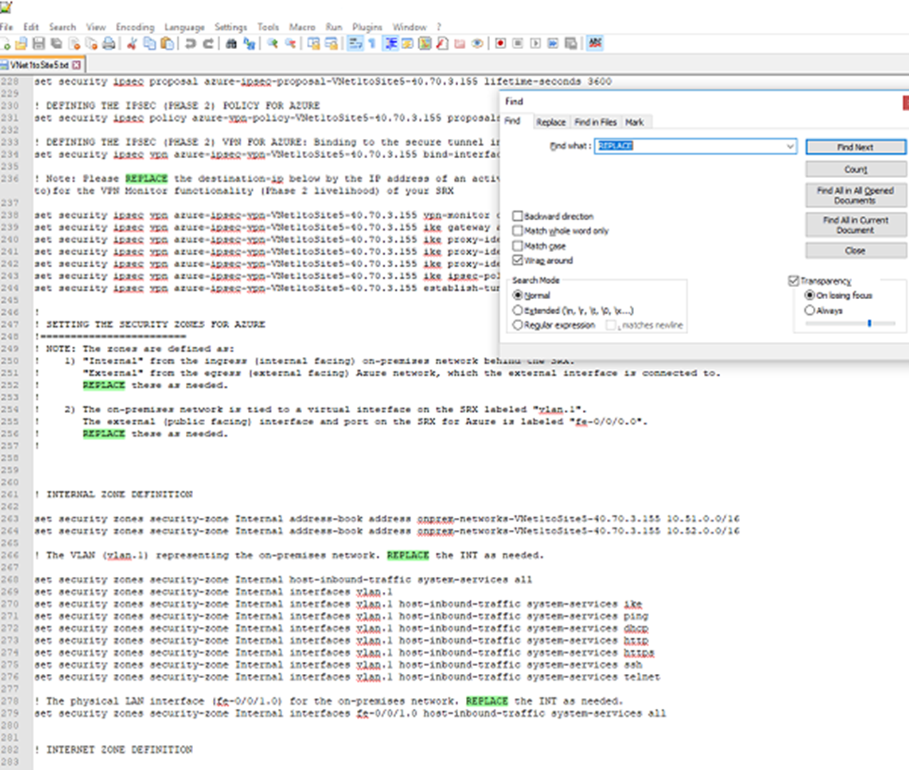
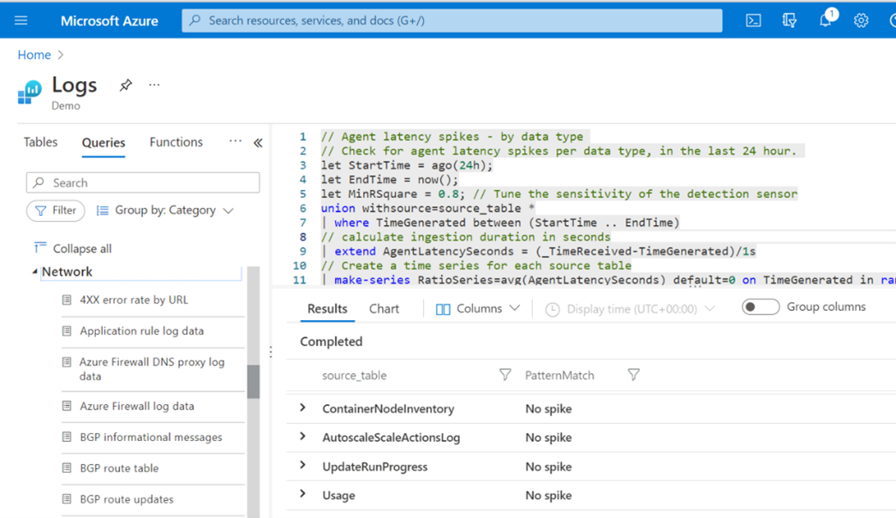
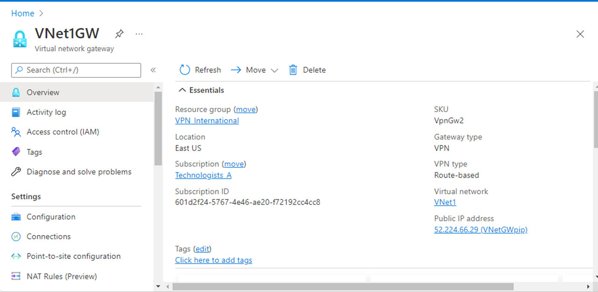
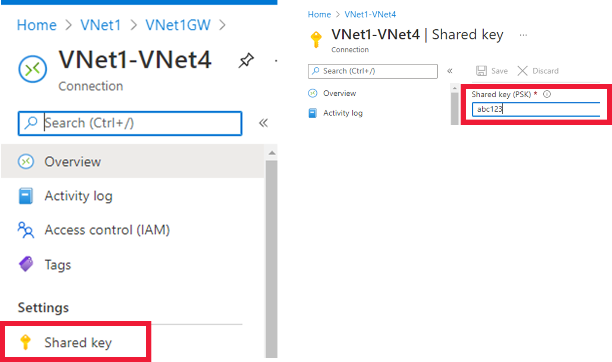
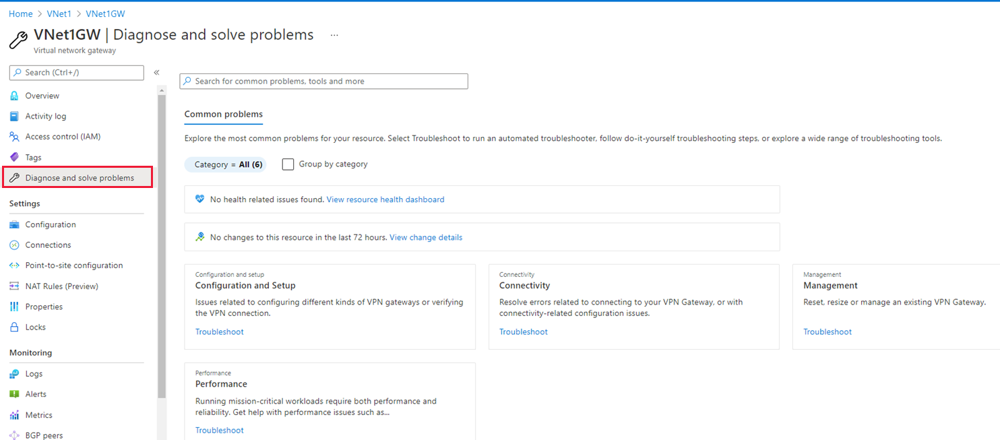
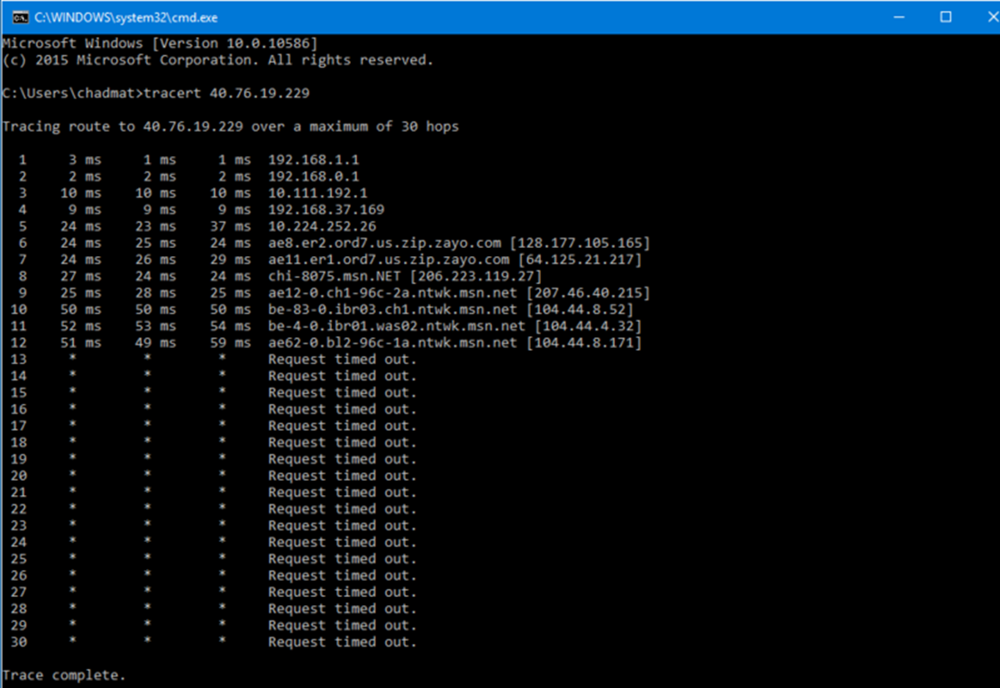

When you use site-to-site VPN gateways there are many steps and numerous areas where problems can occur. This section gives a brief overview of the setup, reviews the areas that can cause problems and shows how to troubleshoot connection issues.

## What are site-to-site VPN gateways?

If you have a business with offices in different locations, you can establish a secure connection between the Local Area Networks (LANs) over the network. A site-to-site VPN gateway creates a secure connection between computer resources at different locations.

The key steps to deploy a site-to-site VPN gateway are:

- Create the virtual network that will connect to the on-premises network.

- Create a gateway subnet on your virtual network.

- Create a VPN gateway.

- Create the local network gateway.

- Configure the on-premises gateway.

- In Azure, create a connection for the site-to-site connection between Azure and the local network gateway.

It will help to troubleshoot your site-to-site or point-to-site connection if you follow clear guidelines at the start. For example:

- Have a resource group name that clearly identifies the network you're setting up as you cannot amend it later.

- Adopt a naming convention that will easily allow you to identify the different components you create.

When you experience problems, check the virtual network connections are correct before delving deeper into the setup. Ask yourself:

- Have you selected the correct subscription?

- Have you selected the correct region?

- Is the IP address range unique for both networks? You cannot connect if address spaces overlap.

- Is the subnet address range correct? This field often auto-populates, and if you change the IPv4 address range, it will not automatically alter the subnet value.

This unit will help to troubleshoot the various steps outlined above.

## Available gateways and SKUs

A site-to-site VPN gateway is a connection over an IPsec/IKE (IKEv1 or IKEv2) VPN tunnel.

### Gateway types

- [VPN](/azure/vpn-gateway/vpn-gateway-about-vpn-gateway-settings) – sends encrypted traffic across the public internet.

- [ExpressRoute](/azure/expressroute/expressroute-about-virtual-network-gateways) – sends encrypted traffic on a private connection.

### SKU size

Each gateway is available in [different SKUs](/azure/vpn-gateway/vpn-gateway-about-vpngateways). You need to determine the CPU usage and bandwidth you require to establish which SKU you need. If you have to change the size and/or type of SKU it might be possible to upgrade. However, in some circumstances, you might need to set up the gateway again.

### VPN type

When you set up a gateway you need to choose a VPN type.  Site-to-site supports route-based or policy-based VPNs. It’s not possible to change the VPN type so check that the limitations of a policy-based gateway are not impacting your system. The key limitations are of a policy-based VPN are:

- You can only use the Basic SKU.

- You can only use one tunnel.

- Only certain devices allow policy-based connections.

- You cannot connect to a point-to-site VPN gateway.

If you have set up the VPN type incorrectly, you will need to delete the virtual gateway and create a new one.

## Border Gateway Protocol (BGP)

[BGP](/azure/vpn-gateway/vpn-gateway-bgp-overview) is an optional feature that can be used with Azure route-based gateways. BGP has the same technology that’s used on the internet, but it's within Azure. This enables the Azure VPN gateway and any connected on-premises gateways to exchange information about the IP ranges being used.

Use the following checklist to troubleshoot BGP connections:

- Have you created an autonomous system number (AS) on the virtual network gateway to enable BGP?

- In Azure, against the Overview section of the virtual network, check that the system supports BGN. If the SKU is basic, then it needs to be resized to VpnGw1 and then add the AS number.

- Have you used PowerShell to provide the Local Network Gateway with the AS number and a BGP peer address?

- Has the connection gateway been BGP enabled?

### Active/active VPN gateways

There are two types of gateway: active/active and active/standby.

If you have configured active/active, then ensure the following are met:

- Two gateway IP configurations have been created with two public IP addresses.

- Ensure the EnableActiveActiveFeature flag has been set.

- Ensure the gateway SKU is **VpnGw1**, **VpnGw2**, or **VpnGw3**.

## Locate, review, and configure the configuration script for a gateway

To complete a cross-premises connection, download and complete a [configuration script](/azure/vpn-gateway/vpn-gateway-download-vpndevicescript). Check the following if you are getting errors:

- Have you downloaded the correct script?

- As the syntax is different for each model and firmware version it's important to ensure you downloaded the correct script.

- Open the script in a text editor and locate the Replace sections. Have you amended the parameter information correctly?

- Double check the following values on your device:

  - Interface numbers.

  - Access control list numbers.

  - Policy names, numbers, and so on.

## Is your Edge device compatible with the gateways?

Not all devices have been verified and validated for VPN gateways. If you are having problems with your devices, the following checklist may help:

- Check whether your [device](/azure/vpn-gateway/vpn-gateway-about-vpn-devices) is configured correctly, and most importantly, is validated by Microsoft.

If your device is not on the list, contact your device manufacturer to see if they can provide support and configuration instructions. It might be that your devices will still work.

## Run log analytics queries to troubleshoot gateway issues

You can use Log Analytics to identify trends and analyse data collected by Azure. It's a useful tool to identify current problems and give important insights into the health of your gateways. Used proactively it might be possible to identify potential issues and be able to take preventative action, rather than troubleshooting.

A range of pre-written queries are available for you to use such as:

- 4xx error rate by RL.

- Application rule log data.

- BGP route table.

- Endpoints with monitoring status down.

- Failed request per hour.

- Gateway configuration changes.

When you first set up your queries, preview the information in the different tables to ensure that you are accessing the correct information to help understand what is happening on your network. The samples shown above are just a few of the several hundred pre-written queries available. There are [tutorials](/azure/azure-monitor/logs/log-analytics-tutorial) to read if you want to write more complex queries.

## Reset a VPN gateway

If your on-premises devices are working correctly, but you cannot establish the IPsec tunnels with the Azure VPN gateway, you need to reset it.

There are two resets available:

- [Gateway](/azure/vpn-gateway/reset-gateway) reset

- [Connection](/azure/vpn-gateway/reset-gateway) reset

The gateway reset will reboot the gateway and retain the current public IP address, so you don't need to update your VPN router configuration.

Before rebooting, use the following checklist:

- Are the two IP addresses for the Azure VPN gateway and the on-premises VPN gateway correctly configured in Azure and on-premises VPN polices?

- Is the preshared key the same on both gateways?

- Have you applied any specific IPsec/IKE configurations, such as encryption or hashing logarithms?

- If so, check that the configurations match on both gateways.

When you issue the command to reboot, it shouldn’t take more than a minute. But if the problem isn’t solved and you issue the command to reboot a second time, it can take up to 45 minutes.

If the problem still exists after two reboots, then a service ticket should be raised with the Azure portal. The reset can be instigated via portal or by using PowerShell.

A connection [reset](/azure/vpn-gateway/reset-gateway) does not reboot the gateway, it only resets the selected connection.

## Troubleshoot site-to-site gateway connection issues

If your connection has been working correctly and suddenly stops, use the following [checklist](/azure/vpn-gateway/vpn-gateway-troubleshoot-site-to-site-cannot-connect):

- Check that the on-premises device is validated and configured correctly.

- Check that the shared keys on each connection match.

- Does the Local Network Gateway IP definition in Azure match the on-premises device IP?

- Check and remove any user-defined routing (UDR) or network security groups (NSGs) and test the result.

- If you are getting sporadic disconnections, ensure that the VPN internet-facing IP address is not included in the Local Network definition in Azure.

- Check that the virtual network subnet address space(s) match on the Azure virtual network and the on-premises network?

- Check the health probe by browsing to: **https://<YourVirtualNetworkGatewayIP>:8081/healthprobe**. If you don’t receive a response, then the gateway is probably unhealthy.

- If you experience sporadic disconnection problems and have perfect forward secrecy enabled on your device, disable the feature and update the VPN gateway IPsec policy.

- Check the resource health.

- Use troubleshooting tools within Azure.

## Identify the root cause for latency issues within site-to-site VPNs

Tunnel ingress and egress metrics can be monitored within the Azure portal using Azure Monitor. Cumulative delays exceeding 100ms can be viewed by running tracert on a client machine.

### Tunnel ingress and egress metrics

Follow the steps below to access the metrics within Azure:

- Go to the virtual network gateway.

- Select **Overview** to view tunnel ingress and egress metrics.

- Click **Metric** on the side panel to view additional metrics as required.

### Monitoring cumulative delays

The tracert command checks for cumulative delays exceeding 100 ms:

- Open a command window on a client machine in the on-premises network.

- Type tracert<VIP for the Azure Gateway>.

- When the result shows * you have hit the Azure edge.

- When the DNS names shows msm you have hit the Microsoft backbone.

